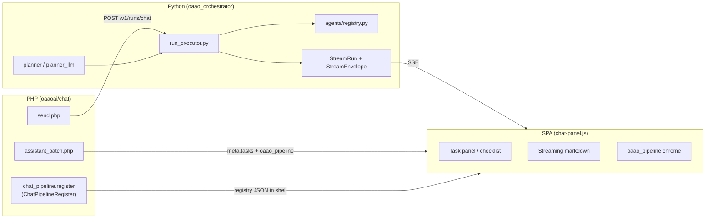

# oaao.ai-v1

Razy-based distributor for [oaao.ai](https://oaao.ai) — PHP (`backbone/`) + Python orchestrator sidecar + optional vector / ASR adjuncts.

## Prerequisites

1. **`backbone/Razy.phar`** is tracked for this distributor; rebuild from `../Razy` when the framework changes (see `.cursor/rules`).
2. From repo root:

```bash
cp docker/env.example .env   # edit ports, secrets, data paths
```

3. See **`docker-compose.yml`** header comments for bind mounts, backup paths, and platform admin hostname.

---

## Docker: what to run (minimize by default)

Compose uses **profiles** so optional services are **not** started unless you opt in.

| Tier | Compose command | Services started | Use when |
|------|-----------------|------------------|----------|
| **Core (minimum)** | `docker compose up -d --build` | `postgres`, `web`, `orchestrator` | Login, chat shell, settings, vault **upload** (jobs queue but embed may fail without vectors) |
| **Vault RAG / embed** | `docker compose --profile vectors up -d --build` | core + **`qdrant`** (+ **`arangodb`** if GraphRAG) | Document vector search, vault embed jobs, chat vault RAG |
| **Speaker ASR (FunASR sidecar)** | `docker compose --profile funasr up -d --build funasr` | core + **`funasr`** | Settings → ASR → **Speaker** mode only |
| **Full local dev** | `docker compose --profile vectors --profile funasr up -d --build` | all of the above | Speaker transcripts + vault embed + optional graph |

**Default rule:** plain `docker compose up` = **core only**. No Qdrant, no Arango, no FunASR.

Open: `http://localhost:${OAAO_WEB_PORT:-8080}/` (DocumentRoot is `backbone/`).

---

## Core stack (always required in Docker)

| Service | Role |
|---------|------|
| **postgres** | Canonical DB (`oaao_*` tables, purposes, vault metadata, jobs) |
| **web** | Apache + PHP (Razy), vault API, settings, SPA shell |
| **orchestrator** | Python sidecar: chat SSE, vault job poll (`vault_job_claim` / `finish`), ASR/embed workers |

**Bind mounts (durable data):** configure in `.env` — `OAAO_PG_DATA_PATH`, `OAAO_VAULT_STORAGE_HOST_PATH`, `OAAO_AUTH_SQLITE_PATH`, `./backbone/config/oaaoai`. See `docker/env.example`.

**Intra-stack URLs (inside containers):**

- Orchestrator → PHP vault jobs: `OAAO_VAULT_JOB_POLL_BASE_URL=http://web/vault/api`
- Orchestrator → FunASR (if running): `OAAO_FUNASR_BASE_URL=http://funasr:8765`
- PHP / orchestrator → Qdrant (if running): `OAAO_QDRANT_URL=http://qdrant:6333`

Do **not** use `localhost` inside `orchestrator` to reach `web` — use the Compose service name `web`.

---

## Optional profiles

### `--profile vectors` (vault embed / RAG)

| Service | Role |
|---------|------|
| **qdrant** | Vector store for vault document chunks |
| **arangodb** | Optional graph index (GraphRAG); only if vault graph mode is enabled |

Without this profile, vault files can upload and ASR can run, but **embed jobs need Qdrant** (configure Settings → Purpose allocation → **Embedding** to a reachable API **and** start Qdrant).

```bash
docker compose --profile vectors up -d
docker compose --profile vectors ps   # postgres, web, orchestrator, qdrant should be Up
```

### `--profile funasr` (Speaker mode ASR only)

| Service | Role |
|---------|------|
| **funasr** | Minimal FunASR HTTP adapter (`/v1/transcribe`) for vault **Speaker** diarization |

**Not started** by default. Also **not** pulled automatically unless:

- Settings → ASR → mode **Speaker**, and
- FunASR ensure / smoke test runs (`OAAO_FUNASR_COMPOSE_ENABLED=1` lets orchestrator run `docker compose --profile funasr up …`).

If you stay on **Normal** ASR and never enable Speaker in Settings, you can **omit `--profile funasr` entirely**.

Manual start:

```bash
docker compose --profile funasr up -d --build funasr
```

FunASR env (`.env` or Settings → ASR persisted meta → ensure): `FUNASR_ADAPTER_MODE=stub|pipeline`, `FUNASR_SPK_MODEL=…` (CAM++ for real diarization). Default image is **stub** (lightweight).

To disable auto-provision from orchestrator:

```bash
OAAO_FUNASR_COMPOSE_ENABLED=0
```

---

## What runs **outside** Docker (operator-provided)

These are **not** Compose services — configure in **Settings → Purpose allocation**:

| Capability | Typical setup | Used by |
|------------|---------------|---------|
| **ASR (Normal mode)** | External OpenAI-compatible endpoint (e.g. Qwen ASR URL) | Vault audio → flat `source_text`, chat voice |
| **Embeddings** | Ollama / OpenAI-compat embedding URL + model | Vault embed, chat RAG |
| **Chat LLM** | Your chat endpoint row | Workspace chat SSE |

Speaker **Stub** still uses your **Qwen ASR** for accurate text while FunASR stub supplies speaker UI structure. Speaker **Pipeline + SPK** uses the **funasr** container for local diarization.

---

## ASR modes vs Docker (quick reference)

Configure in **Settings → ASR** (not in Purpose routing dialog):

| Mode | Docker extra | Notes |
|------|--------------|-------|
| **Normal** | none | Flat transcript; uses Purpose **ASR** endpoint |
| **Speaker + Stub** | `--profile funasr` (after ensure) | Speaker UI; timestamps often estimated |
| **Speaker + Pipeline + SPK** | `--profile funasr` + GPU/models | Real diarization; re-transcribe after switching |

See also: `backbone/sites/oaaoai/oaaoai/docs/backlog/vault-asr-speaker-mode.md`.

---

## Common deploy recipes

**Chat + admin only (no vault vectors):**

```bash
docker compose up -d --build
```

**Vault with search / RAG:**

```bash
docker compose --profile vectors up -d --build
# Settings → Embedding purpose → reachable embedding API
```

**Vault Speaker transcripts (minimal FunASR):**

```bash
docker compose --profile vectors --profile funasr up -d --build
# Settings → ASR → Speaker; wait for FunASR smoke test → Save
```

**Stop optional services:**

```bash
docker compose --profile funasr stop funasr
docker compose --profile vectors stop qdrant arangodb
```

Core (`postgres`, `web`, `orchestrator`) keeps running.

---

## Host / non-Docker orchestrator

If orchestrator runs on the host instead of Compose:

```bash
OAAO_VAULT_JOB_POLL_BASE_URL=http://localhost:8080/vault/api
OAAO_QDRANT_URL=http://localhost:6333
```

Run `uvicorn oaao_orchestrator.app:app` from `python/` with `PYTHONPATH=python`. See `docker/orchestrator/Dockerfile` for system deps (ffmpeg, tesseract, docker CLI for FunASR ensure).

### Orchestrator tests (pytest)

Dev deps are in `python/requirements-dev.txt` (installed in the orchestrator image). After code changes, rebuild then:

```bash
docker compose build orchestrator
docker compose up -d orchestrator
docker compose exec -w /app/python orchestrator python -m pytest tests/ -q
```

Host-only: `cd python && pip install -r requirements-dev.txt && PYTHONPATH=. python -m pytest tests/ -q` (Python 3.10+).

---

## Workspace chat → task pipeline (hooks)

Workspace chat uses a **Manus-style task pipeline**: one background run per send, a visible **Run Task** checklist, optional **Agent** sub-steps, and a single **SSE** stream (`event: oaao.stream`). **PHP never terminates long-lived SSE** — only JSON (`send`, `assistant_patch`, `cancel_run`). Execution and streaming live in **`python/oaao_orchestrator`**.

Design reference: [`backbone/sites/oaaoai/oaaoai/docs/backlog/chat-task-pipeline.md`](backbone/sites/oaaoai/oaaoai/docs/backlog/chat-task-pipeline.md).

### End-to-end flow

```text
Browser                    PHP (Razy)                         Python orchestrator
───────                    ──────────                         ───────────────────
POST /chat/api/send  →  insert user + assistant rows
                        resolve endpoint, vault, planner
                        POST /v1/runs/chat (internal)   →   RunExecutor:
                                                            plan → Run Tasks loop
                                                            → StreamRun.append
GET /v1/stream       ←  stream_url + token              ←   SSE replay (since_seq)
POST assistant_patch ←  final content + meta_json       ←   system/end metrics
POST cancel_run      →  POST /v1/runs/{id}/cancel       →   cooperative cancel
```



### Layer model

| Layer | ID example | Visible in UI | Runtime |
|-------|------------|---------------|---------|
| **Run** | `run_uuid` | — | One `StreamRun` per user message |
| **Run Task** | `rt-2` | Right **Steps** panel | Planner + `RunExecutor` queue |
| **Agent** | `ag-rt2-slides` | Expandable row under a Run Task | `AgentRegistry` (`agent_kind`) |
| **Agent Task** | `at-rt2-retrieve` | Sub-rows under Agent | Progress inside `AgentRunner` |

Run Task types (`RunTaskType`): `vault_rag`, `attachments`, `agent`, `llm_stream`, `llm_call`, `emit`, … — see `python/oaao_orchestrator/tasks/models.py`.

### PHP hooks (UI + bootstrap)

| Hook / API | Listener / file | Role |
|------------|-----------------|------|
| **`chat_pipeline.register`** | `ChatPipelineRegister` via `chat/default/controller/chat.php` | Frozen registry for **composer slots**, **message blocks** (`task_files_cta`, `markdown_stream`), **step rail** templates. Embedded in shell as `OAAO_CHAT_PIPELINE_REGISTRY` for `chat-panel.js`. |
| **`purpose_allocation.register`** (`planning.*`) | `chat.php` | Settings slot for **Task planner** LLM binding (`ChatRunPlannerPurposeConfig`). |
| **`POST /chat/api/send`** | `chat/default/controller/api/send.php` | Starts orchestrator run: messages, endpoint, vault RAG, `run_planner_mode`, `allowed_agents[]`, attachments, glossary, … |
| **`POST /chat/api/assistant_patch`** | `assistant_patch.php` | Persists assistant body + `meta_json` (`tasks`, `oaao_pipeline`). |
| **`POST /chat/api/cancel_run`** | `cancel_run.php` | Forwards cooperative cancel to `POST /v1/runs/{run_id}/cancel`. |
| **`GET /chat/api/task_artifacts`** | `task_artifacts.php` | Aggregates `oaao_pipeline.artifacts` (+ `run_task_id`) for a logical task. |

**Extending UI (PHP):** in your module `__onInit`, call `$this->trigger('chat_pipeline.register')->resolve([...])` with a unique `entry_id`, `kind` (`composer_slot` \| `message_block` \| `step_rail`), and `extras` (`block_type`, `composer_zone`, `sort`, …). See `ChatPipelineRegister.php` docblock.

### Python hooks (execution)

| Component | Path | Role |
|-----------|------|------|
| **RunExecutor** | `run_executor.py` | `build_run_plan` → sequential Run Tasks → `phase=task` + `phase=llm` envelopes |
| **Planner** | `planner.py`, `planner_llm.py` | Default checklist vs LLM-planned tasks; `report_after` replan |
| **AgentRegistry** | `agents/registry.py` | `agent_kind` → `AgentRunner` (`vault_rag`, `sandbox_code`, `slides`, `image_gen`, `web_search`, `mcp_tool`, …) |
| **StreamRun** | `streaming/session.py` | Buffered SSE, `since_seq` replay, `request_cancel()` |
| **Stream envelope** | `streaming/events.py`, `tasks/stream_emit.py` | `phase=task` with `payload.tasks`, `payload.run_task`, `payload.agent_task`; `payload.oaao_pipeline` |

**Extending execution (Python):**

1. Implement `AgentRunner` (see `agents/vault_rag.py`, `agents/stub_vertical.py`).
2. Register in `agents/registry.py` (or entrypoint loader).
3. Ensure `send.php` allows the kind via **Settings → Task planner → Allowed agents** (`ChatAllowedAgentsPurposeConfig` → `allowed_agents` on the run payload).

Orchestrator HTTP (internal token `X-OAAO-Internal-Token`):

- `POST /v1/runs/chat` — start run
- `GET /v1/stream?run_id&token&since_seq` — browser SSE
- `POST /v1/runs/{run_id}/cancel` — stop run

### Frontend (`chat-panel.js`)

| Concern | Behavior |
|---------|----------|
| **SSE** | Single `EventSource` / fetch stream on orchestrator URL from `send` response |
| **Task checklist** | Right **`aside[data-oaao-chat="task-panel"]`**; updates from `phase=task` envelopes (`payload.tasks`, `run_task`, `agent_task`) |
| **Pipeline chrome** | Milestone rail / blocks from `payload.oaao_pipeline` (registry-driven presenters) |
| **Persistence** | `assistant_patch` stores `meta.tasks` + `meta.oaao_pipeline`; `sessionStorage` + reload per conversation |

After changing shell CSS/JS, bump `OAAO_CHAT_SHELL_ASSET_REV` in `chat-panel.js` and hard-reload.

### Configuration

| Setting | Effect |
|---------|--------|
| **Settings → Task planner** (`planning.*` purpose meta) | `run_planner.mode`: `llm` (dynamic checklist) or `stub` (fixed RAG → LLM pipeline) |
| **`OAAO_RUN_PLANNER_MODE`** | Fallback when purpose meta has no mode |
| **Allowed agents** (same settings UI) | Subset of `agent_kind` values passed as `allowed_agents` to orchestrator |
| **Chat endpoint** | LLM upstream for planner + `llm_stream` task |

### Tests

```bash
docker compose build orchestrator
docker compose exec -w /app/python orchestrator python -m pytest tests/test_task_pipeline_phase0.py tests/test_task_pipeline_phase5.py -q
```

### Key paths (quick index)

| Area | Path |
|------|------|
| Design backlog | `backbone/sites/oaaoai/oaaoai/docs/backlog/chat-task-pipeline.md` |
| PHP registry | `backbone/sites/oaaoai/oaaoai/chat/default/library/ChatPipelineRegister.php` |
| Send / cancel | `backbone/sites/oaaoai/oaaoai/chat/default/controller/api/send.php`, `cancel_run.php` |
| UI shell | `backbone/sites/oaaoai/oaaoai/chat/default/view/workspace_panel.tpl` |
| Chat panel JS | `backbone/sites/oaaoai/oaaoai/chat/default/webassets/js/chat-panel.js` |
| Orchestrator | `python/oaao_orchestrator/run_executor.py`, `app.py` |

---

## Related files

| File | Purpose |
|------|---------|
| `docker-compose.yml` | Service definitions and profiles |
| `docker/env.example` | All env vars with comments |
| `docker/transcript-summary-templates/` | View Transcript summary prompts (Markdown, bind-mounted into `web`) |
| `docs/MIGRATION_LEGACY_OAAO.md` | Legacy stack notes |
| `backbone/sites/oaaoai/oaaoai/docs/backlog/chat-task-pipeline.md` | Chat task pipeline design + phase checklist |
| `.cursor/rules/rayfung-razy-stack.mdc` | Razy / phar / vault dev rules |
