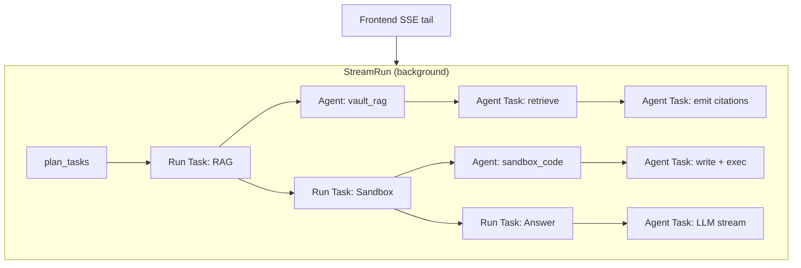

# Backlog：Chat Task Pipeline（Manus 式多工序 + 兩層 Task / Agent）

> **狀態**：設計凍結 v0.1（2026-05-19）— 待實作  
> **產品目標**：前端 **單一 SSE 不斷線**；使用者看到 checklist **一步步完成**；後端 **background run** 排程多道工序，其中 **LLM 串流** 只是某一類 worker。  
> **參考體驗**：[Manus](https://manus.im/) — 規劃 → 多步執行 → 工具／沙箱／產物；可 **hook** 垂直能力（PPT、coding sandbox、圖片生成等）。  
> **相關**：Legacy `Plan` / `Task` / `executor`（`../oaao.ai-old/oaao.ai`）、v1 `StreamRun` + `StreamEnvelope`（`python/oaao_orchestrator`）、`ChatPipelineRegister`（PHP UI registry）。

---

## 1. 設計原則

| 原則 | 說明 |
|------|------|
| **工作 = Event payload** | 不再「hook 階段」與「SSE 產物」兩條線；每一工序的輸出都寫進 **同一 `oaao.stream` 序列** 的 envelope。 |
| **Background run** | `POST /v1/runs/chat` 啟動 `asyncio` run；**瀏覽器斷線不取消** upstream（`StreamRun` 已支援 replay `since_seq`）。 |
| **Hook = 模組註冊** | PHP `chat_pipeline.register` / Python `task_type` registry：模組宣告自己能處理的 **RunTask** / **AgentTask**，不硬編在 `app.py`。 |
| **兩層編排** | **Run Task**（使用者可見 checklist 一步）→ 內含 **Agent** → **Agent Tasks**（子步：tool call、子 LLM、artifact）。 |
| **PHP 不做 SSE** | 長連線只在 orchestrator；PHP 只 `send` 啟動 run、`assistant_patch` 持久化。 |

---

## 2. 終態體驗（對齊 Manus）

```text
使用者提問
    │
    ▼
[規劃]  planner 產出 Run Task 清單（可見 checklist + ability chips）
    │
    ▼
[逐步執行]  每一 Run Task：
    │           ├─ 可能派生 Agent（專用能力：slides / sandbox / image_gen / vault_rag …）
    │           └─ Agent 內再跑 Agent Tasks（檢索、寫檔、跑命令、二次 LLM）
    │
    ▼
[主回答]  LLM_STREAM task 將正文 token 推進同一 SSE（現有 markdown stream）
    │
    ▼
[收尾]  citations / artifacts / follow-up / post_stream queue jobs
```

**可 hook 的能力範例**（非 exhaustive）：

| `agent_kind` | 典型 Run Task 標題 | Agent Tasks 範例 |
|--------------|-------------------|------------------|
| `vault_rag` | 檢索知識庫 | embed query → Qdrant → merge citations block |
| `sandbox_code` | 撰寫並執行程式 | write file → run in sandbox → read stdout → patch |
| `slides` | 製作簡報 | outline LLM → per-slide content → export PPTX artifact |
| `image_gen` | 生成示意圖 | prompt refine → multimodal API (`t2i`) → attach artifact — 見 [multimodal-tts-provider-api.md](./multimodal-tts-provider-api.md) §3 Lance |
| `web_search` | 搜尋網路 | Tavily/search → snippet merge |
| `mcp_tool` | 呼叫整合工具 | MCP discover → invoke → normalize result |

---

## 3. 兩層模型：Run Task → Agent → Agent Tasks

### 3.1 名詞

| 層級 | ID 範例 | 誰看見 | 說明 |
|------|---------|--------|------|
| **Run** | `run_uuid` | 系統 | 一次使用者送訊對應一個 `StreamRun`；monotonic `seq`。 |
| **Run Task** | `rt-3` | **Checklist UI** | 規劃器拆出的高階步驟（「檢索會議」「寫程式」「回覆使用者」）。 |
| **Agent** | `ag-rt3-slides` | 可選深層 UI | 綁定 `agent_kind` + hook 實作；一個 Run Task 可 0..1 個 Agent（複雜步驟才派生）。 |
| **Agent Task** | `at-7` | Agent 展開列 / debug | Agent 內部子步（tool、子 LLM、檔案 IO）；對應舊版 tool / 子 planner。 |

### 3.2 狀態機

```text
Run Task:   pending → active → done | failed | skipped
Agent:      scheduled → running → done | failed
Agent Task: pending → running → done | failed
```

- 同一時間 **最多一個 Run Task 為 `active`**（v1 可先序列；之後允許明確標記 `parallel_ok` 的獨立 task）。
- **LLM 正文 stream** 通常綁在某一 Run Task（`type=llm_stream`）的 `active` 期間，`phase=llm, kind=delta`。

### 3.3 結構示意（mermaid）



---

## 4. 傳輸契約：`oaao.stream` + `StreamEnvelope`

**不恢復** Legacy 十幾種 SSE `event:` 名稱；全部走 **`event: oaao.stream`**，用欄位分派。

### 4.1 既有欄位（v1）

- `phase`: `agent | mcp | sandbox | rag | web_search | llm | system | **task**`（擴充）
- `kind`: `status | delta | start | end | error | **progress**`（擴充）
- `step_id`: 關聯 start/end（tool invocation）
- `text`: 人類可讀一行（activity rail）
- `payload`: 結構化；**必含** `oaao_pipeline` 供 milestone / blocks / artifacts 持久化

### 4.2 建議新增 payload 形狀

```json
{
  "phase": "task",
  "kind": "start",
  "step_id": "rt-2",
  "text": "在沙箱中執行程式…",
  "payload": {
    "run_task": {
      "id": "rt-2",
      "index": 2,
      "total": 5,
      "title": "撰寫並驗證腳本",
      "type": "agent",
      "status": "active",
      "agent_kind": "sandbox_code"
    },
    "agent": {
      "id": "ag-rt2",
      "run_task_id": "rt-2",
      "kind": "sandbox_code",
      "status": "running"
    },
    "tasks": {
      "items": [
        { "id": "rt-1", "title": "檢索知識庫", "status": "done" },
        { "id": "rt-2", "title": "撰寫並驗證腳本", "status": "active" }
      ],
      "abilities": [{ "name": "Sandbox", "description": "" }]
    },
    "oaao_pipeline": {
      "milestone": { "steps": [] },
      "blocks": [],
      "artifacts": []
    }
  }
}
```

**Agent Task 進度**（子層）：

```json
{
  "phase": "sandbox",
  "kind": "progress",
  "step_id": "at-9",
  "payload": {
    "agent_task": {
      "id": "at-9",
      "agent_id": "ag-rt2",
      "run_task_id": "rt-2",
      "title": "執行 pytest",
      "status": "running"
    }
  }
}
```

### 4.3 Legacy 對照

| Legacy SSE `event` | v1 等價 |
|--------------------|---------|
| `task_list` | `phase=task, kind=status`, `payload.tasks` |
| `planner_step` | `payload.run_task` + `kind=progress` |
| `pipeline_stage` | 併入 `run_task` start/end，不單獨空殼遙測 |
| `rag_sources` | `oaao_pipeline.blocks` / `rag_citations` |
| LLM token | `phase=llm, kind=delta`（不變） |
| `iqs` / follow-up | 最後 Run Task 或 `post_stream` QueuePool |

---

## 5. 後端執行器（取代單體 `_run_llm_stream`）

### 5.1 模組切分（Python）

| 模組 | 路徑（建議） | 職責 |
|------|--------------|------|
| `RunExecutor` | `oaao_orchestrator/run_executor.py` | `plan` → loop Run Tasks → `StreamRun.append` |
| `TaskPlanner` | `oaao_orchestrator/planner.py` | `LLM_CALL` 或規則 → `list[RunTaskSpec]` |
| `AgentRegistry` | `oaao_orchestrator/agents/registry.py` | `agent_kind` → `AgentRunner` |
| `RunTaskSpec` | `oaao_orchestrator/tasks/models.py` | pydantic：`type`, `agent_kind`, `depends_on`, `params` |
| 既有 | `streaming/session.py` | buffer + subscribe |
| 既有 | `queue_pool.py` | **僅** heavy / 非即時 post_stream |

### 5.2 RunTask 類型（v1 最小集 → 擴充）

| `RunTaskType` | 執行 |
|---------------|------|
| `emit` | 直接 append envelope（milestones、blocks） |
| `vault_rag` | 現有 `augment_chat_messages_for_vault_rag` + pipeline snapshot |
| `attachments` | 現有 `process_chat_attachments` |
| `llm_stream` | 現有 upstream chat completions stream |
| `llm_call` | 單次 completion（規劃、標題、評分） |
| `agent` | 委派 `AgentRegistry.run(agent_kind, ctx)` |

### 5.3 Agent 契約

```python
class AgentRunner(Protocol):
    agent_kind: str

    async def run(
        self,
        *,
        run: StreamRun,
        run_task: RunTaskSpec,
        ctx: RunContext,
    ) -> AgentResult:
        """Yield progress via run.append; may spawn Agent Tasks internally."""
```

- **Agent** 內部用 **小型 executor** 跑 `AgentTask` 列表（可 `ReportResult` 第二輪，對齊 Legacy `Plan` → `ReportResult` 迴圈）。
- **Sandbox / PPT / Image**：各自 `AgentRunner` + 必要時 **QueuePool** 處理長任務；即時進度仍 `append` 到同一 `StreamRun`。

### 5.4 與 Legacy `hub.proto` Task 對照

| `hub.proto` TaskType | v1 RunTask / AgentTask |
|----------------------|-------------------------|
| `TASK_EMIT` | `RunTaskType.emit` |
| `TASK_LLM_STREAM` | `RunTaskType.llm_stream` |
| `TASK_LLM_CALL` | `RunTaskType.llm_call` 或 Agent 內 `AgentTask` |
| `TASK_TOOL_EXEC` | `AgentTask` under `agent` Run Task |

---

## 6. 前端（`chat-panel.js`）

| 元件 | 行為 |
|------|------|
| **Task strip** | 恢復／新建 checklist（參考 Legacy `#oaao-task-list-strip`）；訂閱 envelope 更新 `items[].status` |
| **Activity rail** | 既有 `oaao_pipeline.milestone` + `phase/kind/text` |
| **正文** | 不變：`llm` + `delta` + streaming markdown |
| **Artifacts** | `oaao_pipeline.artifacts` + 模組區塊（slides 下載、sandbox 連結） |
| **持久化** | `system/end` + `assistant_patch.meta_json` 含完整 `oaao_pipeline` + `tasks` snapshot |

**分派伪代碼**：

```javascript
function onStreamEnvelope(env) {
  if (env.payload?.tasks) mergeTaskStrip(env.payload.tasks);
  if (env.payload?.run_task) updateRunTaskRow(env.payload.run_task);
  if (env.payload?.agent_task) updateAgentSubstep(env.payload.agent_task);
  if (env.phase === 'llm' && env.kind === 'delta') appendAssistantText(env.text);
  if (env.payload?.oaao_pipeline) mergePipelineChrome(env.payload.oaao_pipeline);
}
```

---

## 7. Hook 註冊（PHP + Python）

### 7.1 PHP — UI / composer（已有）

- `chat_pipeline.register` → `ChatPipelineRegister`（composer 區塊、milestone 模板）
- **擴充**：registry 增加 `agent_kind`、`run_task_types[]` metadata，供設定頁／能力 chips 顯示

### 7.2 Python — 執行（待建）

```text
agents/
  __init__.py          # load entrypoints
  vault_rag.py
  sandbox_code.py      # stub → 接 sandbox sidecar
  slides.py            # stub → PPT 生成
  image_gen.py
  mcp_bridge.py
```

- **設定**：`python/materials/agents/*.json` 或 env 開關啟用 agent
- **權限**：Run 啟動前 PHP `send.php` 傳 `allowed_agents[]`（tenant / workspace policy）

---

## 8. v1 現況缺口

| 已有 | 缺少 |
|------|------|
| `StreamRun` replay、`StreamEnvelope` | `RunExecutor` / `RunTaskSpec` |
| 單次 RAG + LLM in `app._run_llm_stream` | `task_list` / 兩層 agent |
| `ChatPipelineRegister`（UI） | registry ↔ orchestrator agent 對齊 |
| `QueuePool` post_stream | inline Agent Task 編排 |
| `oaao_pipeline` milestone/blocks | task strip UI |

---

## 9. 實作 Todo（按階段）

### Phase 0 — 文件與型別骨架

- [x] **P0-1** 新增 `oaao_orchestrator/tasks/models.py`（`RunTaskSpec`, `AgentTaskSpec`, `RunTaskStatus`）
- [x] **P0-2** 擴充 `streaming/events.py` 文件註解 + `PHASE_TASK = "task"`
- [x] **P0-3** `agents/registry.py` 空註冊表 + import hook

### Phase 1 — 單 Run 序列化三工序（無 Agent）

- [x] **P1-1** `run_executor.py`：`plan` stub → 固定 3 task（`vault_rag` → `attachments?` → `llm_stream`）
- [x] **P1-2** `app.py`：`create_task(run_executor)` 取代直接 `_run_llm_stream` 主體
- [x] **P1-3** 每 task `start` / `end` envelope + `payload.tasks` checklist
- [x] **P1-4** 前端：task strip 元件 + `onStreamEnvelope` 分派
- [x] **P1-5** `assistant_patch` 持久化 `meta.tasks` + `oaao_pipeline`（`system/end` → `assistant_patch.meta`）

### Phase 2 — Planner LLM + 動態 checklist

- [x] **P2-1** `planner.py`：`llm_call` 產出 `RunTaskSpec[]`（JSON schema）
- [x] **P2-2** 能力 hints：`abilities[]` 對應可用 `agent_kind`
- [x] **P2-3** `ReportResult` 迴圈（tool 結果後追加 task）— 最小一輪

### Phase 3 — Agent 層（第一個：`vault_rag`）

- [x] **P3-0** Settings → **Task planner**：`planning.*` `meta_json.run_planner.mode`（`llm` \| `stub`）→ `send.php` `run_planner_mode`（env fallback）
- [x] **P3-1** `VaultRagAgent`：將現有 RAG 包進 Agent + AgentTasks（retrieve / emit block）
- [x] **P3-2** envelope `payload.agent` / `payload.agent_task`（`phase=task` start/end 含 `agent`；`phase=rag|…` progress 含 `agent_task`）
- [x] **P3-3** 前端：可摺疊子步（agent task 列 under run task row）

### Phase 4 — 垂直 Agent stubs（可並行）

- [x] **P4-1** `SandboxCodeAgent` stub（`phase=sandbox` progress）
- [x] **P4-2** `SlidesAgent` stub + `artifacts[]` 契約
- [x] **P4-3** `ImageGenAgent` stub
- [x] **P4-4** `McpBridgeAgent` stub（含 `web_search` stub）
- [x] **P4-5** PHP `send.php` 傳 `allowed_agents`；Settings → Task planner 勾選

### Phase 5 — 產物、取消、重播

- [ ] **P5-1** `StreamRun.request_cancel` 傳到 executor / 當前 Agent
- [ ] **P5-2** 重連 `since_seq` E2E 測試（task 狀態從 buffer 還原）
- [ ] **P5-3** `task_artifacts.php` 聚合多 Agent artifact

### Phase 6 — 可選：Go gateway 熱路徑

- [ ] **P6-1** 內部介面凍結後，評估 Go 只接 `LLM_STREAM`（見 `docs/MIGRATION_LEGACY_OAAO.md` §6）

---

## 10. 驗收標準（MVP = Phase 1 完成）

1. 送出一則 chat 後，SSE **全程不斷**。
2. UI 顯示 **≥3 步** checklist，逐步 `pending → active → done`。
3. 正文仍在 **同 thread** 以 streaming markdown 出現。
4. 重新整理／重連 `since_seq` 可還原 checklist 與已出正文。
5. `meta_json` 含 `oaao_pipeline` + `tasks` 快照。

**Manus parity（Phase 3+）**：至少一個 **非 LLM** Agent（sandbox 或 slides）在 checklist 下展示 **子步進度** 與 **artifact**。

---

## 11. 測試

```bash
docker compose build orchestrator
docker compose up -d orchestrator
docker compose exec -w /app/python orchestrator python -m pytest tests/test_task_pipeline_phase0.py -q
```

（`requirements-dev.txt` 已併入 orchestrator 映像；改 Dockerfile 後需 rebuild。）

---

## 12. 參考檔案

| 區域 | 路徑 |
|------|------|
| v1 SSE | `python/oaao_orchestrator/streaming/session.py`, `events.py`, `app.py` |
| v1 前端 | `backbone/sites/oaaoai/oaaoai/chat/default/webassets/js/chat-panel.js` |
| Legacy Plan/Task | `../oaao.ai-old/oaao.ai/sidecar.py` (`Plan`), `gateway/internal/executor/executor.go` |
| Legacy 前端 | `../oaao.ai-old/oaao.ai/src/llm.js` (`task_list`, `planner_step`) |
| Migration | `docs/MIGRATION_LEGACY_OAAO.md` |
| PHP pipeline UI | `chat/default/library/ChatPipelineRegister.php` |

---

## 13. 修訂紀錄

| 日期 | 版本 | 說明 |
|------|------|------|
| 2026-05-19 | 0.1 | 初稿：Event 模型、兩層 Task/Agent、Manus 對齊、分階段 Todo |
