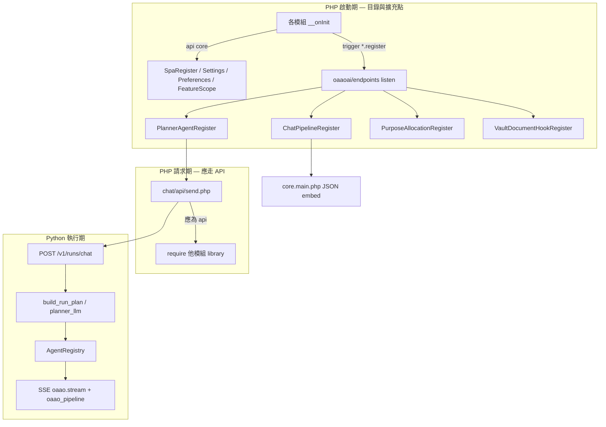
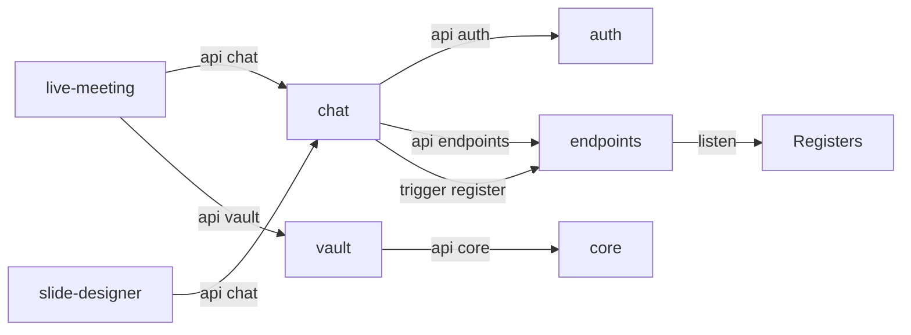

# oaao.ai-v1 — Hook & Register 架構審計報告

**日期**：2026-05-19  
**範圍**：`backbone/sites/oaaoai/oaaoai/**` + `python/oaao_orchestrator/**`（不含 `development-razy0.4/`、未追蹤的 `backbone/` 主幹檔）  
**審計原則**（已與產品方確認）：

- 模組之間**可以有關聯**，但關聯必須透過 **`package.php` 依賴聲明**、**`$this->api('模組')` 已發布命令**、或 **`trigger('*.register')` 事件**。
- **`require_once` 他模組 `library/` / `controller/` 實作** = 越界（應改為 API 回傳 DTO／服務介面）。
- **`core/default/library/*`** 視為 **平台 kernel**（TenantContext、PlatformProductGuard 等）；仍建議逐步改為 `api('core')` 以收斂邊界。

---

## 1. 執行摘要

| 維度 | 結論 |
|------|------|
| **Hook 機制** | 存在且一致：Razy **`$this->trigger('<event>')->resolve($payload)`** → **`oaaoai/endpoints`** 監聽 → 靜態 **`*Register` 類**。非獨立 Hook 框架。 |
| **執行期 Pipeline** | **Python orchestrator**（`execute_chat_run` / `AgentRegistry`）；PHP `ChatPipelineRegister` 主要為 **SPA UI 元資料**，不參與單次訊息業務執行。 |
| **跨模組隔離** | **大量 P0 違規**：`send.php`、`live-meeting`、`slide-designer`、`vault` 等直接 `require` 他模組 library。 |
| **已發布 Module API** | 僅 **5 個模組** 宣告 `addAPICommand`（auth、core、chat、endpoints、vault）；多數能力未透過 API 暴露。 |
| **安全性** | 多處 **`oaao_dev_shared_secret` 硬編碼 fallback**（應僅 dev 且強制 ENV）。 |
| **Hook 超時** | PHP Emitter **無** per-hook timeout；Python `_hook_before_llm` 為 **no-op**；agent 層有 try/except 但 **無統一 timeout/circuit breaker**。 |
| **測試** | Python 已有 **39** 個 `test_*.py`（pipeline phase0–5、planner、vault RAG）；**尚無**統一 `LLM_Mock`、**尚無** end-to-end CLI smoke（Message In → Out）。 |

**建議優先順序**：① 抽出 `oaaoai/orchestrator-bridge` + 補齊 Module API → ② 清理 `send.php` 跨模組 require → ③ Python mock LLM + pipeline smoke → ④ Register 文件化與 CI 違規掃描。

---

## 2. 架構模型（審計基線）



### 2.1 三種合法關聯

| 機制 | 回答的問題 | 消費者 |
|------|------------|--------|
| **`package.php` `require`** | 模組載入順序與依賴 | Razy bootstrap |
| **`trigger('*.register')`** | 啟動後**有什麼**（目錄） | `endpoints` → Register → `core.main` / `send.php` |
| **`$this->api('name')`** | 執行時**做什麼**（行為） | 其他模組 controller / closure |

---

## 3. 專案模組地圖

**Distributor**：`backbone/sites/oaaoai/dist.php`（greedy load 全模組）

| 模組 | `api_name` | 主要職責 |
|------|------------|----------|
| `oaaoai/auth` | `auth` | 登入、DB 適配器、`restrict` / `getUser` / `getDB*` |
| `oaaoai/endpoints` | `endpoints` | Canonical LLM endpoints、**事件總線**、purpose slots |
| `oaaoai/core` | `core` | SPA shell、`registerSpaPage` 等四 API、平台 kernel libs |
| `oaaoai/user` | `user` | Preferences、Settings（用戶管理） |
| `oaaoai/group` | `group` | 權限群組 Settings |
| `oaaoai/chat` | `chat` | 對話、**send**、planner/pipeline registry 種子 |
| `oaaoai/rag` | `rag` | RAG purpose、vault document hooks、pipeline UI |
| `oaaoai/vault` | `vault` | Vault SPA、文件 jobs、hook registry API |
| `oaaoai/slide-designer` | `slide_designer` | 模板、slide_designer agent、composer slots |
| `oaaoai/sandbox-coder` | `sandbox_coder` | planner agent `sandbox_code` 註冊 |
| `oaaoai/live-meeting` | `live_meeting` | Live ASR panel（**高耦合 chat/vault**） |
| `oaaoai/platform` | `platform` | 平台管理員 shell |

**Python**：`python/oaao_orchestrator/` — FastAPI、`run_executor.py`、`agents/registry.py`、`vault_graph_rag.py` 等。

---

## 4. Register 與 Hook 映射表

### 4.1 事件總線（唯一監聽點）

**檔案**：`backbone/sites/oaaoai/oaaoai/endpoints/default/controller/endpoints.php`

| 事件名稱 | Listener | 目標 Register |
|----------|----------|---------------|
| `purpose_allocation.register` | `event/purpose_allocation_register_listener` | `PurposeAllocationRegister` |
| `chat_pipeline.register` | `event/chat_pipeline_register_listener` | `ChatPipelineRegister` |
| `planner_agent.register` | `event/planner_agent_register_listener` | `PlannerAgentRegister` |
| `micro_skill_provider.register` | `event/micro_skill_provider_register_listener` | `MicroSkillsRegister` |
| `vault_document_hook.register` | `event/vault_document_hook_register_listener` | `VaultDocumentHookRegister` |

**注意**：Listener 內部 `require_once` 目標 Register 類（`chat/default/library/...`）屬 **endpoints 樞紐實作**，不視為功能模組越界；功能模組應只 `trigger`，不直接 `PlannerAgentRegister::add`（chat 種子除外，見 §4.3）。

### 4.2 Core Shell 註冊（`api('core')`）

**發布命令**（`core/default/controller/core.php`）：`registerSpaPage`、`registerSettingsSection`、`registerPreferencesSection`、`registerFeatureScope`。

| page_id / 類型 | 註冊模組 | Priority / sort | Action |
|----------------|----------|-----------------|--------|
| `workspace/chat` | core 種子 + chat | 10 | SPA panel `/chat/workspace-panel` + `chat-panel.js` |
| `workspace/vault` | core 種子 + vault | 20 | `/vault/workspace-panel` + `vault-panel.js` |
| `workspace/agents` | core 種子 + chat | 30 | agents catalog |
| `workspace/templates` | core 種子 + slide-designer | 40 | template gallery |
| `workspace/live-meeting` | core 種子 + live-meeting | 50 | live meeting panel |
| Settings: endpoints, purposes, … | core / endpoints / user / group / rag / chat | — | 管理員設定面板 |
| Preferences: chat, user, … | chat / user | — | 使用者偏好 |
| FeatureScope: conversation, vault, slide_template | chat / vault / slide-designer | — | tenant / workspace / personal |

### 4.3 `chat_pipeline.register`（UI / 元資料）

| entry_id | kind | 註冊模組 | Action | Priority |
|----------|------|----------|--------|----------|
| `cp.chat.milestone_vertical` | `step_rail` | chat | 垂直 milestone 時間軸（`oaao_pipeline.milestone`） | 10 |
| `cp.chat.markdown_stream` | `message_block` | chat | 主回答 markdown 區塊 | 20 |
| `cp.chat.task_files_cta` | `message_block` | chat | 任務檔案 CTA | 90 |
| `cp.chat.task_materials` | `message_block` | chat | Materials dialog ESM | 91 |
| `cp.rag.citations` 等 | `message_block` | rag | RAG 引用區塊 + `rag-citations.js` | 多筆 |
| `cp.slide_designer.preview_strip` | `message_block` | slide-designer | 投影片預覽 strip | 80 |
| `cp.slide_designer.template_import` | `composer_slot` | slide-designer | 模板匯入（legacy id） | 22 |

**生命週期對照**：此表**不等於** `on_message_received` / `pre_llm_call`；執行期見 §5。

### 4.4 `planner_agent.register`（規劃器／執行 agent 目錄）

| agent_kind | 註冊模組 | Action | Priority | 備註 |
|------------|----------|--------|----------|------|
| `vault_rag` | chat 種子 | 知識庫檢索 | 10 | Python `VaultRagAgent` 已實作 |
| `sandbox_code` | chat 種子 | 沙箱程式 | 20 | stub / partial |
| `slides` | chat 種子 | 舊簡報 stub | 30 | **deprecated** |
| `image_gen` | chat 種子 | 圖像生成 | 40 | stub |
| `web_search` | chat 種子 | 網路搜尋 | 50 | stub |
| `mcp_tool` | chat 種子 | MCP 工具 | 60 | stub |
| `slide_designer` | slide-designer | 簡報設計 | 25 | Python `SlideDesignerAgent` |
| `sandbox_code`（覆寫） | sandbox-coder | 同上 | — | 僅 register |

**消費路徑**：`send.php` → `agent_catalog` + `allowed_agents` → `ChatRunRequest` → `planner_llm` / `build_fast_chat_plan` → `AgentRegistry`。

### 4.5 `purpose_allocation.register`（LLM Purpose 槽）

| slot_id | 註冊模組 | purpose 前綴 |
|---------|----------|--------------|
| `pa-chat` | endpoints 種子 | `chat.*` |
| `pa-planning` | chat | `planning.*` |
| `pa-rag` / `pa-embedding` / … | rag | `rag.*`, `embedding.*`, … |
| `pa-slide-template` | slide-designer | `slide_template.*` |
| `pa-asr` / vault 相關 | vault | `asr.*`, `vault.*`, … |

### 4.6 `vault_document_hook.register`（文件管線）

| hook_id | kind | 註冊模組 | Action |
|---------|------|----------|--------|
| `vh.rag.audio_asr` | `audio_asr` | rag | 音訊 ASR |
| `vh.rag.document_embed` | `text_embed_rag` | rag | 嵌入 + RAG 索引 |
| `vh.rag.graph_index` | `graph_index` | rag | GraphRAG |
| `vh.vault.rerank_pass` | `text_rerank` | rag | Rerank |
| `vh.vault.summary` | `vault_summary` | rag | 摘要 |

**執行**：Vault job API → orchestrator vault workers（非 PHP SSE）。

### 4.7 已發布 Module API（`addAPICommand`）

| 模組 | 公開命令 | 用途 |
|------|----------|------|
| **auth** | `restrict`, `getUser`, `getUserId`, `getDB`, `getDBLocal`, `getDBSplit`, `ensureAdjunctSqliteLoaded`, `requireAdmin`, `loadModel`, … | 全域認證與 DB |
| **core** | `registerSpaPage`, `registerSettingsSection`, `registerPreferencesSection`, `registerFeatureScope` | Shell 註冊（任意 `oaaoai/*` 可調用） |
| **chat** | `getChatPipelineRegistry`, `getPlannerAgentRegistry` | 讀取 frozen registry |
| **endpoints** | `registerPurposeAllocationSlot`, `getPurposeAllocationSlots` | Purpose UI 槽 |
| **vault** | `getVaultDocumentHookRegistry` | Vault hook 目錄 |

**缺口**：無 `getOrchestratorClient`、`resolveVaultScope`、`getGlossary` 等 — 導致跨模組 `require`（§6）。

---

## 5. Chat Pipeline 執行生命週期（實際 vs 文件目標）

### 5.1 目標模型（`docs/backlog/chat-task-pipeline.md`）

`Run` → `Run Task`（checklist）→ `Agent` → `Agent Task`；工作 = **SSE Event payload**；Hook = 模組註冊 `task_type` / `agent_kind`。

### 5.2 現行實作（Python）

| 階段 | 位置 | 行為 |
|------|------|------|
| 請求入口 | `chat/api/send.php` | 組 `ChatRunRequest` payload，POST orchestrator |
| Pre-LLM hook | `app._hook_before_llm` | **No-op 占位** |
| 規劃 | `planner.build_run_plan` | `needs_multi_agent_turn` → LLM planner；否則 `build_fast_chat_plan` |
| 任務執行 | `run_executor.execute_chat_run` | 序列/部分並行 `RunTask`：`VAULT_RAG` → `ATTACHMENTS` → `LLM_STREAM` → agents |
| Agent | `AgentRegistry.run` | `vault_rag`, `slide_designer`, stubs |
| 串流 | `StreamEnvelope` | `oaao.stream`；UI 用 `oaao_pipeline` |
| Post-stream | `post_stream_pool` | IQS/ACCS 等（run 結束後） |

| 你提到的生命週期名 | 對應實作 |
|-------------------|----------|
| `on_message_received` | `send.php` 收到 POST（無獨立 hook 名） |
| `pre_llm_call` | `_hook_before_llm`（空） |
| `post_process` | `post_stream_pool` + `assistant_patch` / internal sync |

### 5.3 PHP 禁止長連線

Workspace 規則：瀏覽器 SSE/WS **僅** orchestrator；PHP 不得 `while(true)` flush。

---

## 6. 架構違規報告（跨模組 `require` 實作）

**嚴重度**：P0 = 應改 API；P1 = kernel/安裝耦合可接受但需文件化；P2 = 同模組內 require。

### 6.1 P0 — 功能模組直接拉他模組 library

| 來源模組 | 被拉取路徑 | 建議替代 |
|----------|------------|----------|
| **live-meeting** | `chat/.../OrchestratorInternalUrl.php`, `OrchestratorSidecarClient.php` | `api('chat')->…` 或新模組 **`oaaoai/orchestrator-bridge`** |
| **live-meeting** `session_start.php` | `chat/ChatVaultScope`, `ChatVaultRetrievalProfiles`, `vault/VaultGlossary`, `endpoints/AsrPurposeConfig` | `api('chat')->buildVaultSendContext()` 等 |
| **slide-designer** | `chat/OrchestratorInternalUrl`, `OrchestratorSidecarClient` | 同上 bridge |
| **chat** `send.php` | `vault/VaultGlossary`, `slide-designer/SlideTemplate*`, `endpoints/UiqePurposeConfig` | `api('vault')`, `api('slide_designer')`, `api('endpoints')` |
| **chat** `MicroSkillCatalog.php` | `slide-designer/SlideTemplate*`, `SlideOrchestrator` | `api('slide_designer')` |
| **chat** `skills_discover.php` | `slide-designer/SlideOrchestrator` | 同上 |
| **chat** `asr_transcribe.php` | `vault/VaultGlossary` | `api('vault')->getGlossary(...)` |
| **vault** `vault.php` | `chat/.../_workspace_membership.php` | `api('chat')->assertWorkspaceMember(...)` |
| **chat** `assistant_*` | `slide-designer/SlideProjectRegistry` | `api('slide_designer')` |

### 6.2 P1 — 平台 kernel（建議收斂，非立即刪除）

| 來源 | 路徑 | 說明 |
|------|------|------|
| 多模組 | `core/default/library/TenantContext.php` | 租戶上下文；建議 `api('core')->tenantContext()` |
| 多模組 | `core/PlatformProductGuard.php` | 產品守衛 |
| 多模組 | `core/UsageEventRepository.php` | 用量記錄 |
| auth / core | 互相 `require` schema install 腳本 | DB bootstrap 耦合 |

### 6.3 P1 — endpoints 樞紐 require Register 類

| 檔案 | 行為 | 判定 |
|------|------|------|
| `endpoints/.../chat_pipeline_register_listener.php` | require `ChatPipelineRegister` | **允許**（總線實作） |
| `endpoints/.../planner_agent_register_listener.php` | require `PlannerAgentRegister` | **允許** |

### 6.4 數據流／狀態違規風險

| 風險 | 位置 | 說明 |
|------|------|------|
| **就地 mutate messages** | `vault_rag` agent、`augment_chat_messages_for_vault_rag` | 修改 `ctx.messages` — 契約應文件化為 RunContext 欄位 |
| **前端全域狀態** | `chat-panel.js` 模組級 `let` | 單頁 SPA 可接受；多面板需 teardown 契約（已有 `teardownShellPanel`） |
| **無統一 Event Payload schema** | PHP `send` vs `ChatRunRequest` | 建議 JSON Schema / `docs/contracts/chat_run_request.json` |

### 6.5 直接調用 Core 內部（非 `api('core')`）

| 位置 | 行為 |
|------|------|
| `core.main.php` | 正確使用 `api('chat')`, `api('vault')`, `api('endpoints')` |
| 各模組 `registerSpaPage` | 正確使用 `api('core')` |

---

## 7. 第二階段：清理與安全（審計發現）

### 7.1 Legacy / Deprecated（建議清單，未自動刪除）

| 項目 | 位置 | 建議 |
|------|------|------|
| Planner agent `slides` | `chat.php` `oaao_chat_seed_planner_agents` | 已標 `deprecated`；確認無引用後移除 |
| `endpoints-settings/view.js` 等 | `core/.../endpoints-settings/*` | `@deprecated`，遷移後刪 |
| `SlideTemplateStorage` legacy path | `slide-designer/.../SlideTemplateStorage.php` | 註解 `@deprecated` |
| 外部 legacy 棧 | `docs/MIGRATION_LEGACY_OAAO.md` | 參考用，不在本 repo |

**未發現**：`v1_old`、`temp_*` 模組目錄；`temp_` 多為 i18n 鍵或 `tempnam()`。

### 7.2 硬編碼 Secret / 調試預設

| 檔案 | 問題 |
|------|------|
| `endpoints.php`, `send.php`, `ChatRunPrincipal.php`, `app.py`, `run_executor.py`, … | `OAAO_ORCH_SHARED_SECRET` 缺省為 `oaao_dev_shared_secret` |
| **建議** | 生產環境 **強制** ENV；dev 用 `.env.example` 文件化 |

**未發現**：硬編碼 `sk-*` API key 於 oaaoai 模組（`development-razy0.4` 內有歷史 Telegram key，**不在審計範圍**）。

### 7.3 Hook / Agent 韌性

| 層級 | 現狀 |
|------|------|
| PHP `trigger()->resolve` | 同步；無 timeout；listener 異常會中斷 `__onInit` |
| Python `AgentRegistry.run` | 未知 agent → `AgentResult(success=False)`；`vault_rag` 有 try/except |
| Python `execute_chat_run` | 多處 `except Exception` 吞掉或轉 error envelope；**無** per-task 超時 |
| `_hook_before_llm` | 占位，無隔離 |

**建議**：Python 為 `AgentRunner.run` 加 **`asyncio.wait_for`** 配置；規劃器失敗已 fallback `build_default_run_plan`。

### 7.4 Dirty Code（抽樣）

- `chat-panel.js` 體積大（8000+ 行）— 建議按 concern 拆模組（已部分 ESM）。
- `send.php` 單檔職責過多 — 建議抽 `ChatRunPayloadBuilder` service 類並透過 **chat 模組 API** 暴露給 live-meeting。

---

## 8. 第三階段：測試體系現狀與缺口

### 8.1 已有（`python/tests/`）

| 類別 | 檔案範例 |
|------|----------|
| Pipeline 模型 | `test_task_pipeline_phase0.py` … `phase5.py` |
| Planner | `test_fast_chat_planner.py`, `test_planner_agent_catalog.py` |
| Vault RAG | `test_vault_graph_rag_citations.py` |
| Live meeting | `test_live_meeting_*.py` |
| Slide | `test_slide_*.py`, `test_pptx_*.py` |

### 8.2 缺口（原任務要求）

| 項目 | 狀態 |
|------|------|
| **LLM_Mock** | 未統一；部分測試 mock 局部 HTTP |
| **Mock_Core 整合測** | 無 in-process 完整 Event 鏈 |
| **CLI Smoke** | 無 `Message In → Hook Chain → Response Out` 腳本 |
| **Hook 失敗降級測試** | 無專用「agent 拋錯仍完成 run」案例 |
| **PHP 層** | 無 PHPUnit；Register 合併無快照測試 |

**建議下一步**：新增 `python/tests/support/llm_mock.py`、`test_pipeline_smoke_cli.py`、`docs/Debug_Guide.md`（見產品 backlog）。

---

## 9. 重構清單（建議移除／新增）

### 9.1 建議新增

| 項目 | 說明 |
|------|------|
| **`oaaoai/orchestrator-bridge`**（或擴充 `chat` API） | 統一 sidecar URL、secret、postInternalJson |
| **`chat` API 擴充** | `buildOrchestratorRunPayload()`, `resolveVaultForWorkspace()` |
| **`vault` API 擴充** | `getGlossaryForWorkspace()` |
| **`docs/contracts/`** | `ChatRunRequest`、`StreamEnvelope` JSON Schema |
| **CI `scripts/audit_cross_module_requires.sh`** | rg `require_once dirname.*oaaoai/` 違規掃描 |

### 9.2 建議移除／合併（確認後）

| 項目 | 條件 |
|------|------|
| Deprecated planner `slides` | 無 catalog 引用 |
| 重複 `registerSpaPage`（core + 模組雙份） | 保留 core 種子，模組只更新 label |
| `cp.slide_designer.template_import` composer_slot | 文件已標 legacy |

### 9.3 不建議在審計階段直接改動

- 大規模 `send.php` 拆分（需回歸測試）。
- 刪除 `oaao_dev_shared_secret` fallback（破壞本地 dev 除非同步 `.env` 範本）。

---

## 10. 模組 API 關聯圖（目標狀態）



---

## 11. 附錄：審計方法

- 靜態掃描：`trigger(`, `addAPICommand`, `require_once dirname`, `registerSpaPage`。
- 對照：`core.php` 文件、`chat-task-pipeline.md`、`skills.md`（Razy）。
- Python：`agents/registry.py`、`run_executor.py`、`planner.py`。

---

## 12. 實作進度（2026-05-19）

### Phase 2 — 已完成（本輪）

| 項目 | 狀態 |
|------|------|
| `ChatOrchestratorApi` + `api('chat')` bridge 命令 | ✅ |
| `api('endpoints')` ASR / embedding / vault_rag 解析 | ✅ |
| `api('vault')` `getWorkspaceGlossary` | ✅ |
| `live-meeting` 改走 bridge（無 chat library require） | ✅ |
| `slide-designer` `SlideOrchestrator` 改走 `$chatApi` | ✅ |
| `endpoints` funasr / purposes_save 改走 bridge | ✅ |
| `vault` workspace gate 改 `api('chat')->userHasWorkspaceAccess` | ✅ |
| `send.php` / `agent_ask` / `cancel_run` 改 controller API | ✅ |

### Phase 2 — 第二輪（2026-05-19）

| 項目 | 狀態 |
|------|------|
| `send.php` glossary / vault profiles / slide template | ✅ `api('vault')` + `api('slide_designer')` |
| `MicroSkillCatalog` → slide-designer | ✅ `listBoundTemplateSkillsForPlanner` 等 |
| `ChatVaultRetrievalProfiles` | ✅ 移至 `vault/VaultRetrievalProfiles` + `api('vault')` |
| `workspace_glossary` / `asr_transcribe` glossary | ✅ `api('vault')` |
| `skills_discover` | ✅ `api('slide_designer')->discoverSkillsForPlanner` |

### Phase 2 — 第三輪（2026-05-19）

| 項目 | 狀態 |
|------|------|
| `ChatConversationMaterial` / `assistant_*` | ✅ `api('slide_designer')` |
| `send.php` endpoints 綁定 | ✅ `api('endpoints')`（含 UIQE / polish / ASR / RAG） |
| `SlideProjectMaterial.php` | ✅ slide 模組自有 library |

### Phase 3 — CI gate（2026-05-19）

| 項目 | 狀態 |
|------|------|
| `scripts/audit_cross_module_requires.sh --gate` | ✅ chat / live-meeting / slide-designer；允許 core + auth |
| `scripts/ci_check.sh` | ✅ gate + Python 契約測試 |
| `.github/workflows/oaao-ci.yml` | ✅ 嚴格 gate + pytest；full audit 為 informational |
| 修正 audit `grep -n` 誤判 core | ✅ |
| `endpoints` `resolveAllowedAgents` 改本地 library | ✅ 不再 require chat |

### Phase 4 — Full audit 歸零（2026-05-19）

| 項目 | 狀態 |
|------|------|
| `AuthSchemaBridge` + `core::__onReady` 註冊 auth DDL | ✅ |
| `api('auth')` `ensureTenantSchema` / `ensurePermissionGroupSchema` | ✅ |
| user / group / platform 改走 module API | ✅ |
| `scripts/audit_cross_module_requires.sh`（full） | ✅ 0 P0 |

### Phase 5 — Orchestrator + smoke（2026-05-19）

| 項目 | 狀態 |
|------|------|
| `python/oaao_orchestrator/` 納入 git | ✅ |
| CI `app:app` smoke + `OAAO_SMOKE_START_CHAT_RUN=1` | ✅ |
| `test_pipeline_hook_resilience` 嚴格 CI | ✅ |
| `SlideTemplateScope` → `api('core')` | ✅ |
| `requirements-orchestrator-app.txt` | ✅ 完整 app 依賴（CI smoke job） |

### Phase 6 — Python 側私有 import 與 Test_Suite 補強（2026-05-22）

本輪聚焦 **`python/oaao_orchestrator/`** 內的隔離違規，以及 UI 無關的 `Test_Suite/` 黑箱層補強。

#### 6.1 Python 跨模組私有 import 清單（新發現）

下列為**繞過模組公開 API**直接 import 他模組底線命名物件，違反「完全隔離」原則。建議依「根因抽公用」優先處理。

| # | 來源檔 | 私有目標 | 違規程度 | 修復建議 |
|---|--------|----------|----------|----------|
| P1 | `run_executor.py:186` | `vault_graph_rag._inject_system`, `_last_user_query` | 🔴 高 | `vault_graph_rag` 新增公開 `augment_vault_awareness_messages()`，封裝注入邏輯 |
| P1 | `run_executor.py:195` | `vault_graph_rag._query_wants_meeting_record` | 🔴 高 | 同上，併入公開函式 |
| P1 | `run_executor.py:216` | `vault_graph_rag._GROUNDING_RECORD_ZERO_HITS` | 🔴 高 | 移至公開 messages 模組或由公開 API 回傳 |
| P2 | `planner_llm.py:794, 975` | `planner._vault_rag_needed` | 🟡 中 | 改名為公開 `vault_rag_needed()` 或移入 `planner_llm` |
| P3 | `micro_skills/discover.py:9` | `planner_llm._extract_json_object` | 🟡 中（**根因**：散佈 7 檔） | 新增 `oaao_orchestrator/json_utils.py`，所有消費者統一 import |
| P3 | `slide_project/deck_style.py:10` | 同上 | 🟡 中 | 同上 |
| P3 | `slide_project/llm.py:10` | 同上 | 🟡 中 | 同上 |
| P3 | `slide_project/slot_content.py:635` | 同上 | 🟡 中 | 同上 |
| P3 | `slide_project/template_analyzer.py:10` | 同上 | 🟡 中 | 同上 |
| P3 | `slide_project/template_micro_skills.py:16` | 同上 | 🟡 中 | 同上 |
| P3 | `slide_project/template_slot_plan.py:523` | 同上 | 🟡 中 | 同上 |
| P4 | `asr_funasr.py:14` | `asr_common._audio_mime_for_path` | 🟢 低 | 去掉底線（已多模組共用） |
| P5 | `plugins/builtins/iqs.py:7` | `plugins.post_stream_runner.run_scoring_plugin` | 🟢 低 | 註記為 builtins 共用 helper 即可；非真正跨模組 |
| P5 | `plugins/builtins/accs.py:7` | 同上 | 🟢 低 | 同上 |

**統計**：14 項；其中 1 根因（`_extract_json_object`）佔 7 項 — **優先修這項即可消除 50%**。

#### 6.2 Hook 韌性現狀與建議

| 層 | 現狀 | 改進 |
|---|---|---|
| `QueuePool._worker_loop` | ✅ 已 `try/except` 包覆 `plugin.run`（[queue_pool.py:77](../python/oaao_orchestrator/queue_pool.py)） | 加 per-job timeout（`asyncio.wait_for`） |
| `run_executor` agent dispatch | ✅ try/except 包覆三處 `get_agent_registry().run()`（行 522–545、609–657、~736） | 加 per-agent timeout；timeout 後 emit `KIND_ERROR` envelope |
| `AgentRegistry.run` | 已知 agent 例外**會 propagate**（見 `test_pipeline_hook_resilience.py`） | 視為設計：registry 不吞錯，executor 必須 catch；應在 `Test_Suite/resilience/` 持續驗證 |
| `_hook_before_llm` | 占位 no-op（[app.py:4](../python/oaao_orchestrator/app.py) docstring） | 若未來啟用，必須加 timeout |

#### 6.3 安全性確認（單一新發現）

| 位置 | 風險 | 建議 |
|---|---|---|
| `run_executor.py:1118` | `secret = os.environ.get("OAAO_ORCH_SHARED_SECRET", "oaao_dev_shared_secret").strip()` — 若 ENV 未設則用弱預設值簽發 internal sync token | 上線 gate：缺 ENV 直接 `raise RuntimeError`；dev 透過 `.env.example` 文件化（呼應 §7.2） |

`grep` 全 `python/` 無 `sk-*`、`Bearer eyJ`、`AKIA`、`AIza` 等真實憑證樣式。

#### 6.4 Dirty Code（建議只記錄、不在審計輪動手）

| 位置 | 行為 | 建議 |
|---|---|---|
| `run_executor.py:890–920` | LLM stream chunk 解析 6 層巢狀（已被 try/except 包覆） | 抽 `_parse_llm_stream_chunk()` 供單測 |
| `chat-panel.js`（PHP 側） | 單檔 8000+ 行（已知） | 持續按 concern 切 ESM |

#### 6.5 Test_Suite/ 補強（本輪交付）

`Test_Suite/` 不取代既有 `python/tests/`；它是 **無 UI、CLI 可獨立執行** 的黑箱 + 韌性層：

```
Test_Suite/
├── README.md             # 入口（已有 → 本輪更新）
├── conftest.py           # 共用 fixture：reset registries、tmp pool
├── mocks/
│   ├── __init__.py
│   ├── llm_mock.py       # re-export python/tests/support/llm_mock 避免雙份
│   └── mock_core.py      # StreamRun + RunContext harness
├── integration/
│   └── test_pipeline_event_flow.py   # Hook A payload → Hook B
├── smoke/
│   ├── __init__.py
│   ├── cli_smoke.py                  # python -m Test_Suite.smoke.cli_smoke "hello"
│   └── test_smoke_message_in_out.py
└── resilience/
    ├── __init__.py
    ├── test_hook_exception_isolation.py
    └── test_unknown_agent_kind.py
```

執行：

```bash
cd oaao.ai-v1/python
python -m pytest ../Test_Suite -q
python -m Test_Suite.smoke.cli_smoke "你好，介紹一下 oaao"
```

詳細指令、tracing 開關、失敗訊息對照 → [Debug_Guide.md §9](./Debug_Guide.md)。

---

## Phase 7 — GB10 UMA 部署、Circuit Breaker、Hot-plug Skills、ToT/DDTree 缺口（2026-05-23）

> 本階段為**規劃 + 規範**章節（annotate-only），不對 production 代碼做刪改。所有「待移除」清單於 §7.7 集中列出，等對應替代品落地後才執行 deletion PR。
> 配合文件：[Evolution_System_Design.md](./Evolution_System_Design.md)、[Manus_Gap_Analysis.md](./Manus_Gap_Analysis.md)。

### 7.1 Hook & Register Hard-Rule（強化）

| 規則 ID | 規則 | 違規處罰 |
|---|---|---|
| HR-1 | 任一 Module 必須**只**透過 `purpose_allocation.register` / `agent_factories.register` / `post_stream_plugin.register` / `micro_skill.register` 四條軸註冊；禁止 `from oaao_orchestrator.<mod> import <_underscore_name>` | CI 阻擋（`scripts/sandbox_check.sh` 已含 import lint） |
| HR-2 | 跨模組共享狀態必須走 `RunContext.extra` 或 `StreamRun.events`，**禁止**改 module-level dict／singleton | grep `^[A-Z_]+\s*=\s*\{` 報警 |
| HR-3 | 任一 Hook 內的 `await` 必須有 timeout 包裝（直接或經 `circuit_breaker` decorator）| `Test_Suite/perf/test_circuit_breaker_opens.py` 凍結契約 |
| HR-4 | 新 agent / plugin / skill **必須**在 `default_*_factories()` 中加註冊；CI 抽查 `pytest -k registered` 驗證 | 同 HR-1 |

**Phase 6 已知 14 處違規仍未修**（見 §6.1）— 計畫在 Phase 8 集中修復；Phase 7 只凍結規範，不改碼。

### 7.2 GB10 128GB UMA 部署規格

#### 兩台機分工（Tiered Routing）

> 兩台均支援運行所有列名模型；分工為**負載策略**，非硬體約束。

| Box | 角色 | 常駐模型 | KV 池 | Burst |
|---|---|---|---:|---:|
| **Box 1** Heavy | 深推理 + Reflection + ToT/DDTree | Gemma 4 31B IT (FP8, 32GB) + Gemma 4 E4B IT (FP16, 5GB) | 40 GB | 20 GB |
| **Box 2** Throughput | 高 QPS chat + ASR + RAG | Gemma 4 26B-A4B MoE (FP8, 28GB) + Gemma 4 E4B (5GB) + Qwen ASR 1.7B (3GB) + bge-m3 (2.5GB) + bge-reranker-v2-m3 (2.5GB) | 40 GB | 22 GB |

每台 OS + Razy + sidecar + 安全墊預留 **22–27 GB**。完整切割表見 [Evolution_System_Design.md §3](./Evolution_System_Design.md#3-gb10-uma-記憶體切割)。

#### Lane Selector 路由規則

| 條件 | 路由 |
|---|---|
| `purpose_id ∈ {asr, voice_chat}` | Box 2（ASR 駐留） |
| `purpose_id ∈ {rag, vault_search, document_qa}` | Box 2（bge-m3 + reranker） |
| `mode_id ∈ {tot, ddtree}` 或 IQS 預測複雜度 ≥ 0.7 | Box 1（31B + Reflection） |
| `len(messages[-1].content) < 256` 且 IQS < 0.5 | Box 2（MoE 吞吐優勢） |
| 預設 | Box 2 |
| 任一 Box health-fail | fallback 對側並自動降級（ToT/DDTree → default） |

**實作位置**：擴張 Razy `purpose_allocation` PurposeConfig 加 `base_urls[]` + `routing_policy`；Python 側只動 `endpoint.py::pick_base_url(policy, ctx)`。**不引入新 router 層**。

### 7.3 Circuit Breaker 設計（強制）

新建 `python/oaao_orchestrator/safety/circuit_breaker.py`（Phase 8 落地，本階段定 spec）：

```python
@circuit_breaker(
    name="accs_eval",
    failure_threshold=3,   # 連續失敗次數
    reset_timeout=600.0,   # open 後 10 分鐘進 half-open
    call_timeout=8.0,      # 單次 await 上限
)
async def evaluate_accs(...): ...
```

| 狀態 | 行為 |
|---|---|
| `closed` | 正常呼叫；失敗計數累計 |
| `open` | 立刻 raise `BreakerOpen`；上層 catch 後採取降級 |
| `half_open` | 放一個探測請求；成功 → `closed`，失敗 → `open` |

**強制套用點**：

| Hook | 降級行為 |
|---|---|
| `evaluation.iqs` | open → 跳過澄清，標記 `iqs_skipped=True` 進 metrics |
| `evaluation.accs` | open → 不評分，輸出直接 ship；標記 `accs_skipped=True` |
| `reflection.main` | open → 用第一輪輸出；標記 `reflection_skipped=True` |
| `vault_rag`（既有）| open → 跳過檢索，僅用 user message + glossary |
| 任一 agent_kind | timeout → AgentResult(success=False, error="timeout:agent_kind") |

Test_Suite 凍結契約：`Test_Suite/perf/test_circuit_breaker_opens.py`。

### 7.4 Hot-plug Skills（對標 OpenWebUI Tools）

| 軸 | 現況 | 缺口 | Phase 7 規範 |
|---|---|---|---|
| Skill 註冊 | `catalog_from_request()` per-request；MicroSkill protocol 已存在 | Skill 寫死在 Python；無「熱插拔」入口 | 新 purpose `skills.dynamic`，PHP 側 `Skills Manager` 維護 JSON manifest |
| LLM Function Call | 已有 `tools` 欄位透傳 endpoint | 沒有「自動把已註冊 Skill 轉成 OpenAI tools schema」轉換器 | 規範 `skill_to_openai_tool(MicroSkill) -> dict`，由 `prompt_builder` 自動注入 |
| Skill 自我沉澱 | ❌ 無 | CoT → Skill 流程未實作 | §7.5 規格 |

實作放 Phase 9（功能性 PR），本階段只列規範。

### 7.5 Skill 自我沉澱（Crystallization）

當 ACCS ≥ 0.85 且該對話包含 ≥ 2 個 agent 步驟，後台任務（post-stream）將該 CoT 序列化為一個 `CrystallizedSkill`：

| 欄位 | 內容 |
|---|---|
| `id` | hash(planner_output + final_answer) |
| `trigger_intent` | E4B 從 user message 萃取的意圖摘要 |
| `tool_chain` | `[agent_kind, agent_kind, ...]` |
| `param_template` | 從 RunTaskSpec 提煉的參數模板 |
| `success_score` | 來自 ACCS |
| `usage_count` | 累計被引用次數（後續對話命中時 +1）|

**雙寫儲存**（依你要求）：
1. **既有 Vault** Qdrant collection（embedding = `trigger_intent`，做相似命中召回）
2. **新建獨立 `crystallized_skills` Arango collection**（結構化查詢、usage_count 累計、淘汰策略）

下次同類問題到來時，IQS 階段順帶查 Vault → 命中則把 `tool_chain` 直接餵給 planner，跳過動態規劃。

### 7.6 ToT / DDTree 規格（占位填實）

| mode_id | Planner 行為 | 涉及 purpose | Box | 預估延遲（vs default） |
|---|---|---|---|---|
| `default` | 既有 stub / llm planner | `planning` (E4B) | 進來那台 | 1.0× |
| `tot` | E4B 出 N=3 candidate plan → 31B 依序執行 → ACCS 選 best → 回 user | `planning` + `reflection.main` + `evaluation.accs` | Box 1 | 2.5× |
| `ddtree` | E4B 出 root question + 3 子問 → 逐層 expand 至深度 ≤ 3，每層 IQS 過濾 | `planning` + `evaluation.iqs` | Box 1 | 3.0× |

實作面：**只動 `planner_llm.py` 加 if-elif 分支**，不動 executor、不動 agent registry，仍守 Hook 隔離。Test_Suite 將為兩種 mode 各加一個 integration test（Phase 8）。

### 7.7 待移除清單（annotate-only）

> 列出但**不執行**；對應替代品落地後另開 deletion PR。

| ID | 路徑 | 為何要移除 | 替代品（落地後才刪）|
|---|---|---|---|
| RM-1 | `run_executor.py:1118` `oaao_dev_shared_secret` 環境變數 fallback | 硬編碼 dev secret，違反 OWASP A05 | 改用 `OAAO_DEV_SECRET_ENV_NAME` 純間接引用 |
| RM-2 | §6.1 列出的 14 處 `from oaao_orchestrator.X import _Y` 私有 import | 違反 HR-1 | 對應模組各自暴露公開 helper |
| RM-3 | `archived/oaao-hub/` 整個目錄 | 已被 oaao.ai-v1 完全取代 | N/A（直接刪）|
| RM-4 | `oaao.ai-v1-temp/` | 開發暫存副本 | N/A（直接刪，但需先 diff 確認無 unsaved 改動）|
| RM-5 | `python/tests/support/llm_mock.py` 的舊 `LegacyLlmMock` shim（若存在）| Phase 6 後 Test_Suite 已直接用主類 | 等 Phase 8 開始刪 |

執行順序：**RM-3 / RM-4 可立即刪**（archived 目錄），其餘等 Phase 8。

### 7.8 GB10 效能優化建議

| 項 | 建議 |
|---|---|
| vLLM 多模型 | 單進程 `--served-model-name main,coach`；UMA 下 KV 池共享 |
| KV 池上限 | 設 `--gpu-memory-utilization 0.85`（≈40GB on 128GB）；不設 0.95 留 burst 空間 |
| Page size | `--block-size 32`（MoE 友好）|
| Prefix caching | 開（chat history 大量重複） |
| FP8 / INT4 | Box 1 31B 走 FP8（tensor core）；Box 2 26B-A4B 走 FP8（MoE 友好）；ASR 走 INT8 |
| Speculative Decoding | E4B 當 31B 的 draft model（Box 1）；可省 ≈25% latency |
| 監控 | Prometheus exporter 抓 `vllm_kv_cache_usage_perc`、`vllm_num_requests_running`、CPU/GPU SM utilization |

### 7.9 Phase 7 完成條件（DoD）

- [x] §7.1–§7.8 規範定稿、向 [Evolution_System_Design.md](./Evolution_System_Design.md) 與 [Manus_Gap_Analysis.md](./Manus_Gap_Analysis.md) 對齊
- [x] Test_Suite/perf/ 與 Test_Suite/evolution/ 凍結契約測試落地
- [ ] Phase 8 落地 Circuit Breaker（`safety/circuit_breaker.py`）
- [ ] Phase 8 落地 IQS/ACCS Hook（`evaluation/iqs.py`, `evaluation/accs.py`）
- [ ] Phase 9 落地 Hot-plug Skills + Skill 自我沉澱
- [ ] Phase 10 落地兩台機 LB（Razy purpose_allocation 擴張）

---

*Phase 7 新增 GB10 UMA 部署規格、Circuit Breaker、Hot-plug Skills、ToT/DDTree、Skill Crystallization 規範；對應實作分批進入 Phase 8–10。*

