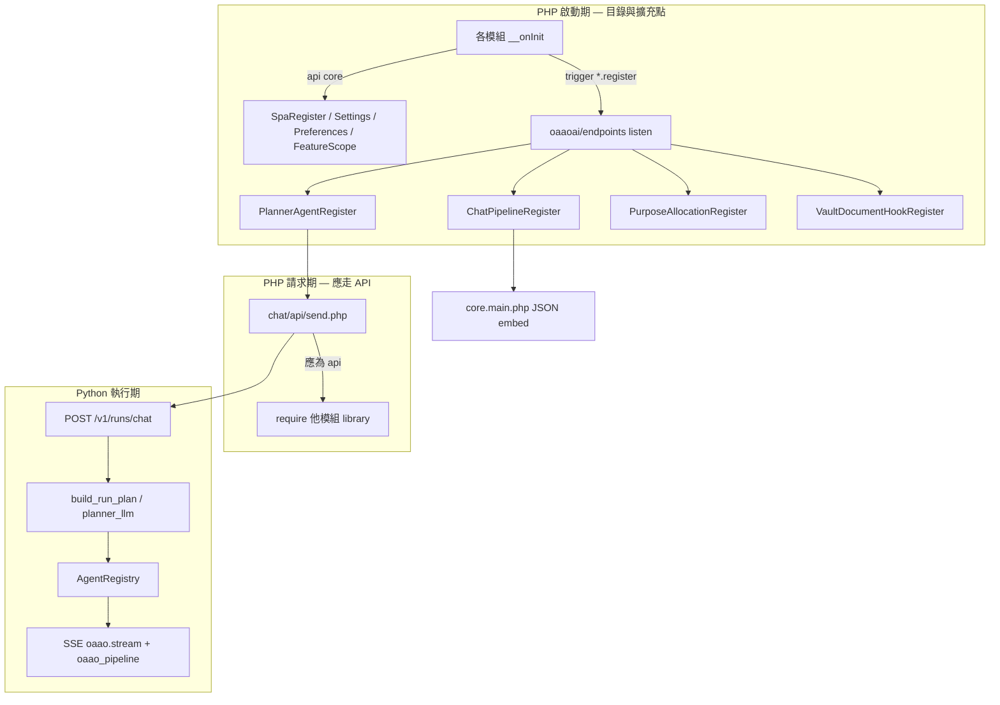
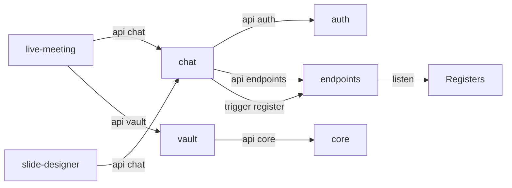

# oaao.ai-v1 — Hook & Register 架構審計報告

**日期**：2026-05-19  
**範圍**：`backbone/sites/oaaoai/oaaoai/**` + `python/oaao_orchestrator/**`（不含 `development-razy0.4/`、未追蹤的 `backbone/` 主幹檔）  
**審計原則**（已與產品方確認）：

- 模組之間**可以有關聯**，但關聯必須透過 **`package.php` 依賴聲明**、**`$this->api('模組')` 已發布命令**、或 **`trigger('*.register')` 事件**。
- **`require_once` 他模組 `library/` / `controller/` 實作** = 越界（應改為 API 回傳 DTO／服務介面）。
- **`core/default/library/*`** 視為 **平台 kernel**（TenantContext、PlatformProductGuard 等）；仍建議逐步改為 `api('core')` 以收斂邊界。

---

## 1. 執行摘要

| 維度 | 結論 |
|------|------|
| **Hook 機制** | 存在且一致：Razy **`$this->trigger('<event>')->resolve($payload)`** → **`oaaoai/endpoints`** 監聽 → 靜態 **`*Register` 類**。非獨立 Hook 框架。 |
| **執行期 Pipeline** | **Python orchestrator**（`execute_chat_run` / `AgentRegistry`）；PHP `ChatPipelineRegister` 主要為 **SPA UI 元資料**，不參與單次訊息業務執行。 |
| **跨模組隔離** | **大量 P0 違規**：`send.php`、`live-meeting`、`slide-designer`、`vault` 等直接 `require` 他模組 library。 |
| **已發布 Module API** | 僅 **5 個模組** 宣告 `addAPICommand`（auth、core、chat、endpoints、vault）；多數能力未透過 API 暴露。 |
| **安全性** | 多處 **`oaao_dev_shared_secret` 硬編碼 fallback**（應僅 dev 且強制 ENV）。 |
| **Hook 超時** | PHP Emitter **無** per-hook timeout；Python `_hook_before_llm` 為 **no-op**；agent 層有 try/except 但 **無統一 timeout/circuit breaker**。 |
| **測試** | Python 已有 **39** 個 `test_*.py`（pipeline phase0–5、planner、vault RAG）；**尚無**統一 `LLM_Mock`、**尚無** end-to-end CLI smoke（Message In → Out）。 |

**建議優先順序**：① 抽出 `oaaoai/orchestrator-bridge` + 補齊 Module API → ② 清理 `send.php` 跨模組 require → ③ Python mock LLM + pipeline smoke → ④ Register 文件化與 CI 違規掃描。

---

## 2. 架構模型（審計基線）

### 2.1 三種合法關聯

| 機制 | 回答的問題 | 消費者 |
|------|------------|--------|
| **`package.php` `require`** | 模組載入順序與依賴 | Razy bootstrap |
| **`trigger('*.register')`** | 啟動後**有什麼**（目錄） | `endpoints` → Register → `core.main` / `send.php` |
| **`$this->api('name')`** | 執行時**做什麼**（行為） | 其他模組 controller / closure |

---

## 3. 專案模組地圖

**Distributor**：`backbone/sites/oaaoai/dist.php`（greedy load 全模組）

| 模組 | `api_name` | 主要職責 |
|------|------------|----------|
| `oaaoai/auth` | `auth` | 登入、DB 適配器、`restrict` / `getUser` / `getDB*` |
| `oaaoai/endpoints` | `endpoints` | Canonical LLM endpoints、**事件總線**、purpose slots |
| `oaaoai/core` | `core` | SPA shell、`registerSpaPage` 等四 API、平台 kernel libs |
| `oaaoai/user` | `user` | Preferences、Settings（用戶管理） |
| `oaaoai/group` | `group` | 權限群組 Settings |
| `oaaoai/chat` | `chat` | 對話、**send**、planner/pipeline registry 種子 |
| `oaaoai/rag` | `rag` | RAG purpose、vault document hooks、pipeline UI |
| `oaaoai/vault` | `vault` | Vault SPA、文件 jobs、hook registry API |
| `oaaoai/slide-designer` | `slide_designer` | 模板、slide_designer agent、composer slots |
| `oaaoai/sandbox-coder` | `sandbox_coder` | planner agent `sandbox_code` 註冊 |
| `oaaoai/live-meeting` | `live_meeting` | Live ASR panel（**高耦合 chat/vault**） |
| `oaaoai/platform` | `platform` | 平台管理員 shell |

**Python**：`python/oaao_orchestrator/` — FastAPI、`run_executor.py`、`agents/registry.py`、`vault_graph_rag.py` 等。

---

## 4. Register 與 Hook 映射表

### 4.1 事件總線（唯一監聽點）

**檔案**：`backbone/sites/oaaoai/oaaoai/endpoints/default/controller/endpoints.php`

| 事件名稱 | Listener | 目標 Register |
|----------|----------|---------------|
| `purpose_allocation.register` | `event/purpose_allocation_register_listener` | `PurposeAllocationRegister` |
| `chat_pipeline.register` | `event/chat_pipeline_register_listener` | `ChatPipelineRegister` |
| `planner_agent.register` | `event/planner_agent_register_listener` | `PlannerAgentRegister` |
| `micro_skill_provider.register` | `event/micro_skill_provider_register_listener` | `MicroSkillsRegister` |
| `vault_document_hook.register` | `event/vault_document_hook_register_listener` | `VaultDocumentHookRegister` |

**注意**：Listener 內部 `require_once` 目標 Register 類（`chat/default/library/...`）屬 **endpoints 樞紐實作**，不視為功能模組越界；功能模組應只 `trigger`，不直接 `PlannerAgentRegister::add`（chat 種子除外，見 §4.3）。

### 4.2 Core Shell 註冊（`api('core')`）

**發布命令**（`core/default/controller/core.php`）：`registerSpaPage`、`registerSettingsSection`、`registerPreferencesSection`、`registerFeatureScope`。

| page_id / 類型 | 註冊模組 | Priority / sort | Action |
|----------------|----------|-----------------|--------|
| `workspace/chat` | core 種子 + chat | 10 | SPA panel `/chat/workspace-panel` + `chat-panel.js` |
| `workspace/vault` | core 種子 + vault | 20 | `/vault/workspace-panel` + `vault-panel.js` |
| `workspace/agents` | core 種子 + chat | 30 | agents catalog |
| `workspace/templates` | core 種子 + slide-designer | 40 | template gallery |
| `workspace/live-meeting` | core 種子 + live-meeting | 50 | live meeting panel |
| Settings: endpoints, purposes, … | core / endpoints / user / group / rag / chat | — | 管理員設定面板 |
| Preferences: chat, user, … | chat / user | — | 使用者偏好 |
| FeatureScope: conversation, vault, slide_template | chat / vault / slide-designer | — | tenant / workspace / personal |

### 4.3 `chat_pipeline.register`（UI / 元資料）

| entry_id | kind | 註冊模組 | Action | Priority |
|----------|------|----------|--------|----------|
| `cp.chat.milestone_vertical` | `step_rail` | chat | 垂直 milestone 時間軸（`oaao_pipeline.milestone`） | 10 |
| `cp.chat.markdown_stream` | `message_block` | chat | 主回答 markdown 區塊 | 20 |
| `cp.chat.task_files_cta` | `message_block` | chat | 任務檔案 CTA | 90 |
| `cp.chat.task_materials` | `message_block` | chat | Materials dialog ESM | 91 |
| `cp.rag.citations` 等 | `message_block` | rag | RAG 引用區塊 + `rag-citations.js` | 多筆 |
| `cp.slide_designer.preview_strip` | `message_block` | slide-designer | 投影片預覽 strip | 80 |
| `cp.slide_designer.template_import` | `composer_slot` | slide-designer | 模板匯入（legacy id） | 22 |

**生命週期對照**：此表**不等於** `on_message_received` / `pre_llm_call`；執行期見 §5。

### 4.4 `planner_agent.register`（規劃器／執行 agent 目錄）

| agent_kind | 註冊模組 | Action | Priority | 備註 |
|------------|----------|--------|----------|------|
| `vault_rag` | chat 種子 | 知識庫檢索 | 10 | Python `VaultRagAgent` 已實作 |
| `sandbox_code` | chat 種子 | 沙箱程式 | 20 | stub / partial |
| `slides` | chat 種子 | 舊簡報 stub | 30 | **deprecated** |
| `image_gen` | chat 種子 | 圖像生成 | 40 | stub |
| `web_search` | chat 種子 | 網路搜尋 | 50 | stub |
| `mcp_tool` | chat 種子 | MCP 工具 | 60 | stub |
| `slide_designer` | slide-designer | 簡報設計 | 25 | Python `SlideDesignerAgent` |
| `sandbox_code`（覆寫） | sandbox-coder | 同上 | — | 僅 register |

**消費路徑**：`send.php` → `agent_catalog` + `allowed_agents` → `ChatRunRequest` → `planner_llm` / `build_fast_chat_plan` → `AgentRegistry`。

### 4.5 `purpose_allocation.register`（LLM Purpose 槽）

| slot_id | 註冊模組 | purpose 前綴 |
|---------|----------|--------------|
| `pa-chat` | endpoints 種子 | `chat.*` |
| `pa-planning` | chat | `planning.*` |
| `pa-rag` / `pa-embedding` / … | rag | `rag.*`, `embedding.*`, … |
| `pa-slide-template` | slide-designer | `slide_template.*` |
| `pa-asr` / vault 相關 | vault | `asr.*`, `vault.*`, … |

### 4.6 `vault_document_hook.register`（文件管線）

| hook_id | kind | 註冊模組 | Action |
|---------|------|----------|--------|
| `vh.rag.audio_asr` | `audio_asr` | rag | 音訊 ASR |
| `vh.rag.document_embed` | `text_embed_rag` | rag | 嵌入 + RAG 索引 |
| `vh.rag.graph_index` | `graph_index` | rag | GraphRAG |
| `vh.vault.rerank_pass` | `text_rerank` | rag | Rerank |
| `vh.vault.summary` | `vault_summary` | rag | 摘要 |

**執行**：Vault job API → orchestrator vault workers（非 PHP SSE）。

### 4.7 已發布 Module API（`addAPICommand`）

| 模組 | 公開命令 | 用途 |
|------|----------|------|
| **auth** | `restrict`, `getUser`, `getUserId`, `getDB`, `getDBLocal`, `getDBSplit`, `ensureAdjunctSqliteLoaded`, `requireAdmin`, `loadModel`, … | 全域認證與 DB |
| **core** | `registerSpaPage`, `registerSettingsSection`, `registerPreferencesSection`, `registerFeatureScope` | Shell 註冊（任意 `oaaoai/*` 可調用） |
| **chat** | `getChatPipelineRegistry`, `getPlannerAgentRegistry` | 讀取 frozen registry |
| **endpoints** | `registerPurposeAllocationSlot`, `getPurposeAllocationSlots` | Purpose UI 槽 |
| **vault** | `getVaultDocumentHookRegistry` | Vault hook 目錄 |

**缺口**：無 `getOrchestratorClient`、`resolveVaultScope`、`getGlossary` 等 — 導致跨模組 `require`（§6）。

---

## 5. Chat Pipeline 執行生命週期（實際 vs 文件目標）

### 5.1 目標模型（`docs/backlog/chat-task-pipeline.md`）

`Run` → `Run Task`（checklist）→ `Agent` → `Agent Task`；工作 = **SSE Event payload**；Hook = 模組註冊 `task_type` / `agent_kind`。

### 5.2 現行實作（Python）

| 階段 | 位置 | 行為 |
|------|------|------|
| 請求入口 | `chat/api/send.php` | 組 `ChatRunRequest` payload，POST orchestrator |
| Pre-LLM hook | `app._hook_before_llm` | **No-op 占位** |
| 規劃 | `planner.build_run_plan` | `needs_multi_agent_turn` → LLM planner；否則 `build_fast_chat_plan` |
| 任務執行 | `run_executor.execute_chat_run` | 序列/部分並行 `RunTask`：`VAULT_RAG` → `ATTACHMENTS` → `LLM_STREAM` → agents |
| Agent | `AgentRegistry.run` | `vault_rag`, `slide_designer`, stubs |
| 串流 | `StreamEnvelope` | `oaao.stream`；UI 用 `oaao_pipeline` |
| Post-stream | `post_stream_pool` | IQS/ACCS 等（run 結束後） |

| 你提到的生命週期名 | 對應實作 |
|-------------------|----------|
| `on_message_received` | `send.php` 收到 POST（無獨立 hook 名） |
| `pre_llm_call` | `_hook_before_llm`（空） |
| `post_process` | `post_stream_pool` + `assistant_patch` / internal sync |

### 5.3 PHP 禁止長連線

Workspace 規則：瀏覽器 SSE/WS **僅** orchestrator；PHP 不得 `while(true)` flush。

---

## 6. 架構違規報告（跨模組 `require` 實作）

**嚴重度**：P0 = 應改 API；P1 = kernel/安裝耦合可接受但需文件化；P2 = 同模組內 require。

### 6.1 P0 — 功能模組直接拉他模組 library

| 來源模組 | 被拉取路徑 | 建議替代 |
|----------|------------|----------|
| **live-meeting** | `chat/.../OrchestratorInternalUrl.php`, `OrchestratorSidecarClient.php` | `api('chat')->…` 或新模組 **`oaaoai/orchestrator-bridge`** |
| **live-meeting** `session_start.php` | `chat/ChatVaultScope`, `ChatVaultRetrievalProfiles`, `vault/VaultGlossary`, `endpoints/AsrPurposeConfig` | `api('chat')->buildVaultSendContext()` 等 |
| **slide-designer** | `chat/OrchestratorInternalUrl`, `OrchestratorSidecarClient` | 同上 bridge |
| **chat** `send.php` | `vault/VaultGlossary`, `slide-designer/SlideTemplate*`, `endpoints/UiqePurposeConfig` | `api('vault')`, `api('slide_designer')`, `api('endpoints')` |
| **chat** `MicroSkillCatalog.php` | `slide-designer/SlideTemplate*`, `SlideOrchestrator` | `api('slide_designer')` |
| **chat** `skills_discover.php` | `slide-designer/SlideOrchestrator` | 同上 |
| **chat** `asr_transcribe.php` | `vault/VaultGlossary` | `api('vault')->getGlossary(...)` |
| **vault** `vault.php` | `chat/.../_workspace_membership.php` | `api('chat')->assertWorkspaceMember(...)` |
| **chat** `assistant_*` | `slide-designer/SlideProjectRegistry` | `api('slide_designer')` |

### 6.2 P1 — 平台 kernel（建議收斂，非立即刪除）

| 來源 | 路徑 | 說明 |
|------|------|------|
| 多模組 | `core/default/library/TenantContext.php` | 租戶上下文；建議 `api('core')->tenantContext()` |
| 多模組 | `core/PlatformProductGuard.php` | 產品守衛 |
| 多模組 | `core/UsageEventRepository.php` | 用量記錄 |
| auth / core | 互相 `require` schema install 腳本 | DB bootstrap 耦合 |

### 6.3 P1 — endpoints 樞紐 require Register 類

| 檔案 | 行為 | 判定 |
|------|------|------|
| `endpoints/.../chat_pipeline_register_listener.php` | require `ChatPipelineRegister` | **允許**（總線實作） |
| `endpoints/.../planner_agent_register_listener.php` | require `PlannerAgentRegister` | **允許** |

### 6.4 數據流／狀態違規風險

| 風險 | 位置 | 說明 |
|------|------|------|
| **就地 mutate messages** | `vault_rag` agent、`augment_chat_messages_for_vault_rag` | 修改 `ctx.messages` — 契約應文件化為 RunContext 欄位 |
| **前端全域狀態** | `chat-panel.js` 模組級 `let` | 單頁 SPA 可接受；多面板需 teardown 契約（已有 `teardownShellPanel`） |
| **無統一 Event Payload schema** | PHP `send` vs `ChatRunRequest` | 建議 JSON Schema / `docs/contracts/chat_run_request.json` |

### 6.5 直接調用 Core 內部（非 `api('core')`）

| 位置 | 行為 |
|------|------|
| `core.main.php` | 正確使用 `api('chat')`, `api('vault')`, `api('endpoints')` |
| 各模組 `registerSpaPage` | 正確使用 `api('core')` |

---

## 7. 第二階段：清理與安全（審計發現）

### 7.1 Legacy / Deprecated（建議清單，未自動刪除）

| 項目 | 位置 | 建議 |
|------|------|------|
| Planner agent `slides` | `chat.php` `oaao_chat_seed_planner_agents` | 已標 `deprecated`；確認無引用後移除 |
| `endpoints-settings/view.js` 等 | `core/.../endpoints-settings/*` | `@deprecated`，遷移後刪 |
| `SlideTemplateStorage` legacy path | `slide-designer/.../SlideTemplateStorage.php` | 註解 `@deprecated` |
| 外部 legacy 棧 | `docs/MIGRATION_LEGACY_OAAO.md` | 參考用，不在本 repo |

**未發現**：`v1_old`、`temp_*` 模組目錄；`temp_` 多為 i18n 鍵或 `tempnam()`。

### 7.2 硬編碼 Secret / 調試預設

| 檔案 | 問題 |
|------|------|
| `endpoints.php`, `send.php`, `ChatRunPrincipal.php`, `app.py`, `run_executor.py`, … | `OAAO_ORCH_SHARED_SECRET` 缺省為 `oaao_dev_shared_secret` |
| **建議** | 生產環境 **強制** ENV；dev 用 `.env.example` 文件化 |

**未發現**：硬編碼 `sk-*` API key 於 oaaoai 模組（`development-razy0.4` 內有歷史 Telegram key，**不在審計範圍**）。

### 7.3 Hook / Agent 韌性

| 層級 | 現狀 |
|------|------|
| PHP `trigger()->resolve` | 同步；無 timeout；listener 異常會中斷 `__onInit` |
| Python `AgentRegistry.run` | 未知 agent → `AgentResult(success=False)`；`vault_rag` 有 try/except |
| Python `execute_chat_run` | 多處 `except Exception` 吞掉或轉 error envelope；**無** per-task 超時 |
| `_hook_before_llm` | 占位，無隔離 |

**建議**：Python 為 `AgentRunner.run` 加 **`asyncio.wait_for`** 配置；規劃器失敗已 fallback `build_default_run_plan`。

### 7.4 Dirty Code（抽樣）

- `chat-panel.js` 體積大（8000+ 行）— 建議按 concern 拆模組（已部分 ESM）。
- `send.php` 單檔職責過多 — 建議抽 `ChatRunPayloadBuilder` service 類並透過 **chat 模組 API** 暴露給 live-meeting。

---

## 8. 第三階段：測試體系現狀與缺口

### 8.1 已有（`python/tests/`）

| 類別 | 檔案範例 |
|------|----------|
| Pipeline 模型 | `test_task_pipeline_phase0.py` … `phase5.py` |
| Planner | `test_fast_chat_planner.py`, `test_planner_agent_catalog.py` |
| Vault RAG | `test_vault_graph_rag_citations.py` |
| Live meeting | `test_live_meeting_*.py` |
| Slide | `test_slide_*.py`, `test_pptx_*.py` |

### 8.2 缺口（原任務要求）

| 項目 | 狀態 |
|------|------|
| **LLM_Mock** | 未統一；部分測試 mock 局部 HTTP |
| **Mock_Core 整合測** | 無 in-process 完整 Event 鏈 |
| **CLI Smoke** | 無 `Message In → Hook Chain → Response Out` 腳本 |
| **Hook 失敗降級測試** | 無專用「agent 拋錯仍完成 run」案例 |
| **PHP 層** | 無 PHPUnit；Register 合併無快照測試 |

**建議下一步**：新增 `python/tests/support/llm_mock.py`、`test_pipeline_smoke_cli.py`、`docs/Debug_Guide.md`（見產品 backlog）。

---

## 9. 重構清單（建議移除／新增）

### 9.1 建議新增

| 項目 | 說明 |
|------|------|
| **`oaaoai/orchestrator-bridge`**（或擴充 `chat` API） | 統一 sidecar URL、secret、postInternalJson |
| **`chat` API 擴充** | `buildOrchestratorRunPayload()`, `resolveVaultForWorkspace()` |
| **`vault` API 擴充** | `getGlossaryForWorkspace()` |
| **`docs/contracts/`** | `ChatRunRequest`、`StreamEnvelope` JSON Schema |
| **CI `scripts/audit_cross_module_requires.sh`** | rg `require_once dirname.*oaaoai/` 違規掃描 |

### 9.2 建議移除／合併（確認後）

| 項目 | 條件 |
|------|------|
| Deprecated planner `slides` | 無 catalog 引用 |
| 重複 `registerSpaPage`（core + 模組雙份） | 保留 core 種子，模組只更新 label |
| `cp.slide_designer.template_import` composer_slot | 文件已標 legacy |

### 9.3 不建議在審計階段直接改動

- 大規模 `send.php` 拆分（需回歸測試）。
- 刪除 `oaao_dev_shared_secret` fallback（破壞本地 dev 除非同步 `.env` 範本）。

---

## 10. 模組 API 關聯圖（目標狀態）

---

## 11. 附錄：審計方法

- 靜態掃描：`trigger(`, `addAPICommand`, `require_once dirname`, `registerSpaPage`。
- 對照：`core.php` 文件、`chat-task-pipeline.md`、`skills.md`（Razy）。
- Python：`agents/registry.py`、`run_executor.py`、`planner.py`。

---

## 12. 實作進度（2026-05-19）

### Phase 2 — 已完成（本輪）

| 項目 | 狀態 |
|------|------|
| `ChatOrchestratorApi` + `api('chat')` bridge 命令 | ✅ |
| `api('endpoints')` ASR / embedding / vault_rag 解析 | ✅ |
| `api('vault')` `getWorkspaceGlossary` | ✅ |
| `live-meeting` 改走 bridge（無 chat library require） | ✅ |
| `slide-designer` `SlideOrchestrator` 改走 `$chatApi` | ✅ |
| `endpoints` funasr / purposes_save 改走 bridge | ✅ |
| `vault` workspace gate 改 `api('chat')->userHasWorkspaceAccess` | ✅ |
| `send.php` / `agent_ask` / `cancel_run` 改 controller API | ✅ |

### Phase 2 — 第二輪（2026-05-19）

| 項目 | 狀態 |
|------|------|
| `send.php` glossary / vault profiles / slide template | ✅ `api('vault')` + `api('slide_designer')` |
| `MicroSkillCatalog` → slide-designer | ✅ `listBoundTemplateSkillsForPlanner` 等 |
| `ChatVaultRetrievalProfiles` | ✅ 移至 `vault/VaultRetrievalProfiles` + `api('vault')` |
| `workspace_glossary` / `asr_transcribe` glossary | ✅ `api('vault')` |
| `skills_discover` | ✅ `api('slide_designer')->discoverSkillsForPlanner` |

### Phase 2 — 第三輪（2026-05-19）

| 項目 | 狀態 |
|------|------|
| `ChatConversationMaterial` / `assistant_*` | ✅ `api('slide_designer')` |
| `send.php` endpoints 綁定 | ✅ `api('endpoints')`（含 UIQE / polish / ASR / RAG） |
| `SlideProjectMaterial.php` | ✅ slide 模組自有 library |

### Phase 3 — CI gate（2026-05-19）

| 項目 | 狀態 |
|------|------|
| `scripts/audit_cross_module_requires.sh --gate` | ✅ chat / live-meeting / slide-designer；允許 core + auth |
| `scripts/ci_check.sh` | ✅ gate + Python 契約測試 |
| `.github/workflows/oaao-ci.yml` | ✅ 嚴格 gate + pytest；full audit 為 informational |
| 修正 audit `grep -n` 誤判 core | ✅ |
| `endpoints` `resolveAllowedAgents` 改本地 library | ✅ 不再 require chat |

### Phase 4 — Full audit 歸零（2026-05-19）

| 項目 | 狀態 |
|------|------|
| `AuthSchemaBridge` + `core::__onReady` 註冊 auth DDL | ✅ |
| `api('auth')` `ensureTenantSchema` / `ensurePermissionGroupSchema` | ✅ |
| user / group / platform 改走 module API | ✅ |
| `scripts/audit_cross_module_requires.sh`（full） | ✅ 0 P0 |

### Phase 4 — 待辦

1. `OAAO_SMOKE_START_CHAT_RUN=1` 真實 `/v1/runs/chat` smoke（需完整 orchestrator 進 git + 環境）
2. 恢復 `test_pipeline_hook_resilience` 為嚴格 CI（同上）
3. `slide-designer/SlideTemplateScope` 可選改 `api('core')->bootstrapTenantContext`（gate 已允許 core）

---

*初版報告為只讀審計；§12 隨實作更新。*
