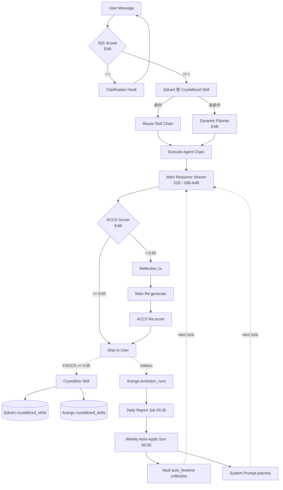

# Evolution System Design — IQS + ACCS Self-Optimization Loop

> 對標 [Audit_Report.md Phase 7](./Audit_Report.md#phase-7--gb10-uma-部署circuit-breakerhot-plug-skillstotddtree-缺口2026-05-23)
> 配合 [Manus_Gap_Analysis.md](./Manus_Gap_Analysis.md) 的 Reflection / Skill Crystallization 路線
> 配合 [Test_Suite/evolution/](../Test_Suite/evolution/) 凍結行為契約

---

## 1. 目標與不變式

| 目標 | 不變式 |
|---|---|
| 用本地小模型（E4B）做品質評分，**不重訓主力模型** | IQS / ACCS 都在 8s timeout 內必須給結果，否則熔斷 |
| 系統自我發現「壞輸入 + 壞輸出」並自動修補 prompt / RAG few-shot | 修補步驟必須**可審計**：所有自動寫回 RAG 的條目都帶 `auto_generated=true` 標記，可一鍵 rollback |
| 縮短 Manus.im 差距（Reflection、Skill 沉澱） | Reflection 只在 ACCS < 閾值時觸發；最多 1 輪，避免無限迴圈 |

---

## 2. 名詞表

| 縮寫 | 全名 | 角色 |
|---|---|---|
| **IQS** | Information Quality Score | 對 **user 輸入** 評分；低分觸發澄清 |
| **ACCS** | Accuracy & Alignment Consensus Score | 對 **LLM 輸出** vs **user 意圖**評分 |
| **CoT** | Chain of Thought | Planner 產的 task chain + 各 agent 輸出 |
| **Coach** | E4B IT (Gemma 4 4B) | IQS / ACCS / Planning 共用評分模型 |
| **Crystallization** | 技能自我沉澱 | 高分 CoT 寫成可重用 Skill |
| **Few-shot Backfill** | 自動寫回 RAG 範例 | 演化迴圈的執行端 |

---

## 3. GB10 UMA 記憶體切割

### Box 1 — Heavy Lane

| 元件 | 預算 | 量化 |
|---|---:|---|
| OS + Razy + sidecar + 安全墊 | 27 GB | — |
| Gemma 4 31B IT (Main Reasoner) | 32 GB | FP8 |
| Gemma 4 E4B IT (Coach: IQS + ACCS + Planning) | 5 GB | FP16 |
| vLLM Shared KV Pool | 40 GB | PagedAttention block_size=32 |
| Reflection + 並發 burst | 20 GB | dynamic |
| OOM 緩衝 | 4 GB | — |
| **合計** | **128 GB** | |

### Box 2 — Throughput Lane

| 元件 | 預算 | 量化 |
|---|---:|---|
| OS + Razy + sidecar + 安全墊 | 25 GB | — |
| Gemma 4 26B-A4B MoE (Fast Chat) | 28 GB | FP8 |
| Gemma 4 E4B IT (本機 Coach 鏡像) | 5 GB | FP16 |
| Qwen ASR 1.7B | 3 GB | INT8 |
| bge-m3 (embedding) | 2.5 GB | FP16 |
| bge-reranker-v2-m3 | 2.5 GB | FP16 |
| vLLM Shared KV Pool | 40 GB | block_size=32 |
| 多模態 + RAG burst | 22 GB | dynamic |
| **合計** | **128 GB** | |

### 排程紅線

| 紅線 | 閾值 | 動作 |
|---|---:|---|
| KV 池佔用 | > 34 GB (上限的 85%) | 拒絕新請求 → 503 retry-after=2s |
| Coach (E4B) 連續失敗 | 3 次 | open IQS/ACCS circuit 10 分鐘 |
| Box health-check | timeout > 500ms | 切對側 Box，並降級 mode_id |
| Swap 觸發 | > 1GB | evict ASR / Reranker (LRU) |

---

## 4. IQS（Information Quality Score）

### 4.1 觸發點

放在 `run_executor` 的**最早期 hook**（在 vault_rag 之前）：

```
user message → IQS scorer → if score < τ_iqs: emit clarification → halt
                          → else: continue to planner
```

### 4.2 公式

IQS 不是單一神經網路 head，而是 **4 個維度的加權幾何平均**，每個維度由 E4B 一次 forward 給出 0–1 分：

$$
\text{IQS} = \left(\prod_{d \in D} \max(s_d, \epsilon)^{w_d}\right)^{1/\sum w_d}
$$

| 維度 d | $w_d$ | 評分 prompt 摘要 |
|---|---:|---|
| **Clarity** | 0.30 | 「這個請求是否有明確的動作動詞與目標？」 |
| **Specificity** | 0.25 | 「是否包含足夠的具體名詞、數字、約束？」 |
| **Actionability** | 0.25 | 「這個請求在沒有額外資料時可否被執行？」 |
| **Context-Completeness** | 0.20 | 「對話歷史 + 當前訊息是否自洽，無懸空指代？」 |

$\epsilon = 0.05$ 防止 0 分讓整體歸零；幾何平均比算術平均**更嚴格**（任一維度低就嚴重拉低）。

### 4.3 行為閾值

| IQS 區間 | 行為 |
|---|---|
| `[0.80, 1.00]` | 直接走 planner |
| `[0.50, 0.80)` | 走 planner，但在 system prompt 注入「assume reasonable defaults」自我補完提示 |
| `[0.30, 0.50)` | 觸發 **Clarification Hook**：E4B 生成 1–2 個澄清問題回 user，halt |
| `[0.00, 0.30)` | 觸發 **Hard Clarification**：E4B 生成 ≥ 3 個澄清問題 + 範例輸入，halt |

τ 值（0.30 / 0.50 / 0.80）寫在 `evaluation/iqs.py` 的常數，**可在 Razy purpose meta 覆寫** 供 A/B。

### 4.4 失敗模式 → 熔斷

```python
@circuit_breaker(name="iqs", failure_threshold=3, reset_timeout=600, call_timeout=8)
async def score_iqs(ctx: RunContext) -> IQSResult: ...
```

熔斷後直接放行（`iqs_skipped=True` 進 metrics），不阻擋使用者。

---

## 5. ACCS（Accuracy & Alignment Consensus Score）

### 5.1 觸發點

放在 LLM stream 結束之後、post-stream 之前：

```
LLM stream end → ACCS scorer → if score < τ_accs: trigger reflection (max 1 round)
                              → else: ship + record metrics
```

### 5.2 公式

ACCS = **使用者意圖對齊**與**輸出正確性**的雙因子，Coach 一次 forward 同時給出：

$$
\text{ACCS} = \alpha \cdot \text{Alignment}(intent, output) + \beta \cdot \text{Accuracy}(facts, output) - \gamma \cdot \text{Hallucination}(output, evidence)
$$

| 因子 | 預設權重 | 說明 |
|---|---:|---|
| $\alpha$ Alignment | 0.50 | Coach 判定輸出是否回應了 user 的「真正問題」（含未明說的目標） |
| $\beta$ Accuracy | 0.40 | Coach 判斷事實 / 邏輯陳述是否正確（無外部驗證時用語意一致性近似） |
| $\gamma$ Hallucination 懲罰 | 0.15 | Coach 比對輸出 vs `vault_rag` 取得的 evidence；找不到出處的關鍵陳述 → 扣分 |

ACCS 最終 clip 到 `[0, 1]`。

### 5.3 行為閾值

| ACCS 區間 | 行為 |
|---|---|
| `[0.85, 1.00]` | 直接 ship；標記為 **Crystallization 候選** |
| `[0.65, 0.85)` | 直接 ship；不沉澱；記錄 metrics |
| `[0.40, 0.65)` | 觸發 **Reflection**：把 Coach 的扣分理由 + evidence 注入 prompt，Main Reasoner 重生一次；新輸出再評分後 ship（不再 reflect） |
| `[0.00, 0.40)` | 觸發 Reflection；若仍 < 0.40 → 標記 `degraded=true` ship，並寫入演化日誌供下次 Daily Report 分析 |

### 5.4 失敗模式 → 熔斷

```python
@circuit_breaker(name="accs", failure_threshold=3, reset_timeout=600, call_timeout=8)
async def score_accs(...) -> ACCSResult: ...
```

熔斷後輸出直接 ship（`accs_skipped=True`），Reflection 不觸發。

---

## 6. Reflection（Self-Critique 二輪生成）

### 6.1 流程

```mermaid
flowchart LR
  A[Main 第一輪輸出] --> B[ACCS 評分]
  B -- score >= 0.65 --> Z[Ship]
  B -- score < 0.65 --> C[Coach 列扣分理由]
  C --> D[Reflection Prompt 注入]
  D --> E[Main 第二輪生成]
  E --> F[ACCS 再評分]
  F --> Z
  F -. 仍 < 0.40 .-> G[標記 degraded=true]
  G --> Z
```

### 6.2 不變式

| 規則 | 理由 |
|---|---|
| **最多 1 輪** Reflection | 防無限迴圈與 token 爆炸 |
| Reflection 階段**禁止**重新跑 vault_rag | 不確定性放大；evidence 已在第一輪內 |
| 第二輪 prompt 必須包含 Coach 給的「具體扣分點」 | 不是泛泛「請改寫」，是針對性修補 |
| Reflection 開關可被 `OAAO_REFLECTION_DISABLE=1` 強制關閉 | 壓測 / 急性故障時 escape hatch |

---

## 7. 每日 / 每週演化 Report

### 7.1 資料源

| 資料 | 儲存 | 保留期 |
|---|---|---|
| 每次 run 的 IQS / ACCS / mode / purpose / latency | Arango `evolution_runs` collection | 90 天 |
| 低分案例（IQS < 0.5 或 ACCS < 0.65）的完整 transcript | Arango `low_score_cases` | 30 天 |
| Crystallized Skills usage_count | Arango `crystallized_skills` + Qdrant | 永久（LRU 淘汰）|

### 7.2 Daily Report Job（post-stream pool 之外，獨立 cron）

```
00:30 UTC daily
  → 抓昨天的 low_score_cases
  → 用 31B 在 Box 1 dry-run（不打使用者）分析 5–20 個樣本
  → 產出：
      - Top-N IQS 殺手詞（最常造成低 IQS 的用詞 / 主題）
      - Top-N ACCS 殺手 agent_kind（最常拖低 ACCS 的 agent）
      - 建議的 system prompt 修補 patch（diff 形式）
      - 建議寫回 Vault 的 few-shot 範例（pair: bad_input → corrected_input）
  → 落地到 Arango evolution_reports（不自動套用）
```

### 7.3 Weekly Auto-Apply（保守自動套用）

每週日 00:30 UTC：

```
  → 拿過去 7 天 Daily Reports
  → 對「重複出現 ≥ 5 次」的修補建議：
      - 若是 prompt patch 且 diff 行數 ≤ 5 → 自動套用 + 標記 auto_generated
      - 若是 few-shot example 且該範例的反例已產生 ≥ 3 次 → 寫入 Vault Qdrant
                                                          collection: "auto_fewshot"
                                                          payload.auto_generated=true
                                                          payload.report_id=<source>
  → 其他建議堆到「人類審批佇列」，發 Slack/Email
```

### 7.4 Rollback

每個自動套用都記 `evolution_patches` collection：

```json
{
  "patch_id": "auto-2026-05-25-iqs-clarity-001",
  "type": "system_prompt",
  "applied_at": "2026-05-25T00:30:00Z",
  "diff": "...",
  "source_report_id": "...",
  "metrics_before": { "iqs_p50": 0.62, "accs_p50": 0.71 },
  "metrics_after_24h": null,
  "rollback_command": "POST /admin/evolution/rollback/auto-2026-05-25-iqs-clarity-001"
}
```

24 小時後若 `accs_p50` 反而下降 > 5% → **自動 rollback**。

---

## 8. Skill 自我沉澱（Crystallization）

### 8.1 候選條件

```
ACCS >= 0.85
AND run has >= 2 agent steps
AND run has no "degraded" or "iqs_skipped" or "accs_skipped" flags
```

### 8.2 序列化結構

```python
class CrystallizedSkill(BaseModel):
    id: str                          # hash(planner_output + final_answer_first_200ch)
    trigger_intent: str              # E4B 萃取的意圖摘要 (≤ 80 chars)
    intent_embedding: list[float]    # bge-m3
    tool_chain: list[str]            # [agent_kind, ...]
    param_template: dict[str, Any]   # {agent_kind: {param: "$user_input.field"}}
    success_score: float             # ACCS at sealing time
    usage_count: int = 0
    created_at: datetime
    last_used_at: datetime | None
    source_run_id: str
```

### 8.3 雙寫儲存

| 儲存 | 用途 | Schema |
|---|---|---|
| **Qdrant `crystallized_skills` collection** | 相似度召回（IQS 階段順帶查）| vector = `intent_embedding`, payload = { id, tool_chain, usage_count } |
| **Arango `crystallized_skills` collection** | 結構化查詢、usage_count 累計、LRU 淘汰 | 上述完整 CrystallizedSkill |

### 8.4 命中流程

```
IQS 階段並發查 Qdrant (cosine sim >= 0.88, top 1)
  → 命中：
      - 把 tool_chain 直接餵給 planner（跳過動態 LLM planning）
      - 在 stream 發 phase=system kind=status text="reusing crystallized skill X"
      - Arango 更新 usage_count++、last_used_at=now()
  → 未命中：
      - 走原本動態 planning
```

### 8.5 淘汰策略

每週 cron：

```
  evict where usage_count == 0 AND age > 30d
  evict where success_score < 0.85 AND age > 7d  # 後續資料降低信心
```

---

## 9. 演化迴圈總圖



---

## 10. 落地路徑（依賴鏈）

| Phase | 落地內容 | 前置 |
|---|---|---|
| **8** | `safety/circuit_breaker.py` + `evaluation/iqs.py` + `evaluation/accs.py` + `evaluation/reflection.py` | Phase 7 規範定稿 ✅ |
| **9** | Hot-plug Skills + `crystallization/sealer.py` + `crystallization/recall.py` | Phase 8 ACCS 落地（用 ACCS 觸發沉澱）|
| **10** | Razy purpose_allocation 擴張 (`base_urls[]` + `routing_policy`) + Python `endpoint.py::pick_base_url` | Phase 8（純資源層，可平行）|
| **11** | Daily / Weekly Report cron + 自動 rollback | Phase 8 metrics 收集穩定 |

---

## 11. 相關文件

- [Audit_Report.md Phase 7](./Audit_Report.md#phase-7--gb10-uma-部署circuit-breakerhot-plug-skillstotddtree-缺口2026-05-23)
- [Manus_Gap_Analysis.md](./Manus_Gap_Analysis.md)
- [Test_Catalog.md](./Test_Catalog.md)
- [Test_Suite/evolution/](../Test_Suite/evolution/) — 演化邏輯凍結契約
- [Test_Suite/perf/](../Test_Suite/perf/) — 熔斷與兩台機 failover 凍結契約
