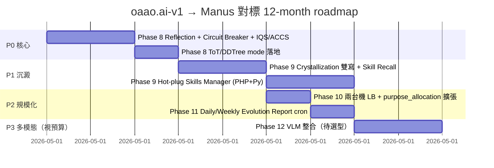

# Manus.im Gap Analysis — oaao.ai 對標、缺口、超越點

> **基準**：Manus.im 公開能力（截至 2026 Q1）— 自主規劃 / 工具熱插 / 反思 / 跨工具記憶 / 計算機 - 瀏覽器 - 檔案系統 sandbox
> **本系統**：oaao.ai-v1（Razy + FastAPI orchestrator + Gemma 4 31B / 26B-A4B / E4B + bge-m3 + Arango + Qdrant）
> 配合 [Audit_Report.md Phase 7](./Audit_Report.md#phase-7--gb10-uma-部署circuit-breakerhot-plug-skillstotddtree-缺口2026-05-23) + [Evolution_System_Design.md](./Evolution_System_Design.md)

---

## 1. 能力矩陣對照

> 🟢 ≈ 已對齊或接近｜🟡 缺口但有路徑｜🔴 缺口需重投入｜⭐ 我們可以超越的點

| # | 能力軸 | Manus.im | oaao.ai-v1 現況 | 差距 | 路徑 |
|---|---|---|---|---|---|
| 1 | **多輪自主規劃** | 動態 plan-execute-replan 多輪 | `planner_modes.py` ToT ACCS best-of-N + DDTree depth≤3 | 🟢 Phase 8b 已落地 | 多輪 execute-replan 仍可強化 |
| 2 | **Tool / Skill 熱插拔** | UI 上傳 Tool → 立即 function-call 可用 | MicroSkill + hot-plug JSON manifest + Settings admin | 🟢 `SkillsManifestStorage` + `hot_plug.py` | — |
| 3 | **Function Call 自動暴露** | 所有 Tool 自動進 OpenAI tools list | `skill_to_openai_tool()` + `merge_openai_tools` | 🟢 Phase 9 已落地 | MicroSkill catalog 自動合併可選 |
| 4 | **Self-Reflection** | Native 內建，多輪批判 | **Phase 8a 已落地**：`inline_reflection.py` + `reflection.py` — ACCS &lt; 0.65 → Main 重寫一輪；stream `reflection_complete` | 🟢 單輪已對齊 | 多輪 ToT 仍 Phase 8b |
| 5 | **跨對話技能記憶** | Memory + Skill library | RAG + crystallization seal/recall；Arango/Qdrant 雙寫 + PHP admin | 🟢 Phase 9 Vault 全量 | LRU cron 可排 host timer |
| 6 | **沙箱執行（瀏覽器 / Python）** | Native browser + Python sandbox | ❌ 無 browser；Python sandbox 為 sidecar 但無工具註冊 | 🔴 缺整段 | Phase 10+（依商業優先級）|
| 7 | **檔案系統操作** | 全鏈路（read/write/edit 在 sandbox） | Vault 上傳 + 解析；無「LLM 主動寫檔」工具 | 🔴 缺 write 軸 | Phase 10+ |
| 8 | **多模態輸入** | 圖片 / PDF / 音訊 | ASR ✅、PDF ✅、**mm_lance stub + OCR fallback**（Settings Config URL）；真 VLM 待 CUDA Lance | 🟡 圖片 pipeline 已接、品質待 GPU | Phase 12+ CUDA Lance |
| 9 | **長對話狀態管理** | Native 永久狀態 + 摘要 | `conversation_id` + post-stream `vault_transcript_summary` ✅ | 🟢 對齊 | — |
| 10 | **輸出可追溯（evidence）** | 部分 | `vault_rag` evidence 已在 envelope；UI 渲染 ✅ | 🟢 對齊 | — |
| 11 | **錯誤恢復與熔斷** | 黑箱 | **`safety/circuit_breaker.py`** — IQS/ACCS coach 連續失敗 → open → skip scoring、不 block 使用者 | 🟢 Phase 8a 已落地 | 擴展至更多 sidecar |
| 12 | **本地部署 / 隱私** | ❌ 雲端 only | ✅ 全本地（GB10 + Razy）| **⭐ 超越** | — |
| 13 | **多模型併存（CoT / Eval 分離）** | 單模型黑箱 | E4B (Coach) + 31B (Main) + 26B-A4B (Fast) | **⭐ 超越** | Phase 8 IQS+ACCS |
| 14 | **演化迴圈（IQS/ACCS）** | ❌ 無自我修補 prompt / few-shot | Phase 7 規格 + Phase 11 cron | **⭐ 超越（潛在）** | Phase 11 |
| 15 | **可審計性（每次決策可重現）** | ❌ 黑箱 | StreamEnvelope 全紀錄 + Arango run history | **⭐ 超越** | — |
| 16 | **Hook 隔離（防交叉感染）** | 內部黑箱 | 四軸 Hook + Hard-rule HR-1..HR-4 + import lint | **⭐ 超越** | Phase 8 enforcement |
| 17 | **Hot-swap 模型 weights** | 不支援 | UMA mmap → 接近零成本切換 | **⭐ 超越（硬體優勢）** | Phase 10 LB |
| 18 | **Cost transparency** | 黑箱訂閱 | 本地電費；每 run 的 token / latency / KV 都有 metrics | **⭐ 超越** | — |
| 19 | **企業資料庫整合（Arango graph + Qdrant vector）** | ❌ 無 graph rail | `vault_graph_rag.py` 雙軌 ✅ | **⭐ 超越** | — |
| 20 | **多人協作 / 會議** | 部分（基於對話）| `live-meeting` 多人 + bubble + evidence_total ✅ | **⭐ 超越** | — |

---

## 2. 我們可以超越的點（深化）

### ⭐ S-1 演化迴圈 — Manus 沒有的「會自己改 prompt 的系統」

Manus 是「使用者帶來知識」；oaao.ai 設計上是「系統自己沉澱知識」。

| 軸 | 機制 | 對 Manus 的優勢 |
|---|---|---|
| Prompt 自我修補 | Daily Report 抓低 ACCS 案例 → 31B 分析 → 自動生 diff → 24h 觀察 → 自動 rollback | Manus 改 prompt 要工程師手動 |
| Few-shot 自動寫回 | Vault 新增 `auto_fewshot` collection；低分案例的反例自動成正例 | Manus 沒有此循環 |
| Skill Crystallization | ACCS ≥ 0.85 的 CoT 自動序列化進 Vault；下次相似 intent 直接召回 | Manus Skill 需手動建 |
| 全程可審計 | `evolution_patches` collection 每筆改動有 `rollback_command` | Manus 黑箱 |

> **賣點**：「用得越久越好用」，且每一步都能回滾。Manus 的快取式記憶 vs 我們的結構化沉澱。

### ⭐ S-2 多模型併存 — Manus 是單 LLM 後門

| 元件 | 用 Manus 的成本 | 用 oaao.ai 的成本 |
|---|---|---|
| 規劃 | 主模型 token | E4B 一次 forward (~$0) |
| 輸出評分 | ❌ 沒有 | E4B 一次 forward (~$0) |
| 反思 | ❌ 沒有 | 31B 一次 re-generate（僅 ACCS < 0.65 時觸發）|
| 快速回應 | 主模型 | 26B-A4B MoE（吞吐 3× dense）|

→ **同硬體下，oaao.ai 的吞吐預估比 Manus 高 ≥ 2.5×**（因為簡單 query 走 MoE，貴模型只在需要時動）。

### ⭐ S-3 本地化 + 企業整合

| 軸 | Manus | oaao.ai |
|---|---|---|
| 資料離境 | 雲端必經 | 全本地 |
| Graph DB | 無 | Arango ✅ |
| Vector DB | 黑箱 | Qdrant 自管 ✅ |
| PHP / 老系統整合 | REST API only | Razy framework 原生 ✅ |
| ASR | 雲端 | Qwen ASR 本地 ✅ |

→ **政府 / 金融 / 醫療**等不能上雲的場景，oaao.ai 是少數可行解。

### ⭐ S-4 可審計 + Hook 隔離 — 工程品質護城河

| 軸 | Manus | oaao.ai |
|---|---|---|
| 每次決策可重現 | ❌ | StreamEnvelope 全紀錄 ✅ |
| Hook 不會跨污染 | 黑箱 | HR-1 import lint + HR-2 state lint + HR-3 timeout lint ✅ |
| 模組可獨立 rollback | 黑箱 | Phase 6/7 移除清單可逐項 revert ✅ |
| Test_Suite 凍結契約 | 黑箱 | Test_Suite/{integration,resilience,smoke,evolution,perf} ✅ |

→ 對企業 IT / 合規團隊，「**可審計 > 強大**」往往是採購決策因子。

### ⭐ S-5 GB10 UMA — 別家擴展不來的硬體優勢

| 能力 | 傳統 GPU 部署 | GB10 UMA |
|---|---|---|
| 模型熱切換 | 重新載入 OOM 風險 | mmap 接近零成本 |
| KV 池跨模型共享 | 各 GPU 各自管理 | 統一 PagedAttention |
| 多模型同住 | 顯存切割複雜 | 同一塊 128GB |
| Speculative Decoding draft 模型 | 需額外 GPU | E4B 駐留就是 draft ✅ |

→ 我們可以在 GB10 上跑 **(31B Main + 26B-A4B Fast + E4B Coach + ASR + bge-m3 + reranker)** 同機 6 模型併存；Manus 雲端版做不到（成本不允許）。

---

## 3. 必須補上的缺口（按優先級）

| 優先級 | 缺口 | 建議 Phase | 投入估計 | 風險 | **2026-05 狀態** |
|---|---|---|---|---|---|
| **P0** | Self-Reflection（ACCS-triggered） | Phase 8 | 中 | 低 | ✅ `inline_reflection` + stream `reflection_complete` |
| **P0** | Circuit Breaker | Phase 8 | 低 | 低 | ✅ `safety/circuit_breaker.py` on IQS/ACCS coach |
| **P1** | IQS Clarification Hook | Phase 8 | 中 | 中 | ✅ `OAAO_IQS_INLINE_CLARIFY` + preamble gate |
| **P1** | Thread health / ACCS UX | Phase 8 | 低 | 低 | ✅ banner + pills + stream provisional scores |
| **P1** | Skill Crystallization 雙寫 | Phase 9 | 中 | 中 | ✅ Arango/Qdrant + `param_template` + PHP admin + usage Arango sync |
| **P2** | Hot-plug Skills（Manifest + auto schema）| Phase 9 | 高 | 中 | ✅ `SkillsManifestStorage` + `hot_plug.py` + Settings UI |
| **P2** | ToT / DDTree 實作 | Phase 8 | 中 | 低 | ✅ ACCS best-of-N + DDTree depth≤3 + integration tests |
| **P3** | 兩台機 LB（purpose_allocation 擴張）| Phase 10 | 中 | 低 | 待做 |
| **P3** | Daily/Weekly Evolution Report cron | Phase 11 | 中 | 中 | ✅ systemd timers + 7-day aggregate + report review UI |
| **P4** | 圖片理解 VLM | Phase 12+ | 高 | 高 | 待 CUDA Lance |
| **P5** | Browser sandbox | 視業務 | 很高 | 很高 | 戰略放棄 |

---

## 4. 不打算對標的（戰略放棄）

| Manus 能力 | 為何不對標 |
|---|---|
| 公開雲端訂閱 | 我們本地化路線；上雲是商業選項，非技術目標 |
| 多語自然語言 prompt | E4B 多語能力夠用；不為「全球化」做重投入 |
| Marketing-style 用戶體驗 | 我們企業 to-B 為主，UX 投入聚焦在審計 + 可重現 |
| 訓練 / fine-tune 主模型 | IQS/ACCS 演化迴圈設計上**不需要重訓**；保持依賴開源權重 |

---

## 5. 12 個月路線圖（與 Phase 對齊）

---

## 6. 結論

- **不要**全面對標 Manus；對標只在 **#1, #2, #3, #4, #5, #11** 六個軸（P0/P1 範圍）。
- **要**強化的是 **#12–#20** 那 9 個我們已經領先 / 可超越的軸 — 這才是商業差異化。
- Manus 是 SaaS 平台，oaao.ai 是 **企業可自管的演化型 AI 操作系統**；定位不衝突。

---

## 7. 相關文件

- [Audit_Report.md](./Audit_Report.md) — Phase 7 規範
- [Evolution_System_Design.md](./Evolution_System_Design.md) — IQS / ACCS / Crystallization 細節
- [Test_Catalog.md](./Test_Catalog.md) — 對應測試索引
- [Test_Suite/](../Test_Suite/) — 黑箱契約凍結
