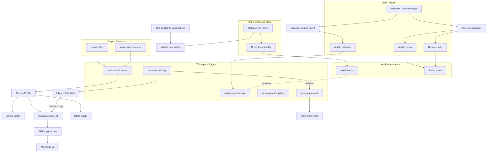
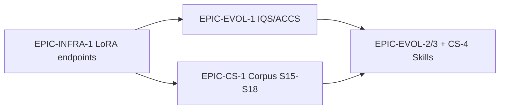
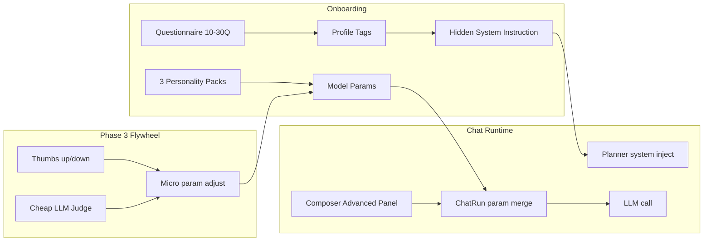
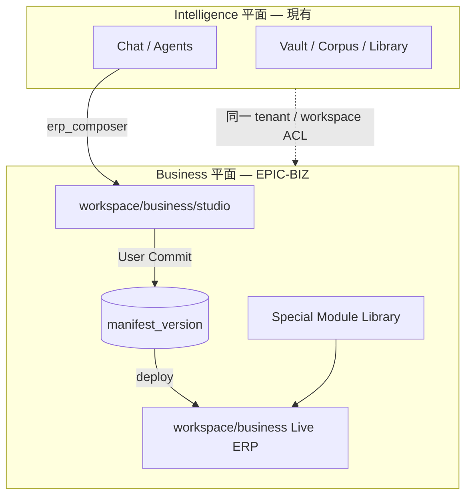
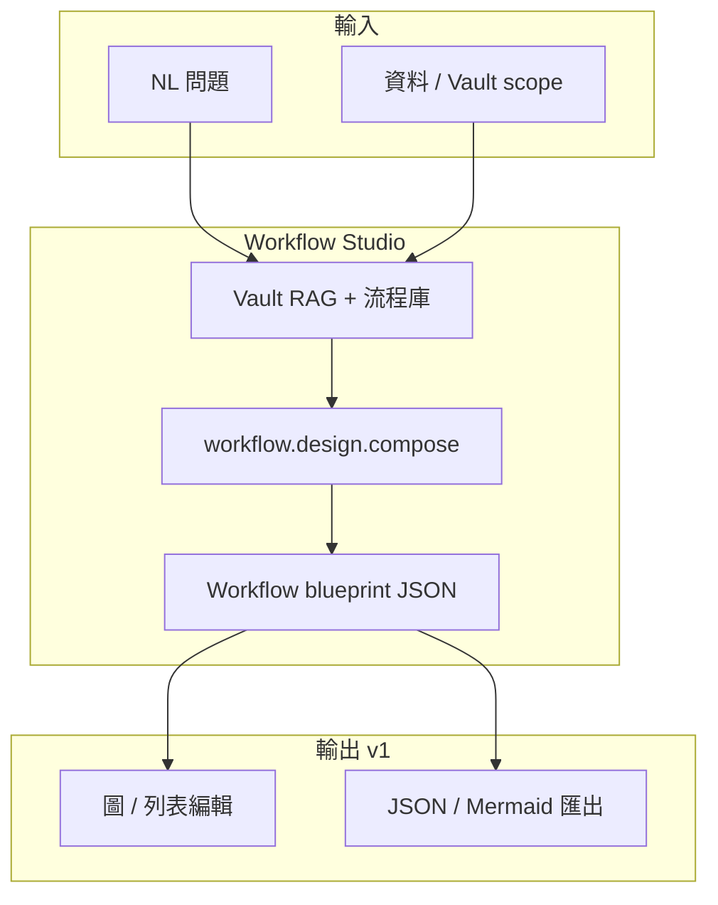

# OAAO Content Studio — Epic & Story Backlog（Jira / Linear）

> **Project:** `OAAO-V1`  
> **Milestone:** `Content-Studio-2026`（產品線）· `Platform-2026`（Platform CMS / 發版）  
> **匯入檔:** [OAAO_Content_Studio_Jira_Import.csv](./OAAO_Content_Studio_Jira_Import.csv)  
> **相關:** [MIGRATION_LEGACY_OAAO.md](./MIGRATION_LEGACY_OAAO.md) · [Manus_Gap_Analysis.md](./Manus_Gap_Analysis.md) · [Evolution_System_Design.md](./Evolution_System_Design.md) · [OAAO_90D_Jira_Import_Guide.md](./OAAO_90D_Jira_Import_Guide.md)  
> **最終龐大產品線（Post-2026）:** [design/erp-business-workspace.md](./design/erp-business-workspace.md) · **EPIC-BIZ** §17 · [design/workflow-decider-studio.md](./design/workflow-decider-studio.md) · **EPIC-WF** §18

---

## 0. 產品定位（凍結）

四個能力共用 **Content Studio** 產品線，但 **Corpus 是獨立 workspace page**（對標 `workspace/templates` gallery 模式），**不是** Settings 子面板或 Vault 子 tab。

另兩條 **Chat 生產力 Agent** 線（Calendar / Todo）共用 orchestrator 事件抽取 + workspace shell UX，但入口不同：**Calendar** 在 **icon rail**；**Todo** 在 **header**（notification 旁）。

**Platform 層（control plane）** 另立 **Release Notes & News**：由 **platform host** 發布 changelog / blog，可 **跨 tenant fan-out** 通知所有使用者；workspace 端依 **version & build** 瀏覽 What's New（對齊 `OaaoBuildInfo` / `build_info.json`）。

| 能力                      | Workspace 入口                          | 與 Vault / Chat 關係                                                                                                 |
| ----------------------- | ------------------------------------- | ----------------------------------------------------------------------------------------------------------------- |
| **Corpus**              | `workspace/corpus`                    | 來源 = 上傳檔 **或** 引用 Vault folder/files → 分類 + 學風格 → 產出 **Corpus Profile**；供 Editor / Chat / Office Agent 引用         |
| **Library + AI Editor** | `workspace/library`                   | Soft-RAG 文件庫 + Notion-like Block Editor；Chat **必須 @指定檔** 才 RAG Library；**Save to Vault** 後才進 Hard-RAG auto source |
| **Office Agent**        | （Chat pipeline / Editor export）       | 從 markdown/blocks 生成 docx / pdf / xlsx artifact                                                                   |
| **Conversation Skills** | （Chat thread UX）                      | 對話沉澱 → thread icon → Dialog 確認建立 Skill → 版本 + 用量升級                                                                |
| **Calendar Agent**      | `workspace/calendar`（**icon rail**）   | AI 從對話/訊息抽取 **事件候選** → inline **Add to calendar** → 寫入 tenant calendar；Calendar page 檢視/編輯                        |
| **Todo Agent**          | **Header todos icon**（notification 旁） | AI 抽取 **待辦候選** → inline **Add to todos**；thread 內顯示關聯待辦 + **Resolve**；panel 手動完成                                  |

| 能力                       | Platform / Workspace 入口                               | 說明                                                                                                        |
| ------------------------ | ----------------------------------------------------- | --------------------------------------------------------------------------------------------------------- |
| **Release Notes & News** | Platform CMS + workspace **What's New**               | Platform 發布 changelog / news / blog；**跨 tenant** 推播 notification；使用者依 **version / build_id** 篩選瀏覽         |
| **User Invitation**      | Platform / Tenant Settings → Users                    | Admin **Send invitation**（取代直接建 user）；受邀者 **Registration page** 自設 name/password；**Forgot password** 自助重設 |
| **Chat Personalization** | Chat composer **Advanced** + Settings **Preferences** | 手動調 **model params**（temp、top-k 等）；**Auto-Tuning** 問卷/性格包 → 標籤 + params；**Thumbs** 閉環優化                   |
| **Workflow / Decider Studio** | `workspace/workflow`（規劃） | 丟入 **資料 + 問題** → **Vault RAG** 推理 → AI 產出 **Workflow** 藍圖（含 **Classification** / **Decider** / **Pipeline** 節點）；v1 **設計為主**，執行另 Epic |

**已具備基礎（本 backlog 假設可用）：** per-tenant object storage、Vault RAG、MicroSkill、crystallization、slide PPTX export、`AgentMaterialStorage`、workspace notification bell + dropdown panel 模式、`**OaaoBuildInfo`**（`VERSION` + `build_info.json`）、`**oaaoai/platform**` control plane（tenant registry）、tenant-scoped `**notifications_send**`（單 tenant 廣播）。

### 0.1 商品化約束（硬性 — 全 Content Studio / 相關 Agent）

**禁止** 以「單一客戶／單一公文版型」的 **hard code**（固定 regex 欄位名、寫死 HTML 欄位、if 文件標題則…）當作 **正式能力** 的實作方式。MVP 可短期存在 **behind `document_type` 外掛 schema**，但必須有明確替換路徑與測試，不得無限期累積。

| 允許                                                                 | 禁止（商品化後）                                                           |
| ------------------------------------------------------------------ | ------------------------------------------------------------------ |
| **資料驅動**：`document_type` → JSON Schema / Pydantic / `contracts/v1` | 在 `segmenting.py` / `html_template.py` 新增「又一種通告」專用 regex 而無 schema |
| **版面 → Markdown**（Docling / Unstructured / 等）再進 LLM                | 只靠 `pypdf` 平面字串 + 猜 `\d{3}` 表格列                                    |
| **兩階段 extraction**：Pass A 邊界+結構、Pass B 主文清洗；驗證失敗可重試／降級             | 一次 prompt 刮 JSON；失敗靜默空白                                            |
| **Schema registry**（few-shot 隨 type 載入）                            | LLM fill 寫死 `id,before,after,…` 等欄位鍵                               |
| **租戶可選模板覆寫**（欄位標籤、CSS）                                             | UI 只為單一 `layout_type=table` 寫死文案                                   |

**Corpus 現況技術債（須 CS-1-S15–S18 替換，非擴寫）：** HK 行員通告 regex（`【第 N 號行員】`、`行員申請轉讓會籍`、`_TABLE_COLUMNS`）、表格 `layout_type` 启发式。

**DoD 原則：** golden fixtures **≥3 種不同版式** 同一 pipeline 通過；未知版式 → `document_type=unknown` + 明確 UI，而非錯版 PDF。

---

## 1. 架構概覽

---

## 2. Epic 清單（6 Content Studio + 3 Platform + 1 收尾 + Business ERP）

| Epic ID          | 名稱                                                            | Priority | 建議 Sprint                                     | Depends On                                                                                               |
| ---------------- | ------------------------------------------------------------- | -------- | --------------------------------------------- | -------------------------------------------------------------------------------------------------------- |
| **EPIC-CS-1**    | Corpus Studio（workspace/corpus）                               | P0       | CS-W1 – CS-W4                                 | Tenant storage ✅                                                                                         |
| **EPIC-CS-2**    | Library + AI Block Editor                                     | P0       | CS-W3 – CS-W8                                 | EPIC-CS-1（Corpus picker 部分）                                                                              |
| **EPIC-CS-3**    | Office Generation Agent                                       | P1       | CS-W6 – CS-W9                                 | EPIC-CS-2（內容來源）                                                                                          |
| **EPIC-CS-4**    | Conversation Skills Evolution                                 | P1       | CS-W4 – CS-W7                                 | MicroSkill ✅                                                                                             |
| **EPIC-CS-5**    | Calendar Agent（workspace/calendar）                            | P1       | CS-W7 – CS-W10                                | Chat stream ✅ · Notifications ✅                                                                          |
| **EPIC-CS-6**    | Todo Agent（header todos + thread resolve）                     | P1       | CS-W8 – CS-W10                                | Chat stream ✅ · Notifications panel 模式 ✅                                                                 |
| **EPIC-PLAT-1**  | Release Notes & Product News（Platform CMS）                    | P1       | CS-W8 – CS-W11                                | Platform host ✅ · Notifications ✅ · OaaoBuildInfo ✅                                                      |
| **EPIC-PLAT-2**  | User Invitation & Self-Registration                           | P0       | CS-W1 – CS-W3                                 | SMTP / mail ✅ · Auth ✅                                                                                   |
| **EPIC-UX-1**    | Chat Model Params & Auto-Tuning                               | P1       | CS-W4 – CS-W12                                | Chat run ✅ · `preferences_json` ✅                                                                        |
| **EPIC-CS-P**    | Platform 收尾（非功能）                                              | P2       | 穿插                                            | OAAO 90D 剩餘項                                                                                             |
| **EPIC-EVOL-1**  | IQS / ACCS / Reflection / Circuit breaker                     | P0       | Phase 8 · 穿插                                  | [Evolution_System_Design.md](./Evolution_System_Design.md)                                               |
| **EPIC-EVOL-2**  | Crystallization + skill recall                                | P1       | Phase 9                                       | Qdrant + Arango `crystallized_skills`                                                                    |
| **EPIC-EVOL-3**  | Evolution patches（Phase 11 cron）                              | P1       | Phase 11                                      | `evolution_patches` + auto-rollback                                                                      |
| **EPIC-INFRA-1** | Endpoint / LoRA purpose 矩陣                                    | P0       | CS-W2 · 穿插                                    | `oaao_endpoint`；見 §2.1                                                                                   |
| **EPIC-WS-1**    | Web Search → **Knowledge buckets**（oaao 級 RAG 補充）             | P1       | CS-W10+                                       | 見 §2.1 · [web-search-knowledge-evolution.md](./design/web-search-knowledge-evolution.md)                 |
| **EPIC-BIZ-1…6** | **ERP Business Workspace**（AI Manifest + User Commit 版本化 ERP） | P1       | **BIZ-W1+** · Milestone **Business-ERP-2027** | **§17** · CS-2026 主線 · EVOL-1 · PLAT-2 · [erp-business-workspace.md](./design/erp-business-workspace.md) |

---

## 2.1 EPIC-EVOL / EPIC-INFRA 與 Content Studio 并列總覽

三條軸線與 CS **并列**，避免只做 Corpus regex 而忽略「智能資產」主線：

| 軸線           | Epic                                                | 產物（不綁單一 31B 主模型）                                                                      | 規格                                                         |
| ------------ | --------------------------------------------------- | ------------------------------------------------------------------------------------- | ---------------------------------------------------------- |
| **推理適配**     | EPIC-INFRA-1                                        | LoRA / 專模經 **purpose** 掛載                                                             | 本節 LoRA 矩陣                                                 |
| **執行時品質**    | EPIC-EVOL-1                                         | IQS、ACCS、Reflection、熔斷                                                                | [Evolution_System_Design.md](./Evolution_System_Design.md) |
| **可重用知識/能力** | EPIC-EVOL-2、EPIC-EVOL-3、**EPIC-CS-4**、**EPIC-WS-1** | CrystallizedSkill、evolution patches、MicroSkill、**Knowledge buckets**（公開 web → 全站 RAG） | Evolution §8；CS-4；WS-1 設計稿                                 |
| **文件智能（CS）** | EPIC-CS-1 S15–S18                                   | Markdown ingest → `document_type` → schema extract → template                         | §3；[稽核報告](./reports/Intelligence-vs-Hardcode-Audit.md)     |

### LoRA / purpose 矩陣（EPIC-INFRA-1）

經 `**oaao_endpoint**` + orchestrator `**llm_cfg**` 注入；LoRA 權重在推理服務側掛載，**不是**存進 `style_json`。

| Purpose（建議）                          | 消費者                          | 任務                                                 | 備註                        |
| ------------------------------------ | ---------------------------- | -------------------------------------------------- | ------------------------- |
| `corpus.analyze`                     | `POST /v1/corpus/analyze`    | S15 Markdown 結構化、**S16 document_type**、S17 extract | 可綁 domain LoRA            |
| `corpus.style`                       | analyze tail / style_json    | 風格 profile                                         | 與 analyze 可同模或分模          |
| `corpus.render_fill`                 | `POST /v1/corpus/render`     | 模板參數 / table_rows                                  | schema 鍵由 S16 registry 驅動 |
| `planning` / `planning.coach`        | planner、ToT/DDTree           | 任務分解                                               | 見 Audit Phase 8           |
| `evaluation.iqs` / `evaluation.accs` | post-stream、run preamble     | IQS / ACCS coach（E4B）                              | Evolution §4–5            |
| `evaluation.uiqe`                    | 舊稱兼容                         | 同上                                                 | 逐步遷移到 `evaluation.iqs`    |
| `chat.main` / `chat.fast`            | llm_stream                   | 主對話                                                | Box1 31B / Box2 MoE       |
| `slide.template`                     | template_analyze / slot_plan | PPTX 槽位語義                                          | 已 LLM-first；禁 keyword 擴寫  |
| `knowledge.orientation`              | WS-1 orientation worker      | 對話取向 / 定時搜尋主題                                      | EPIC-WS-1 ✅               |
| `knowledge.search_plan`              | WS-1-S3 search plan          | 多查詢拆解（非 user 原文）                                   | EPIC-WS-1 ✅ stub          |
| `knowledge.search_plan`              | WS-1 web agent               | 多查詢 + 引擎路由                                         | EPIC-WS-1                 |
| `knowledge.classify`                 | WS-1-S9（規劃）                  | bucket 再分類、主題標籤                                    | EPIC-WS-1 🔲              |
| `knowledge.distill`                  | WS-1-S9（規劃）                  | 精華摘要 → 高效 RAG / patch                              | EPIC-WS-1 🔲              |

**原則：** 新增業務欄位 → **S16 `document_type` + contract**；新增「理解能力」→ **purpose 矩陣加列**，而非 Python regex 分支。

### EPIC-WS-1 — Web Search → Knowledge buckets（oaao 級 RAG 補充）

**產品模型：** **Web search** 擷取中立公開資料 → 寫入 **platform Knowledge buckets**（oaao **自我演化** 技術，**tenant 不可見**）→ 依 **跨租戶對話／話題／關鍵字重要分數** 決定是否納入 **auto web search**；多次搜尋後評估 **更新密度、市場話題性、時效** — 低收益或過時則暫停，除非 **突破／關聯話題** 再啟動。定時 **分類、精華、ACCS 晉升**（Vault embed、`evolution_patches`）。**全系統** RAG 可引用；**非** workspace 或租戶管理員設定。

**與其他軸線：** 有別於 workspace **Vault 勾選**（私有上傳）、**Corpus Studio**（企業文件風格／文員）、使用者 **preferences knowledge** 文字。

**作用域：** **platform** catalog（預設）；**workspace / tenant_id 僅歸因**；**Platform console → Knowledge** 為唯一營運 UI。

| Story        | Summary                                                  | Priority                       |
| ------------ | -------------------------------------------------------- | ------------------------------ |
| **WS-1-S1**  | `SearchProvider` 抽象 + SearXNG                            | ✅ P0                           |
| **WS-1-S2**  | `orientation_json` + 對話尾隨更新                              | ✅ P0                           |
| **WS-1-S3**  | 多查詢 search plan（LLM，非 regex）                             | ✅ stub P1                      |
| **WS-1-S4**  | bucket 條目 → Vault + embed + `evolution_patches`          | ✅ ACCS gate                    |
| **WS-1-S5**  | 定時 refresh worker                                        | ✅ `POST /v1/knowledge/refresh` |
| **WS-1-S6**  | Platform console → Knowledge（refresh、opt-out、RAG merge）  | ✅                              |
| **WS-1-S10** | 話題重要分數 + 生命週期 gate（低 yield / 過時 / breakthrough）          | ✅                              |
| **WS-1-S11** | 對話表批次 importance + platform Knowledge vault 自動 provision | ✅                              |
| **WS-1-S8**  | 全系統 recall（bucket + knowledge vault 合併）                  | ✅ `recall.py` + RAG merge      |
| **WS-1-S9**  | 定時分類／精華 + `knowledge.classify` / `knowledge.distill`     | ✅ classify API + batch         |

設計草案：[web-search-knowledge-evolution.md](./design/web-search-knowledge-evolution.md)（§1.1 Knowledge buckets）。與 **EPIC-EVOL-2/3** 共用 ACCS 寫入門檻與可重用資產模型。

### Sprint CS-AUDIT-1 — 智能稽核修復（與 S16 同 sprint）

| ID          | 項                                                | 動作                                                                                        | 狀態      |
| ----------- | ------------------------------------------------ | ----------------------------------------------------------------------------------------- | ------- |
| **AUDIT-1** | Corpus regex 擴寫禁令                                | §0.1 + PR checklist                                                                       | ✅ Epics |
| **AUDIT-2** | **CS-1-S16**                                     | `schema_registry.py` + `contracts/v1/corpus-extract-*.json`                               | ✅ 本輪    |
| **AUDIT-3** | `slide_project/templates/plan.json` **keywords** | `title_hints` 清空；`title_hint_layout()` 不再 keyword 路由                                      | ✅       |
| **AUDIT-4** | `ChatTeachingIntent.php`                         | 僅 template chip 開 slide_designer；vault 改 composer 檔名匹配 + `shouldExpandVaultComposerScope` | ✅       |
| **AUDIT-5** | `live_meeting/bubble_engine.py`                  | 意圖改 LLM + glossary（可選 LoRA purpose）                                                       | 🔲 P2   |
| **AUDIT-6** | CS-1-S17 / S18                                   | 兩階段 extract + schema-driven template                                                      | ✅       |

---

## 3. EPIC-CS-1 — Corpus Studio（`workspace/corpus`）

### 3.1 產品規格

- **Runtime 分工（硬性）：** **Python orchestrator** = extract、segment、LLM style、markdown generate、HTML template build、render/PDF（CS-3）、background jobs。**PHP** = auth、workspace ACL、CRUD、storage locator、組 payload、**≤30s enqueue**、poll 轉發、結果落庫；**不得在 PHP-FPM 做 heavy load**（會阻塞 worker pool）。
- **入口：** `registerSpaPage('workspace/corpus', …)`，Gallery layout（對齊 `workspace/templates`）。
- **Corpus 實體：** 一筆 profile = 名稱 + 描述 + 標籤 + **style_json** + 來源清單 + 狀態（`draft` / `learning` / `ready` / `error`）。
- **來源類型：**
  1. **Upload** — 直接上傳（docx/pdf/md/txt…）→ tenant storage `corpus` domain（或專用 prefix）。
  2. **Vault reference** — 選 **folder（container）** 或 **多個 document**；存 locator + vault_id，不複製正文（analyze 時 materialize/cache）。
- **Pipeline（目標架構，見 §0.1）：** ingest → **layout-aware Markdown** → **document_type** → schema extraction（兩階段 + 驗證）→ segments + **learn**（style_json）→ template 由 schema 生成 → **ready**。  
**現行 MVP：** ingest → vault 平面 extract → regex `segment_analyze_text` → 可選 LLM 貼標／style → heuristic `html_template`（**不得再擴寫 domain regex**）。
- **雙軌輸出（硬性分工）：**
  1. **Markdown 軌** — Chat 助理回覆、Library Editor（blocks + markdown mirror）、`CorpusGenerate` 預覽、CS-3 docx。內容可編、可 @library、可 crystallize。
  2. **HTML Template 軌** — Analyze 產出 `style_json.meta.html_template`（`corpus_html_template_v1`：固定 HTML/CSS + `parameters[]`）。Generate / Chat / Office **只填參數再渲染**；**PDF 僅走此軌**（weasyprint / print CSS，對齊 CS-3-S3），不得用自由 markdown 拼版湊 PDF。
- **輸出：** Editor / Chat 預設 Markdown 軌 + `corpus_id` 風格注入；Corpus page **Generate** 分「Markdown 預覽」與「渲染 PDF」；Office `office_generate` 可選 `source=corpus_template`。

### 3.2 Stories

| Story ID     | Summary                               | Priority | Owner       | Acceptance Criteria（摘要）                                                                                                                                                                                                            |
| ------------ | ------------------------------------- | -------- | ----------- | ---------------------------------------------------------------------------------------------------------------------------------------------------------------------------------------------------------------------------------- |
| **CS-1-S1**  | `oaaoai/corpus` 模組骨架 + SPA 註冊         | P0       | php-lead    | `workspace/corpus` 出現在 sidebar；空狀態 gallery shell；i18n EN/zh                                                                                                                                                                        |
| **CS-1-S2**  | PostgreSQL schema                     | P0       | php-lead    | 表：`oaao_corpus_profile`、`oaao_corpus_source`、`oaao_corpus_segment`；workspace ACL；migration                                                                                                                                         |
| **CS-1-S3**  | Corpus 列表 / 建立 / 刪除 API               | P0       | php-lead    | CRUD JSON envelope；列表含 status、source 計數、標籤                                                                                                                                                                                         |
| **CS-1-S4**  | 來源：上傳檔案                               | P0       | php-lead    | 多檔 upload → storage locator；關聯 `corpus_source.kind=upload`                                                                                                                                                                         |
| **CS-1-S5**  | 來源：Vault folder / files 引用            | P0       | php-lead    | Picker 复用 vault scope；`kind=vault_container` / `vault_document`；存 ref 不 embed                                                                                                                                                      |
| **CS-1-S6**  | Orchestrator `CorpusAnalyze` job      | P0       | python-lead | `POST /v1/corpus/analyze`；enqueue；progress SSE 或 poll；segment + classify 輸出                                                                                                                                                        |
| **CS-1-S7**  | Style learning（LLM profile 提取）        | P0       | python-lead | 產出 `style_json` v1 schema；可重跑；失敗可 partial                                                                                                                                                                                          |
| **CS-1-S8**  | Corpus 詳情 UI：來源、分類、profile 編輯         | P0       | php-lead    | 分類 chips 可手改；style 區塊 form + JSON 進階；Re-analyze 按鈕                                                                                                                                                                                 |
| **CS-1-S9**  | `CorpusGenerate` preview              | P1       | python-lead | 輸入 brief → 套用 profile 生成 sample；Corpus page 內預覽                                                                                                                                                                                    |
| **CS-1-S10** | Chat / API contract：`corpus_id`       | P1       | python-lead | `ChatRunRequest` + send.php 傳遞；planner system 注入 style block                                                                                                                                                                       |
| **CS-1-S11** | Contract tests + PHP/Python tests     | P1       | qa-lead     | schema 進 `contracts/v1/`；≥1 integration test analyze→profile                                                                                                                                                                       |
| **CS-1-S12** | Dual output：`corpus_html_template_v1` | P1       | python-lead | Analyze 寫入 `style_json.meta.html_template`（parameters + html_body + css）；heuristic 自 block 樹；`POST /v1/corpus/template/build` 可重算                                                                                                  |
| **CS-1-S13** | Orchestrator `CorpusRender`           | P1       | python-lead | `POST /v1/corpus/render`（`format=html|pdf`，poll job）；HTML 填參；PDF skeleton→CS-3 weasyprint；contracts `corpus-render.*`                                                                                                              |
| **CS-1-S14** | Corpus UI：Markdown vs PDF             | P2       | php-lead    | Generate 對話框兩 tab；PDF 下載走 render job；顯示 template 參數預覽                                                                                                                                                                              |
| **CS-1-S15** | Layout ingest → `document_markdown`   | P0       | python-lead | `corpus/document_markdown.py`：LLM-first 結構化 Markdown（endpoint/LoRA 可經 `llm_cfg`）；fallback heuristic；寫入 `style_json.meta`；analyze 分段改吃 Markdown。稽核：[Intelligence-vs-Hardcode-Audit.md](./reports/Intelligence-vs-Hardcode-Audit.md) |
| **CS-1-S16** | `document_type` + schema registry     | P0       | python-lead | ✅ `corpus/schema_registry.py`；`contracts/v1/corpus-schema-registry.json`、`corpus-extract-*.json`；analyze 寫入 `meta.document_type*`；Pydantic `validate_extraction`；heuristic+LLM classify。與 **CS-AUDIT-1** 同 sprint                  |
| **CS-1-S17** | 兩階段 extraction worker                 | P1       | python-lead | Pass A：區塊邊界+結構化 JSON；Pass B：主文/函首清洗；失敗 partial + `error` 可讀                                                                                                                                                                        |
| **CS-1-S18** | Schema-driven `html_template`         | P1       | python-lead | Template 由 extraction schema 生成 parameters/columns；**移除** CGSE 專用 regex 預設；golden ≥3 版式回歸                                                                                                                                          |

**DoD（Epic）：** 使用者可在 Corpus page 從 upload 或 Vault 引用建立 profile，跑 analyze，編輯 style，並在 Chat 選 corpus 看到風格差異；具備 **html_template** 時可從 Corpus 觸發 **render PDF**（或收到明確的 renderer-not-ready）。

---

## 4. EPIC-CS-2 — Library + AI Block Editor（`workspace/library`）

### 4.1 產品規格

- **入口：** `workspace/library` — 文件列表 + 開啟 Editor。
- **文件模型：** `library_document` + `library_revision`（blocks JSON + optional markdown mirror）；版本链。
- **Import：** upload → orchestrator convert → blocks（docx/pdf/txt/md）；初始 revision v1。
- **Editor：** RazyUI Block Editor（Notion-like）；AI actions：rewrite / expand / summarize / **apply corpus style**。
- **Soft-RAG：** Qdrant collection `library_{tenant}` 或 workspace  scoped；**僅** `attached_library_doc_ids` 時检索。
- **Chat 規則（硬性）：** planner auto RAG **不包含** Library；composer @library-doc 才帶 `library_search` tool / context。
- **Finalize to Vault：** 一鍵複製正文+附件 locator → vault document + embed job → 之後 Chat vault scope 可見。

### 4.2 Stories

| Story ID     | Summary                           | Priority | Owner       | Acceptance Criteria（摘要）                                        |
| ------------ | --------------------------------- | -------- | ----------- | -------------------------------------------------------------- |
| **CS-2-S1**  | `oaaoai/library` 模組 + SPA         | P0       | php-lead    | `workspace/library`；列表 + 新建空白文檔                                |
| **CS-2-S2**  | Library schema + revision API     | P0       | php-lead    | CRUD document；`POST revision` delta；樂觀鎖                        |
| **CS-2-S3**  | Upload → blocks 轉換                | P0       | python-lead | `/v1/library/convert`；复用 vault extract + block 化 heuristics    |
| **CS-2-S4**  | Block Editor shell（RazyUI）        | P0       | php-lead    | 基本 block types：paragraph、heading、list、code、divider；儲存 revision |
| **CS-2-S5**  | Editor AI 側欄 / 選區操作               | P1       | python-lead | 選段 → AI 改寫；SSE 或一次性 JSON；audit log                             |
| **CS-2-S6**  | Corpus 選擇器整合 Editor               | P1       | php-lead    | Toolbar 選 corpus profile；AI 操作帶 `corpus_id`                    |
| **CS-2-S7**  | Library embed + search API        | P0       | python-lead | chunk + embed；`POST /v1/library/search`；tenant 隔離              |
| **CS-2-S8**  | Chat contract：library attach only | P0       | python-lead | send.php 傳 `library_doc_ids`；run_executor 無 id 不搜 library      |
| **CS-2-S9**  | Finalize to Vault                 | P0       | php-lead    | 選 vault folder → 建 document + locator + enqueue embed          |
| **CS-2-S10** | Composer @library UX              | P1       | php-lead    | Chat composer 搜尋/附加 library doc；與 vault attach 區分              |
| **CS-2-S11** | Tests + i18n                      | P1       | qa-lead     | soft-RAG 隔離測試；finalize 後 vault RAG 命中                          |

**DoD（Epic）：** Library 文檔可編輯、可 AI 改、可套 Corpus；Chat 僅 @library 才检索；Finalize 後 Vault 可 RAG。

---

## 5. EPIC-CS-3 — Office Generation Agent（docx / pdf / xlsx）

### 5.1 產品規格

- Planner agent / tool：`office_generate`（params: format, source: `library_doc`  `message`  `corpus_brief`  `**corpus_template`**, `corpus_id?`, `parameters?`）。
- **PDF：** `source=corpus_template` 時走 Corpus **HTML Template 軌**（`POST /v1/corpus/render` `format=pdf`），非 markdown 轉版。
- **DOCX：** 仍由 markdown/blocks 軌（Corpus 影響 heading/list 風格）。
- 產物存 `agent_materials` domain；Materials dialog 下載。
- Editor 快捷：Export → docx（markdown 軌）/ pdf（html template 或 blocks→html，依文件類型）。

### 5.2 Stories

| Story ID    | Summary                        | Priority | Owner       | Acceptance Criteria（摘要）                                                   |
| ----------- | ------------------------------ | -------- | ----------- | ------------------------------------------------------------------------- |
| **CS-3-S1** | Agent 註冊 + planner tool schema | P1       | python-lead | `PlannerAgentRegister` + OpenAI tool；manifest 文件                          |
| **CS-3-S2** | DOCX generator                 | P1       | python-lead | markdown/blocks → python-docx；Corpus 影響 heading/list 風格                   |
| **CS-3-S3** | PDF generator                  | P1       | python-lead | weasyprint（或等價）接 CS-1-S13 render HTML；CJK `@font-face`；Corpus template 優先 |
| **CS-3-S4** | XLSX generator                 | P2       | python-lead | table block → openpyxl；基本 styling                                         |
| **CS-3-S5** | Artifact persist + media URL   | P1       | php-lead    | `AgentMaterialStorage`；download API；TTL 可配置                               |
| **CS-3-S6** | Chat Materials UI              | P1       | php-lead    | task_materials 顯示 office 檔；重新生成                                           |
| **CS-3-S7** | Library Editor export 菜單       | P2       | php-lead    | Export docx/pdf 走同一 orchestrator 路由                                       |
| **CS-3-S8** | Tests                          | P1       | qa-lead     | 各 format smoke；corpus_id 回歸                                               |

**DoD（Epic）：** Chat 可要求「輸出 docx 報告」並下載；可選 Corpus 風格。

---

## 6. EPIC-CS-4 — Conversation Skills Evolution

### 6.1 產品規格

- 與 **Crystallization**（系統自動 seal）分線：**User Skills** = 使用者確認、可編輯、有版本。
- 足夠 knowledge 時（classifier confidence + 回合數 + 可選 ACCS）→ thread 出現 **skill 圖示**。
- 點擊 → RazyUI Dialog：preview markdown + payload → Confirm 建立 `MicroSkill` v1。
- 使用次數 + 成功評分 → 建議升級 v2（diff preview，類 evolution patches UX）。

### 6.2 Stories

| Story ID    | Summary                              | Priority | Owner       | Acceptance Criteria（摘要）                                            |
| ----------- | ------------------------------------ | -------- | ----------- | ------------------------------------------------------------------ |
| **CS-4-S1** | MicroSkill schema v2                 | P1       | php-lead    | `version`、`parent_skill_id`、`usage_count`、`last_used_at`；migration |
| **CS-4-S2** | Skill candidate classifier           | P1       | python-lead | post-turn 或 post-stream 輕量評分；輸出 `skill_candidate` struct           |
| **CS-4-S3** | SSE `skill_suggested` event          | P1       | python-lead | stream envelope；含 preview_md、confidence、proposed_title             |
| **CS-4-S4** | Thread icon + dismiss                | P1       | php-lead    | chat-panel 顯示 icon；dismiss 存 thread-local                          |
| **CS-4-S5** | Create Skill Dialog                  | P1       | php-lead    | RazyUI Dialog；edit title/summary → `skills_save`                   |
| **CS-4-S6** | Version bump + history               | P1       | php-lead    | Save as v2；列表顯示版本链                                                 |
| **CS-4-S7** | Usage tracking + upgrade prompt      | P2       | python-lead | N 次成功 invoke → suggest upgrade；可選 ACCS 門檻                          |
| **CS-4-S8** | Settings / docs 與 crystallization 分界 | P2       | qa-lead     | 文件 + Settings 說明兩條路徑                                               |
| **CS-4-S9** | Tests                                | P1       | qa-lead     | classifier mock；dialog save；version chain                          |

**DoD（Epic）：** 長對話出現 skill 建議 icon；確認後可保存並在後續 Chat 套用；可升版。

---

## 7. EPIC-CS-5 — Calendar Agent（`workspace/calendar`）

### 7.1 產品規格

- **入口：** icon **rail** 新增 Calendar icon → `registerSpaPage('workspace/calendar', …)`（列表 / 月曆視圖）。
- **AI 觸發：** post-turn 或 assistant message 完成後，**Calendar extract agent** 掃描可排程內容（日期、時間、地點、標題、參與者）。
- **Chat UX：** 命中候選時，訊息下方出現 **Add to calendar** chip / 按鈕（RazyUI Button）；點擊 → Dialog 預填欄位（可編輯）→ 確認寫入。
- **事件實體：** `calendar_event` — title、start/end（或 all-day）、timezone、location、notes、status（`confirmed` / `cancelled`）、**provenance**（`conversation_id`、`message_id`、optional `workspace_id`）。
- **Calendar page：** 檢視即將到來 / 月曆格；手動新增、編輯、刪除；點事件可跳回來源對話（若存在）。
- **提醒（v1 可選 P2）：** 建立事件時可選「提前 N 分鐘」→ 走現有 **notification** 基礎設施，不另做 PHP SSE。
- **硬性：** 長連線仍走 orchestrator；PHP 只 CRUD JSON + 懶載入 calendar page。

### 7.2 Stories

| Story ID    | Summary                                       | Priority | Owner       | Acceptance Criteria（摘要）                                                     |
| ----------- | --------------------------------------------- | -------- | ----------- | --------------------------------------------------------------------------- |
| **CS-5-S1** | `oaaoai/calendar` 模組 + SPA + rail icon        | P1       | php-lead    | `workspace/calendar` 可進入；rail Calendar icon；i18n EN/zh                      |
| **CS-5-S2** | Calendar PostgreSQL schema + CRUD API         | P1       | php-lead    | `oaao_calendar_event`；tenant + workspace scope；CRUD JSON envelope           |
| **CS-5-S3** | Calendar page UI（list + month）                | P1       | php-lead    | 列表/月曆切換；手動 CRUD；空狀態                                                         |
| **CS-5-S4** | CalendarEvent extraction agent                | P1       | python-lead | post-turn 輕量 LLM/規則；輸出 `calendar_event_candidate` struct（confidence、fields） |
| **CS-5-S5** | Stream `calendar_event_suggested` + chat chip | P1       | python-lead | SSE envelope；前端在 message 下渲染 **Add to calendar**                            |
| **CS-5-S6** | Add to calendar Dialog + save                 | P1       | php-lead    | RazyUI Dialog 預填；確認 → `POST calendar_events_save`；成功 toast                  |
| **CS-5-S7** | Provenance：事件 ↔ 對話/message 連結                 | P1       | php-lead    | Calendar 詳情 / Chat chip 可互相 deep link                                       |
| **CS-5-S8** | Optional reminder → notification              | P2       | php-lead    | 建立事件可選提醒；到期寫入 notification 表                                                |
| **CS-5-S9** | Tests + contracts                             | P1       | qa-lead     | extract mock；save round-trip；timezone 邊界                                    |

**DoD（Epic）：** Chat 出現可加入日曆的建議；確認後 event 出現在 Calendar page；可手動管理；可回溯來源對話。

---

## 8. EPIC-CS-6 — Todo Agent（header todos + thread resolve）

### 8.1 產品規格

- **入口：** workspace **header**，**notification bell 左側** 新增 **Todos icon** + dropdown/panel（樣式對齊 notification panel CSS 模式）。
- **AI 觸發：** 同 Calendar，**Todo extract agent** 從對話抽取 actionable items（title、due、priority、context snippet）。
- **Chat UX：** 訊息下方 **Add to todos** chip；確認 → 寫入 todo list（預設 `open`）。
- **Thread 關聯：** 有未完成的 conversation-linked todos 時，thread header 或 sidebar 顯示 **open count**；列表可展開。
- **Resolve UX：** post-turn **completion checker** 判斷某 open todo 是否已在對話中完成 → 在相關訊息或 todo row 顯示 **Resolve** 按鈕 → 標記 `done`（可 undo 短時間內）。
- **Todos panel：** 篩選 open / done；手動勾選完成、編輯標題、刪除；可選 due date。
- **實體：** `oaao_todo_item` — title、status（`open` / `done` / `cancelled`）、due_at、priority、provenance（conversation_id、message_id、workspace_id）、completed_at。
- **與 Skills 分界：** Todo = 一次性可勾選任務；Skill = 可重用 procedure（EPIC-CS-4）。

### 8.2 Stories

| Story ID    | Summary                                          | Priority | Owner       | Acceptance Criteria（摘要）                                     |
| ----------- | ------------------------------------------------ | -------- | ----------- | ----------------------------------------------------------- |
| **CS-6-S1** | Todo schema + CRUD API                           | P1       | php-lead    | `oaao_todo_item`；list/filter by status；tenant + user scope  |
| **CS-6-S2** | Header todos icon + dropdown panel               | P1       | php-lead    | notification 旁 icon；open count badge；panel 列表 + 手動完成        |
| **CS-6-S3** | Todo extraction agent                            | P1       | python-lead | `todo_item_candidate` struct；confidence；dedupe 同 thread 相似項 |
| **CS-6-S4** | Stream `todo_item_suggested` + Add to todos chip | P1       | python-lead | Chat message 下渲染 chip；dismiss 可選                            |
| **CS-6-S5** | Add to todos confirm + save                      | P1       | php-lead    | 輕量 Dialog 或 inline expand；`POST todos_save`                 |
| **CS-6-S6** | Thread-linked todo strip                         | P1       | php-lead    | 對話內顯示 open todos；點擊跳 panel 或 inline expand                  |
| **CS-6-S7** | Completion checker + Resolve button              | P1       | python-lead | 檢測完成意圖/結果 → SSE 或 poll hint；Resolve 標記 done                 |
| **CS-6-S8** | Manual complete / reopen in panel                | P1       | php-lead    | 勾選完成；done 列表；reopen                                         |
| **CS-6-S9** | Tests + i18n + Skill 分界 doc                      | P1       | qa-lead     | extract→save→resolve E2E；文件說明 Todo vs Skill                 |

**DoD（Epic）：** Chat 可加入 todo；header panel 可管理；對話內可 Resolve；手動完成可用。

---

## 9. EPIC-PLAT-1 — Release Notes & Product News（Platform CMS）

### 9.1 產品規格

- **發布端（Platform host only）：** `oaaoai/platform` 新增 Settings 面板 **Release notes / News** — 建立、預覽、發布 **changelog / news / blog** 文章（Markdown body + summary + tags + locale）。
- **版本 / build 標記（硬性對齊 deploy）：**
  - 每篇文章綁定 `**release_version`**（semver，對齊 `VERSION` / `OaaoBuildInfo.version`）
  - 可選 `**release_build_id**`（對齊 `build_info.json` `build_id`）
  - 可選 `**min_version` / `max_version**` 篩選「對哪些部署可見」
  - 發布時 snapshot 當前 platform `OaaoBuildInfo::stamp()` 寫入 post row（稽核）
- **跨 tenant 通知：**
  - **Publish** 觸發 **fan-out worker**（非 PHP 長連線）：列舉所有 tenant → 各 tenant 所有 active user → 寫入 `oaao_notification`（`kind=release` / `news`）
  - `payload_json` 含 `release_post_id`、`release_version`、`release_build_id`、deep link slug
  - 與現有 tenant-scoped `POST /user/api/notifications_send` **分線** — 後者保留給 tenant admin；PLAT-1 僅 platform operator
- **消費端（Workspace / 任意 tenant host）：**
  - **Notification bell** 收到 release 類通知；點擊開 **What's New** Dialog 或 scroll 至該篇
  - **User menu build line**（`oaao-build-info-line`）可點 → **What's New** — 預設篩選「自上次登入 build 以來」+ 依 version 分組
  - 列表支援 filter：**All / Changelog / News**；sort by version desc
  - `GET /user/api/release_notes`（或 `/core/api/release_notes`）— 依 caller `build` + `locale` + `since_version` 回傳；**無 platform 權限** 的 tenant user 唯讀
- **已讀狀態：** `oaao_release_post_read` 或 user `preferences_json.last_seen_release_at` + per-post read；未讀計數合併進 notification badge 或獨立 dot（v1 可併入 bell unread）
- **可選 P2：** 公開只讀 RSS/JSON feed（marketing site）；staging draft preview URL

### 9.2 Stories

| Story ID       | Summary                                              | Priority | Owner    | Acceptance Criteria（摘要）                                                                                            |
| -------------- | ---------------------------------------------------- | -------- | -------- | ------------------------------------------------------------------------------------------------------------------ |
| **PLAT-1-S1**  | `oaao_release_post` schema + migration               | P1       | php-lead | 表含 version/build/locale/type/status/published_at/body_md；platform DB global（非 tenant 表）或 platform tenant 專用 schema |
| **PLAT-1-S2**  | Platform CMS panel（CRUD draft/publish）               | P1       | php-lead | platform Settings 新 section；Markdown 編輯；preview；i18n EN/zh                                                         |
| **PLAT-1-S3**  | Platform API `release_posts_save` / `publish`        | P1       | php-lead | 僅 platform operator；publish 設 `published_at` + build snapshot                                                      |
| **PLAT-1-S4**  | Cross-tenant notification fan-out worker             | P1       | php-lead | 發布後 enqueue；best-effort 全 tenant × active user；可續跑                                                                 |
| **PLAT-1-S5**  | User API `release_notes_list` + `release_notes_read` | P1       | php-lead | 依 version/build/locale 篩選；mark read；JSON envelope + `build` stamp                                                  |
| **PLAT-1-S6**  | What's New Dialog（workspace）                         | P1       | php-lead | RazyUI Dialog；version 分組 accordion；changelog vs news tabs；JIT 排版                                                   |
| **PLAT-1-S7**  | Notification deep link + kind `release`              | P1       | php-lead | bell 列表點 release → 開 What's New 定位該篇；`notification-panel.js` 擴充                                                    |
| **PLAT-1-S8**  | Build line → What's New + since-build 預設篩選           | P1       | php-lead | user menu build 可點；對比 `dataset.oaaoBuildId` 高亮「本次部署」段落                                                             |
| **PLAT-1-S9**  | Version/build 比對 helper（PHP + JS）                    | P1       | php-lead | 共用 semver compare；build_id 字串相等/排序；單元測試                                                                            |
| **PLAT-1-S10** | Tests + ops doc + optional RSS                       | P1       | qa-lead  | publish→notify E2E；多 tenant fixture；`docs/` 發版 runbook                                                             |

**DoD（Epic）：** Platform 發布一篇 changelog 後，各 tenant 使用者 bell 收到通知；可開 What's New 依 version/build 瀏覽；build line 可進入同一視圖。

---

## 10. EPIC-PLAT-2 — User Invitation & Self-Registration

### 10.1 產品規格

- **取代 admin「直接建立使用者」：** Tenant admin / platform operator 改為 **Send invitation** — 輸入 email（+ 可選 role/workspace）→ 系統寄出 **一次性 invitation link**。
- **受邀者流程：** 點擊 link → **Registration page**（token 驗證）→ 自行設定 **display name** + **password** → 帳號 `active`。
- **Invitation 實體：** `oaao_user_invitation` — email、token_hash、tenant_id、role、invited_by、status（`pending` / `accepted` / `expired` / `revoked`）、`expires_at`。
- **Forgot password：** Login 頁 **Forgot password** → 輸入 email → 寄 reset link → **Reset password page**（token 驗證）→ 設定新密碼；與 invitation token **分表/分 kind**，共用 mail 基礎設施。
- **安全（硬性）：** token 單次使用、TTL（建議 72h invite / 1h reset）、rate limit、**不回傳 email 是否存在**（防 enumeration）、密碼強度 policy 對齊現有 auth。
- **Admin UX：** Settings → Users 列表顯示 **Pending invitations**；可 resend / revoke；已接受者顯示一般 user row。

### 10.2 Stories

| Story ID      | Summary                                  | Priority | Owner    | Acceptance Criteria（摘要）                                                           |
| ------------- | ---------------------------------------- | -------- | -------- | --------------------------------------------------------------------------------- |
| **PLAT-2-S1** | Invitation + password-reset token schema | P0       | php-lead | 表 `oaao_user_invitation`；reset token 欄位或 `oaao_password_reset`；migration          |
| **PLAT-2-S2** | Send invitation API（取代 create-user）      | P0       | php-lead | `POST users_invite`；禁止 admin 直接設密碼；pending row + enqueue mail                     |
| **PLAT-2-S3** | Invitation & reset email templates       | P0       | php-lead | i18n EN/zh；deep link 含 signed token；SMTP 可配置                                      |
| **PLAT-2-S4** | Registration page SPA                    | P0       | php-lead | `/register?token=` 驗證 → name + password form → 建立 user + mark invitation accepted |
| **PLAT-2-S5** | Forgot password + reset page             | P0       | php-lead | Request reset API + `/reset-password?token=`；舊 session 可選 invalidate              |
| **PLAT-2-S6** | Admin invite management UI               | P1       | php-lead | Pending list、resend、revoke；create-user 入口改為 Invite                                |
| **PLAT-2-S7** | Security tests + rate limits             | P0       | qa-lead  | 過期/已用 token 拒絕；enumeration 防護；CI 覆蓋 happy path                                    |

**DoD（Epic）：** Admin 只能邀請；受邀者自行註冊；忘記密碼可自助重設；無 admin 代設密碼路徑。

---

## 11. EPIC-UX-1 — Chat Model Params & Auto-Tuning

### 11.1 產品規格

三層能力：**手動 Advanced 參數** → **問卷/性格包 Auto-Tuning（三階段）** → **對話回饋閉環**。底層對齊 OpenWebUI 風格 **per-user Model Params**，並在 orchestrator `ChatRun` 合併。

#### A. Composer Advanced（手動）

- Chat **user input** 區可展開 **Advanced（adv）** 面板：細調 `temperature`、`top_p`、`top_k`、`presence_penalty`、`frequency_penalty`、`max_tokens`（及 tenant 允許的擴充欄位）。
- **預設（off）**：send 僅用 endpoint/purpose preset，不合併 account `model_params`。
- **Per-thread**：`off` | `auto_tune`（v2：baseline purpose→user prefs，planner `inference_delta` 微調，ACCS 預設關）| `manual`（滑桿）；見 `docs/design/chat-inference-auto-tune.md`。
- 每則 message `meta_json.inference` 記錄當次生效 mode + `params_applied`。
- UI 顯示目前生效值；Reset to defaults。

#### B. Auto-Tuning — 第一階段：偏好標籤與 Prompt 注入（最快 ROI）

- **首次登入**（或 invitation 完成後）可選 **Preference questionnaire**（10–30 題）— **可 Skip**。
- 問卷答案 → LLM 或規則轉 **用戶畫像標籤**（例：`#簡潔` `#幽默` `#學術傾向` `#程式碼優先`）。
- 標籤映射為 **隱藏 System Instruction** 注入 planner/composer（使用者不可見原文，Settings 可檢視摘要）。
- **Preferences → Re-tune** 可重跑問卷或手改標籤。

#### C. Auto-Tuning — 第二階段：動態參數對映

- 問卷維度 → **Model Params 映射表**（小步調整，避免一次跳太大）：
  - 創造力傾向 → `temperature ∈ [0.7, 1.2]`
  - 邏輯/程式碼傾向 → `temperature ∈ [0.1, 0.3]`, `top_p = 0.9`
  - 多樣性傾向 → `presence_penalty ∈ [0.2, 0.6]`
- **三個預設性格包**（快速選路）：**創意家** / **嚴謹學者** / **親切助手** — 選包後問卷 **微調** 包內數值。
- 結果寫入 `preferences_json.model_params` + `preference_tags`；與 Advanced 面板雙向同步。

#### D. Auto-Tuning — 第三階段：閉環反饋（Data Flywheel）

- 每則 assistant message 旁 **Thumbs up / down**。
- **Downvote：** 記錄 context + 當前 params → **微調**（例：降 `temperature` 0.1，有上下界）。
- **Auto-optimizer：** 廉價 LLM（GPT-4o-mini / 本地 Llama）擔任 **裁判** — 分析不滿意對話，輸出結構化建議（例：「Temperature 過高導致幻覺，建議 -0.1」）→ 可 **自動套用** 或 **Settings 待確認**（v1 建議待確認 + audit log）。

### 11.2 Stories

| Story ID     | Summary                                    | Priority | Owner       | Acceptance Criteria（摘要）                                             |
| ------------ | ------------------------------------------ | -------- | ----------- | ------------------------------------------------------------------- |
| **UX-1-S1**  | Per-user `model_params` schema + API       | P1       | php-lead    | `preferences_json.model_params` v1 schema；GET/POST user preferences |
| **UX-1-S2**  | Composer Advanced panel UI                 | P1       | php-lead    | adv 展開；temp/top_p/top_k/presence/frequency/max_tokens；Reset         |
| **UX-1-S3**  | ChatRun contract — merge user params       | P1       | python-lead | send.php + orchestrator 合併 params；thread override 可選                |
| **UX-1-S4**  | First-login preference questionnaire       | P1       | php-lead    | 10–30 題；Skip；完成後存 raw answers                                       |
| **UX-1-S5**  | Phase 1 — tags → hidden system instruction | P1       | python-lead | 標籤生成 + 映射表；planner 注入；Settings 可見摘要                                 |
| **UX-1-S6**  | Preferences Re-tune entry                  | P1       | php-lead    | Settings 重跑問卷或編輯標籤                                                  |
| **UX-1-S7**  | Phase 2 — three personality packs          | P1       | php-lead    | 創意家/嚴謹學者/親切助手 preset；一鍵選取                                           |
| **UX-1-S8**  | Phase 2 — survey-to-params mapping engine  | P1       | python-lead | 映射表可配置；輸出 bounded params；寫入 preferences                             |
| **UX-1-S9**  | Phase 3 — message thumbs up/down UI        | P2       | php-lead    | 每則 assistant message 評價；持久化 feedback row                            |
| **UX-1-S10** | Phase 3 — downvote micro-adjustment        | P2       | python-lead | downvote 觸發 bounded delta；audit log                                 |
| **UX-1-S11** | Phase 3 — LLM judge auto-optimizer         | P2       | python-lead | 廉價 model 分析不滿對話 → 結構化建議；可選 auto-apply                               |
| **UX-1-S12** | Tests + mapping config docs                | P1       | qa-lead     | params 合併契約測試；問卷→標籤→params 集成測試                                     |

**DoD（Epic）：** 使用者可手動 adv 調參；首次登入可選問卷/性格包並注入 system + params；Preferences 可 Re-tune；Phase 3 評價可驅動參數優化（至少待確認模式）。

**Depends On：** EPIC-PLAT-2（首次登入時機）；EPIC-UX-1-S2/S3 為 Phase 2/3 前置。

---

## 12. EPIC-CS-P — Platform 收尾（可穿插）

| Story ID    | Summary                                 | Priority | 來源                                                    |
| ----------- | --------------------------------------- | -------- | ----------------------------------------------------- |
| **CS-P-S1** | Vault job ingest SSE Phase 2            | P1       | Top-20 #9                                             |
| **CS-P-S2** | Redis queue canary Stage 2 ops          | P1       | W8_S3                                                 |
| **CS-P-S3** | 更新 MIGRATION_LEGACY §4 parity 表         | P2       | 含 storage ✅、Corpus/Library 規劃                         |
| **CS-P-S4** | `contracts/v1` corpus + library schemas | P1       | W7 延伸；含 `corpus-html-template.json`、`corpus-render.*` |

---

## 13. 建議 Sprint 排程（Content Studio + Platform）

| Sprint     | 週次  | 焦點                                                                                                              |
| ---------- | --- | --------------------------------------------------------------------------------------------------------------- |
| **CS-W1**  | 1   | CS-1-S1…S5 + **PLAT-2-S1…S3**（Corpus page + invite schema/mail）                                                 |
| **CS-W2**  | 2   | CS-1-S6…S8 + **PLAT-2-S4…S5**（Analyze + learn + registration/reset pages）                                       |
| **CS-W3**  | 3   | CS-2-S1…S3 + **PLAT-2-S6…S7**（Library module + invite admin UI + security tests）                                |
| **CS-W4**  | 4   | CS-1-S9…S11 + **CS-1-S12…S13**（dual output + render API）+ CS-4-S1…S3 + **UX-1-S1…S3**                           |
| **CS-W5**  | 5   | CS-2-S4…S6 + **UX-1-S4…S5**（Block Editor + preference questionnaire + tags）                                     |
| **CS-W6**  | 6   | CS-2-S7…S9 + **UX-1-S6…S8**（Soft-RAG + Re-tune + personality packs + param mapping）                             |
| **CS-W7**  | 7   | CS-2-S10…S11 + CS-4-S4…S6 + **CS-5-S1…S3**（Composer @library + Skill dialog + Calendar shell）                   |
| **CS-W8**  | 8   | CS-3-S1…S3 + CS-4-S7…S9 + **CS-5-S4…S6** + **CS-6-S1…S2**（Office docx/pdf + Calendar extract/chip + Todo panel） |
| **CS-W9**  | 9   | CS-3-S4…S8 + **CS-5-S7…S9** + **CS-6-S3…S6**（Office buffer + Calendar provenance + Todo extract/thread）         |
| **CS-W10** | 10  | **CS-6-S7…S9** hardening（Resolve flow + tests）；CS-5-S8 reminder 若排入                                             |
| **CS-W11** | 11  | **PLAT-1-S1…S6**（Release schema + CMS + fan-out + What's New shell）                                             |
| **CS-W12** | 12  | **PLAT-1-S7…S10** + **UX-1-S9…S12**（release deep link + feedback flywheel + tests）                              |

---

## 14. 依賴與風險

| 風險                             | 緩解                                                                   |
| ------------------------------ | -------------------------------------------------------------------- |
| RazyUI Block Editor 成熟度        | CS-2-S4 spike 一週；不足則 ProseMirror 薄封裝                                 |
| Corpus analyze 成本              | 批次 + segment 上限；watch credit ledger                                  |
| Library / Vault 雙轨 RAG 混淆      | CS-2-S8 契約測試 + composer UX 明確標籤                                      |
| Skill vs Crystallization 重疊    | CS-4-S8 產品分界；crystallization 保持 ACCS 自動                              |
| Todo vs Skill 混淆               | CS-6-S9 文件 + UX 文案；Todo 不可一鍵升級為 Skill（除非使用者明確走 CS-4）                 |
| Calendar/Todo 抽取幻覺             | confidence 門檻 + Dialog 確認必填；低 confidence 只顯示 dismiss                 |
| 時區 / 全天事件                      | CS-5-S2 schema 明確 `timezone` + `all_day`；測試 DST 邊界                   |
| Header panel 與 JIT             | Todo/Notification dropdown 用 plain CSS anchor（同 notification 修復模式）   |
| 跨 tenant fan-out 量級            | PLAT-1-S4 批次 + 續跑 cursor；monitor queue depth；大 tenant 可 async 分片     |
| Release post 與實際 deploy 不一致    | publish 強制寫入 `OaaoBuildInfo` snapshot；What's New 顯示 version/build 標籤 |
| Tenant admin broadcast 混淆      | 文件 + `kind` 區分：`release`（platform）vs `news`（tenant admin）            |
| Invitation token 洩漏            | 短 TTL + HTTPS only + single-use；revoke API                           |
| 問卷 Skip 後無個人化                  | Phase 1 標籤可後補；性格包三選一降低門檻                                             |
| Auto-tuning 與手動 adv 衝突         | UX-1-S3 merge：manual/auto_tune thread > purpose；off 時無 thread override |
| 回饋循環過度調參                       | bounded delta + 每日調整上限；Phase 3 v1 待確認模式                              |
| LLM judge 成本                   | 僅 downvote 觸發；batch + 廉價 model；可 tenant 關閉                           |
| Business ERP 與 Intelligence 混淆 | 獨立 `workspace/business` rail；§17 產品分界                                |
| per-tenant Razy 模組 codegen     | 架構紅線：僅 `oaaoai/erp-studio` + manifest runtime                        |
| Special module 會計幻覺            | ACCS + tests + 人審；GL 禁 NL；只引用 blueprint                              |
| Manifest 版本 rollback 資料        | forward-compatible schema；migrate 人工核准                               |
| 動態 entity 查詢性能                 | 熱表物化；EAV 冷数据                                                         |

---

## 15. Jira / Linear 匯入

1. 匯入 [OAAO_Content_Studio_Jira_Import.csv](./OAAO_Content_Studio_Jira_Import.csv)（欄位對照見 [OAAO_90D_Jira_Import_Guide.md](./OAAO_90D_Jira_Import_Guide.md)）。
2. Milestone：`Content-Studio-2026`（CS-1…6）· `**Platform-2026`**（PLAT-1、**PLAT-2**）· `**Personalization-2026`**（UX-1）· `**Business-ERP-2027**`（EPIC-BIZ，見 §17；Jira CSV 待 CS-2026 收尾後匯入）
3. Labels 建議：`content-studio` `corpus` `library` `editor` `office-agent` `skills` `calendar-agent` `todo-agent` `productivity` `**platform**` `**release-notes**` `**changelog**` `**identity**` `**invitation**` `**auth**` `**personalization**` `**auto-tuning**` `**model-params**` `**business-erp**` `**erp-studio**` `**manifest**` `**special-module**`.

---

## 16. 相關文件更新（實作後）

- **設計包（實作前凍結）：** [docs/design/README.md](./design/README.md) — [corpus-studio.md](./design/corpus-studio.md) · [library-editor.md](./design/library-editor.md) · [user-invitation.md](./design/user-invitation.md) · **[erp-business-workspace.md](./design/erp-business-workspace.md)**（EPIC-BIZ，最終龐大產品線）
- [MIGRATION_LEGACY_OAAO.md](./MIGRATION_LEGACY_OAAO.md) — §3 Corpus/Library 對標表
- [Manus_Gap_Analysis.md](./Manus_Gap_Analysis.md) — 檔案系統 write 軸（Library finalize 部分緩解）
- `backbone/sites/oaaoai/oaaoai/docs/backlog/` — 其餘 Epic 設計包（productivity-agents、office-agent 等）見 design README「planned」

---

## 17. EPIC-BIZ — ERP Business Workspace（Milestone: Business-ERP-2027）

> **定位：** OAAO **最後一條龐大產品線** — 在 Intelligence（Chat / Vault / Content Studio）之上新增 **Business** 工作平面。  
> **設計包（凍結）：** [design/erp-business-workspace.md](./design/erp-business-workspace.md)  
> **啟動條件：** Content Studio 2026（CS-W12）、EPIC-EVOL-1（ACCS）、EPIC-PLAT-2、Credit ledger ✅ · **建議與 EPIC-WS-1 並行或先行**（市場情報供 compose / 優化）
> **Legacy 參考：** `../Razy-Dev/sites/main/dev/`*（Membership 域；**不** import 0.4 runtime）

### 17.1 產品規格（凍結）

- **入口：** `registerSpaPage('workspace/business', …)` · `workspace/business/studio`（draft / commit / deploy）
- **Live ERP 定義：** workspace 上 `**active` manifest version** + 已掛載 **Special Module**（`special_id` + semver）
- **無「基礎模組庫」：** company、individual 等結構性主檔 = **Blueprint Schema 生成的 Manifest JSON**（≈80% 零 coding）
- **Special Module Library：** 跨模組 invariant、transfer post、registration 生命週期等（≈20%；AI coding + 人審 + tests）
- **工作流：** AI / User → **draft** → review → **User Commit**（`oaao_erp_manifest_version`）→ **deploy** → Live；支援 **rollback**（pointer swap）
- **架構紅線：** **單 Razy.phar** — 僅固定模組 `oaaoai/erp-studio`；**禁止** per-tenant 生成 PHP 模組打進 phar
- **Runtime 分工：** PHP = auth、manifest CRUD、generic entity API、commit/deploy；Python = `/v1/erp/assemble`、special validate、AI special coding
- **Scope：** workspace-bound（`FeatureScopeRegister::LEVEL_WORKSPACE`）
- **Chat：** planner agent `erp_composer`；commit 前 Dialog（constraints + credit 報價）
- **Web Search（EPIC-WS-1）：** 引用 platform Knowledge buckets 的公開市場 / 法規 / 行業趨勢，驅動 manifest 與 special module **優化建議**（更貼近 market demand & trending）；輸出仍為 **draft**，僅 User **commit** 才寫入版本化 ERP
- **Module Studio（SugarCRM Studio 概念 · 現代 + AI 化）：** UI 可視化管理所有 **module / entity / field / layout / relationship / enum / permissions / special wiring**；即時 Preview + 版本 Diff；AI 側欄；Advanced Manifest JSON — 詳見 [erp-business-workspace.md §9.1](./design/erp-business-workspace.md)

**三詞表：** **Blueprint Schema**（型別）· **Generated Manifest**（實例 JSON）· **Special Module Library**（特殊邏輯庫）

### 17.2 架構概覽

### 17.3 Epic 清單

| Epic ID        | 名稱                                                                 | Priority | 建議 Sprint         | Depends On                     |
| -------------- | ------------------------------------------------------------------ | -------- | ----------------- | ------------------------------ |
| **EPIC-BIZ-1** | Business shell + Manifest 版本 / commit / deploy                     | P0       | BIZ-W1 – BIZ-W4   | core SPA ✅ · workspace scope ✅ |
| **EPIC-BIZ-2** | Blueprint Schema + Assembly Runtime（JSON → CRUD + UI）              | P0       | BIZ-W2 – BIZ-W6   | EPIC-BIZ-1                     |
| **EPIC-BIZ-3** | ERP Studio + **Module Studio**（field/layout 視覺化、draft、diff、commit） | P0       | BIZ-W4 – BIZ-W9   | EPIC-BIZ-1 · EPIC-BIZ-2        |
| **EPIC-BIZ-4** | Chat `erp_composer` + orchestrator assemble                        | P1       | BIZ-W5 – BIZ-W9   | EPIC-BIZ-2 · Chat stream ✅     |
| **EPIC-BIZ-5** | Special Module Library + AI coding pipeline                        | P1       | BIZ-W7 – BIZ-W12  | EPIC-BIZ-2 · EPIC-EVOL-1       |
| **EPIC-BIZ-6** | Membership 垂直首包（Razy-Dev 域）                                        | P1       | BIZ-W10 – BIZ-W14 | EPIC-BIZ-5                     |

### 17.4 LoRA / purpose 矩陣（EPIC-BIZ）

| Purpose（建議）               | 消費者                          | 任務                                                           |
| ------------------------- | ---------------------------- | ------------------------------------------------------------ |
| `erp.manifest.compose`    | `POST /v1/erp/assemble`      | NL → Manifest draft                                          |
| `erp.manifest.diff`       | Studio diff UI               | 與 active 比對說明                                                |
| `erp.constraint.validate` | pre-commit                   | deterministic schema + wiring 檢查                             |
| `erp.special.draft`       | AI coding pipeline           | 新 special module 草稿                                          |
| `erp.special.review`      | ACCS gate                    | 上架前人審輔助                                                      |
| `erp.market.research`     | `erp_composer` · Studio 優化建議 | 检索 EPIC-WS-1 Knowledge → manifest / special 迭代方向（draft only） |
| `erp.studio.ai_assist`    | Module Studio 側欄             | 建議 field / layout / picklist（寫入 draft）                       |

**與 EPIC-WS-1：** Business ERP 借 OAAO **Web Search → Knowledge buckets** 貼近市場需求與 trending，指導 module（manifest / special）**如何優化**；不自動 deploy，User commit 為準。詳見 [erp-business-workspace.md §7.1](./design/erp-business-workspace.md)。

### 17.5 EPIC-BIZ-1 — Business shell + Manifest 版本

| Story ID     | Summary                                                | Priority | Owner    | Acceptance Criteria（摘要）                                    |
| ------------ | ------------------------------------------------------ | -------- | -------- | ---------------------------------------------------------- |
| **BIZ-1-S1** | `oaaoai/erp-studio` 模組骨架                               | P0       | php-lead | `module.php` · package · 懶路由                               |
| **BIZ-1-S2** | PostgreSQL schema（manifest / version / deploy / draft） | P0       | php-lead | 表見 design pack §8；workspace ACL                            |
| **BIZ-1-S3** | `registerSpaPage('workspace/business')` + rail icon    | P0       | php-lead | JIT shell；空狀態；i18n EN/zh                                   |
| **BIZ-1-S4** | Manifest version CRUD + commit API                     | P0       | php-lead | commit 寫 snapshot；不可改 committed 內容                         |
| **BIZ-1-S5** | Deploy / rollback API                                  | P0       | php-lead | `oaao_erp_workspace_deploy.active_version_id` pointer swap |
| **BIZ-1-S6** | `registerFeatureScope` business ERP                    | P1       | php-lead | workspace level 宣告                                         |
| **BIZ-1-S7** | Tests + contracts `erp-manifest-version.`*             | P1       | qa-lead  | commit→deploy→rollback E2E                                 |

**DoD：** workspace 可 commit 一版空 manifest 並 deploy；rollback 恢復上一 active。

### 17.6 EPIC-BIZ-2 — Blueprint Schema + Assembly Runtime

| Story ID     | Summary                                           | Priority | Owner       | Acceptance Criteria（摘要）        |
| ------------ | ------------------------------------------------- | -------- | ----------- | ------------------------------ |
| **BIZ-2-S1** | `contracts/v1/erp-blueprint-v1.schema.json`       | P0       | python-lead | Pydantic + PHP 校驗共用            |
| **BIZ-2-S2** | Field type registry（code、text、fk、composite…）      | P0       | python-lead | 文件化可擴 type 列表                  |
| **BIZ-2-S3** | Runtime：manifest → PG 表 / 動態 row                  | P0       | php-lead    | 至少 master entity 物化            |
| **BIZ-2-S4** | Generic ERP API `/{entity_slug}/list|save|delete` | P0       | php-lead    | auth + manifest 授權 action      |
| **BIZ-2-S5** | Dynamic list / form SPA                           | P0       | php-lead    | RazyUI + JIT；讀 active manifest |
| **BIZ-2-S6** | Permissions fork 生成                               | P1       | php-lead    | 依 manifest.permissions 註冊      |
| **BIZ-2-S7** | Sample：company manifest 端到端                       | P0       | qa-lead     | 零 PHP 業務 code 可 CRUD           |
| **BIZ-2-S8** | Contract tests + forward-compatible migration 策略  | P1       | qa-lead     | 加 field 不 break active         |

**DoD：** 手寫 company Manifest JSON → deploy → `workspace/business` 可 CRUD 公司。

### 17.7 EPIC-BIZ-3 — ERP Studio + Module Studio UI

**Module Studio** = SugarCRM Studio 心智 + OAAO 現代化（JIT / RazyUI / 版本化 / AI 側欄）。使用者 **不需讀 JSON** 即可管理全部 field settings 與 layout。

| Story ID      | Summary                                        | Priority | Owner       | Acceptance Criteria（摘要）                                                  |
| ------------- | ---------------------------------------------- | -------- | ----------- | ------------------------------------------------------------------------ |
| **BIZ-3-S1**  | `workspace/business/studio` SPA shell          | P0       | php-lead    | entity 樹 + 分區導航；i18n EN/zh                                               |
| **BIZ-3-S2**  | **Fields** 設定面板（Sugar Field Editor 對標）         | P0       | php-lead    | 列表/edit 全部 fields：type、label、required、unique、default、validation；寫入 draft |
| **BIZ-3-S3**  | **Layouts** 編輯（list columns + form sections）   | P0       | php-lead    | drag reorder；對應 `ui.list` / `ui.form`                                    |
| **BIZ-3-S4**  | Relationships + Picklists（FK、enum）             | P1       | php-lead    | FK 選 target entity；enum 值 CRUD                                           |
| **BIZ-3-S5**  | Access + Logic 唯讀/enable 面板                    | P1       | php-lead    | permissions fork 預覽；special wiring toggle                                |
| **BIZ-3-S6**  | Split **Live Preview**（沙箱，不寫 active）           | P0       | php-lead    | 右側即時 form/list preview                                                   |
| **BIZ-3-S7**  | **AI Assist** 側欄（建議欄位/排版/WS 優化）                | P1       | python-lead | 套用 → draft；不 auto commit                                                 |
| **BIZ-3-S8**  | Advanced Manifest JSON 編輯 + schema 校驗          | P1       | php-lead    | 視覺 ↔ JSON 雙向同步                                                           |
| **BIZ-3-S9**  | Diff vs active + Commit / Deploy / Rollback UI | P0       | php-lead    | 高亮 +field/~layout；版本歷史                                                   |
| **BIZ-3-S10** | Live ERP「查看設定」read-only + 「在 Studio 編輯」        | P1       | php-lead    | active manifest 唯讀瀏覽                                                     |
| **BIZ-3-S11** | i18n + Sugar Studio 對標說明文件                     | P1       | qa-lead     | admin 手冊                                                                 |

**DoD：** Admin 在 Module Studio 可視化新增 company 欄位、調 list/form layout、預覽、commit、deploy；無需手改 JSON（Advanced 可選）。

### 17.8 EPIC-BIZ-4 — Chat erp_composer

| Story ID     | Summary                                | Priority | Owner       | Acceptance Criteria（摘要）       |
| ------------ | -------------------------------------- | -------- | ----------- | ----------------------------- |
| **BIZ-4-S1** | Planner agent `erp_composer` 註冊        | P1       | python-lead | manifest + OpenAI tool schema |
| **BIZ-4-S2** | `POST /v1/erp/assemble` job            | P1       | python-lead | NL → manifest draft；poll      |
| **BIZ-4-S3** | 相似 manifest RAG（tenant 歷史）             | P1       | python-lead | fork 建議，非基礎模組庫                |
| **BIZ-4-S4** | IQS 澄清（缺 field / workflow）             | P1       | python-lead | 同 Calendar chip 模式            |
| **BIZ-4-S5** | Credit quote pre-assemble              | P1       | php-lead    | field/entity 數 → credit 估算    |
| **BIZ-4-S6** | Chat → Studio deep link                | P1       | php-lead    | draft 自動開 Studio              |
| **BIZ-4-S7** | Tests + purpose `erp.manifest.compose` | P1       | qa-lead     | CI 綠                          |

**DoD：** Chat 描述公司管理需求 → draft manifest → Studio 可 commit。

### 17.9 EPIC-BIZ-5 — Special Module Library

| Story ID     | Summary                                    | Priority | Owner       | Acceptance Criteria（摘要）          |
| ------------ | ------------------------------------------ | -------- | ----------- | -------------------------------- |
| **BIZ-5-S1** | `oaao_erp_special_catalog` + install 表     | P1       | php-lead    | platform catalog + workspace pin |
| **BIZ-5-S2** | Special module 契約 `erp-special-*.json`     | P1       | python-lead | kind、applies_to、hook 點           |
| **BIZ-5-S3** | Runtime hook：manifest wiring → Python      | P1       | python-lead | post / validate / event          |
| **BIZ-5-S4** | AI coding pipeline（draft → tests → review） | P1       | python-lead | 產出 PR 式 artifact，非直接 prod        |
| **BIZ-5-S5** | ACCS + 自動 tests 上架門檻                       | P1       | python-lead | 對齊 EPIC-EVOL-1                   |
| **BIZ-5-S6** | Platform console → Special catalog CRUD    | P2       | php-lead    | operator publish semver          |
| **BIZ-5-S7** | Marketplace：special module 授權              | P2       | php-lead    | credit 分成                        |
| **BIZ-5-S8** | Tests                                      | P1       | qa-lead     | wiring + hook smoke              |

**DoD：** 至少一個 constraint special 可 catalog → install → manifest 引用 → runtime 執行。

### 17.10 EPIC-BIZ-6 — Membership 垂直首包

**參考域（凍結）：** Individual · Company · Share · Minter · Transfer · Registration（`../Razy-Dev`）

| Story ID     | Summary                                                    | Priority | Owner       | Acceptance Criteria（摘要）    |
| ------------ | ---------------------------------------------------------- | -------- | ----------- | -------------------------- |
| **BIZ-6-S1** | Manifest 模板：individual + company + share + minter          | P1       | python-lead | JSON only，deploy 可 CRUD    |
| **BIZ-6-S2** | Special：`membership.minter_requires_share_v1`（INV-1）       | P1       | python-lead | tests 覆蓋                   |
| **BIZ-6-S3** | Special：`membership.transfer_v1`（A→B + direct grant）       | P1       | python-lead | post 搬移 company_id         |
| **BIZ-6-S4** | Special：`membership.registration_requires_share_v1`（INV-4） | P1       | python-lead | join/transfer/resign/renew |
| **BIZ-6-S5** | Studio 一鍵 deploy Membership 包                              | P1       | php-lead    | manifest + wiring 預填       |
| **BIZ-6-S6** | Domain E2E tests                                           | P1       | qa-lead     | transfer + registration 場景 |
| **BIZ-6-S7** | Razy-Dev 對照文件                                              | P2       | qa-lead     | 0.4 vs manifest 欄位映射       |

**DoD：** Membership 包 deploy 後可 CRUD 主檔；transfer post 與 registration 前置規則生效。

### 17.11 建議 Sprint 排程（Business-ERP-2027）

| Sprint       | 週次  | 焦點                                                                    |
| ------------ | --- | --------------------------------------------------------------------- |
| **BIZ-W1**   | 1   | BIZ-1-S1…S3（erp-studio 模組 + schema + business shell）                  |
| **BIZ-W2**   | 2   | BIZ-1-S4…S7 + BIZ-2-S1…S2（commit/deploy + blueprint schema）           |
| **BIZ-W3**   | 3   | BIZ-2-S3…S5（runtime 表 + generic API + dynamic UI）                     |
| **BIZ-W4**   | 4   | BIZ-2-S6…S8 + BIZ-3-S1…S3（company E2E + Module Studio Fields/Layouts） |
| **BIZ-W5**   | 5   | BIZ-3-S4…S7（relationships、preview、AI Assist 側欄）                       |
| **BIZ-W6**   | 6   | BIZ-3-S8…S11 + BIZ-4-S1…S3（Advanced JSON、commit/deploy、erp_composer）  |
| **BIZ-W7**   | 7   | BIZ-4-S4…S7 + BIZ-5-S1…S2（IQS、credit、special catalog）                 |
| **BIZ-W8**   | 8   | BIZ-5-S3…S5（runtime hooks + AI coding pipeline）                       |
| **BIZ-W9**   | 9   | BIZ-5-S6…S8 + BIZ-6-S1（platform catalog + membership manifests）       |
| **BIZ-W10**  | 10  | BIZ-6-S2…S4（membership special modules）                               |
| **BIZ-W11**  | 11  | BIZ-6-S5…S6（membership deploy + E2E）                                  |
| **BIZ-W12+** | 12+ | BIZ-5-S7 Marketplace · BIZ-6-S7 文件 · Module Studio hardening          |

### 17.12 依賴與風險（EPIC-BIZ）

| 風險                       | 緩解                                               |
| ------------------------ | ------------------------------------------------ |
| 與 Content Studio 資源搶排    | **Business-ERP-2027** 獨立 milestone；CS-2026 完成後啟動 |
| per-tenant PHP 誘惑        | 架構 review；僅 erp-studio 固定模組                      |
| Special module 品質        | ACCS + tests + 人審；會計禁 NL                         |
| Manifest 性能              | 熱 entity 物化；索引策略                                 |
| Razy-Dev 0.4 鴻溝          | 只萃取 domain graph + 欄位；不 import runtime           |
| Module Studio 與 JSON 不同步 | 視覺 ↔ JSON 雙向 binding；schema 校驗；單一 draft 來源       |
| Sugar 式 layout 複雜度       | v1 列表+表單 section；drag reorder；v2 再考慮自由畫布         |

---

## 18. Workflow / Decider Studio（EPIC-WF-1 — 流程設計；Milestone Workflow-Decider-2027）

**設計包（權威）：** [design/workflow-decider-studio.md](./design/workflow-decider-studio.md)

**定位：** 企業流程 **設計** 工作台 — 使用者提供情境與資料指標，AI 依 **RAG（Vault / 歷史流程 / 可選 Knowledge）** 生成 **Workflow 藍圖**，內含 **Classification**（分類閘）、**Decider**（分支）、**Pipeline**（可執行管線引用）。v1 **不** 取代 `RunExecutor` 即時執行（Legacy `WorkflowExecute` 遷移屬 EPIC-WF-2）。

### 18.1 四種類型（凍結 — 勿與 Purpose slot / Chat pipeline 混淆）

| 類型 | `kind` | 一句話 |
|------|--------|--------|
| **Workflow** | `workflow` | 業務流程藍圖（容器）：階段、角色、邊、目標 |
| **Classification** | `classification` | 標籤 / 路由步：`document_type`、`route_key`、意圖桶 |
| **Decider** | `decider` | 分支決策：選下一 path（規則 + LLM + RAG） |
| **Pipeline** | `pipeline` | 可執行多步管線：對齊 `RunTaskSpec`、vault hook、`purpose.*` |

**關係：** Workflow ⊃ {Classification, Decider, Pipeline 段}；Decider → 選擇下游 Pipeline 或子圖。

### 18.2 架構概覽

### 18.3 Epic 清單

| Epic ID | 名稱 | Priority | 建議 Sprint | Depends On |
|---------|------|----------|-------------|------------|
| **EPIC-WF-1** | Workflow Studio + RAG 設計（藍圖 CRUD / design job） | P1 | WF-W1 – WF-W6 | Vault RAG ✅ · jobs poll ✅ |
| **EPIC-WF-2** | Workflow 執行 runtime（`WorkflowExecute` 遷移） | P2 | WF-W7+ | EPIC-WF-1 · RunExecutor |

### 18.4 LoRA / purpose 矩陣（EPIC-WF-1）

| Purpose（建議） | 消費者 | 任務 |
|-----------------|--------|------|
| `workflow.design.compose` | `POST /v1/workflow/design` | NL + RAG → Workflow draft |
| `workflow.design.refine` | Studio 局部重生成 | 保留未改節點 |
| `workflow.decider.explain` | Decider 節點詳情 | 分支理由 + citations |
| `workflow.classify.suggest` | 樣本文件試跑 | 建議 Classification 標籤集 |
| `workflow.pipeline.bind` | 節點屬性面板 | 推薦 purpose / 模板 id |

### 18.5 Stories（EPIC-WF-1 摘要）

| Story ID | Summary | Priority |
|----------|---------|----------|
| **WF-1-S1** | `contracts/v1/workflow-blueprint-v1` + 四 `kind` 枚舉 | P0 |
| **WF-1-S2** | PostgreSQL `workflow_blueprint` + version 表 | P0 |
| **WF-1-S3** | `oaaoai/workflow` 模組 + `workspace/workflow` SPA | P1 |
| **WF-1-S4** | `POST /v1/workflow/design`（RAG + LLM）+ PHP enqueue | P0 |
| **WF-1-S5** | Studio：問題表單 + Vault scope + 進度 poll | P1 |
| **WF-1-S6** | 節點編輯器（Classification / Decider / Pipeline ref） | P1 |
| **WF-1-S7** | 匯出 JSON + Mermaid；citations 面板 | P1 |
| **WF-1-S8** | `workflow.design.refine` + diff | P2 |
| **WF-1-S9** | Tests + purpose 註冊 + i18n | P1 |

**DoD：** 上傳政策文件至 Vault → 輸入流程問題 → 90s 內得到可編輯 Workflow draft（含三類節點）→ 匯出 JSON。

### 18.6 依賴與風險

| 風險 | 緩解 |
|------|------|
| 與 EPIC-BIZ「workflow」欄位混淆 | 文件 §18.1 凍結詞彙；ERP 用 `wiring` / `special_id` |
| 與 Purpose slot 混淆 | UI 標 **Pipeline 執行模板**；slot 仍叫 purpose allocation |
| 設計準確度 | 強制 citations；低 confidence → IQS 澄清（同 BIZ-4-S4） |
| 執行範圍膨脹 | v1 明確 **不執行**；EPIC-WF-2 另立 |

