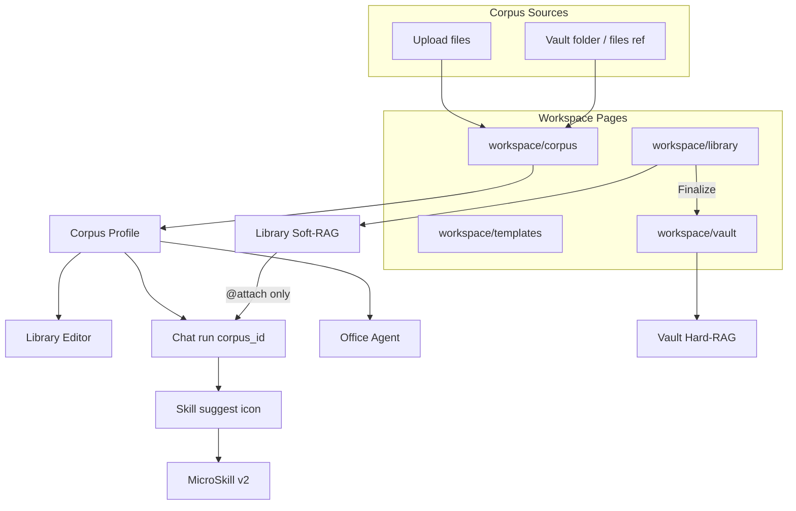

# OAAO Content Studio — Epic & Story Backlog（Jira / Linear）

> **Project:** `OAAO-V1`  
> **Milestone:** `Content-Studio-2026`  
> **匯入檔:** [OAAO_Content_Studio_Jira_Import.csv](./OAAO_Content_Studio_Jira_Import.csv)  
> **相關:** [MIGRATION_LEGACY_OAAO.md](./MIGRATION_LEGACY_OAAO.md) · [Manus_Gap_Analysis.md](./Manus_Gap_Analysis.md) · [Evolution_System_Design.md](./Evolution_System_Design.md) · [OAAO_90D_Jira_Import_Guide.md](./OAAO_90D_Jira_Import_Guide.md)

---

## 0. 產品定位（凍結）

四個能力共用 **Content Studio** 產品線，但 **Corpus 是獨立 workspace page**（對標 `workspace/templates` gallery 模式），**不是** Settings 子面板或 Vault 子 tab。

| 能力 | Workspace 入口 | 與 Vault / Chat 關係 |
|------|----------------|----------------------|
| **Corpus** | `workspace/corpus` | 來源 = 上傳檔 **或** 引用 Vault folder/files → 分類 + 學風格 → 產出 **Corpus Profile**；供 Editor / Chat / Office Agent 引用 |
| **Library + AI Editor** | `workspace/library` | Soft-RAG 文件庫 + Notion-like Block Editor；Chat **必須 @指定檔** 才 RAG Library；**Save to Vault** 後才進 Hard-RAG auto source |
| **Office Agent** | （Chat pipeline / Editor export） | 從 markdown/blocks 生成 docx / pdf / xlsx artifact |
| **Conversation Skills** | （Chat thread UX） | 對話沉澱 → thread icon → Dialog 確認建立 Skill → 版本 + 用量升級 |

**已具備基礎（本 backlog 假設可用）：** per-tenant object storage、Vault RAG、MicroSkill、crystallization、slide PPTX export、`AgentMaterialStorage`。

---

## 1. 架構概覽

---

## 2. Epic 清單（先建 4 + 1 可選）

| Epic ID | 名稱 | Priority | 建議 Sprint | Depends On |
|---------|------|----------|-------------|------------|
| **EPIC-CS-1** | Corpus Studio（workspace/corpus） | P0 | CS-W1 – CS-W4 | Tenant storage ✅ |
| **EPIC-CS-2** | Library + AI Block Editor | P0 | CS-W3 – CS-W8 | EPIC-CS-1（Corpus picker 部分） |
| **EPIC-CS-3** | Office Generation Agent | P1 | CS-W6 – CS-W9 | EPIC-CS-2（內容來源） |
| **EPIC-CS-4** | Conversation Skills Evolution | P1 | CS-W4 – CS-W7 | MicroSkill ✅ |
| **EPIC-CS-P** | Platform 收尾（非功能） | P2 | 穿插 | OAAO 90D 剩餘項 |

---

## 3. EPIC-CS-1 — Corpus Studio（`workspace/corpus`）

### 3.1 產品規格

- **入口：** `registerSpaPage('workspace/corpus', …)`，Gallery layout（對齊 `workspace/templates`）。
- **Corpus 實體：** 一筆 profile = 名稱 + 描述 + 標籤 + **style_json** + 來源清單 + 狀態（`draft` / `learning` / `ready` / `error`）。
- **來源類型：**
  1. **Upload** — 直接上傳（docx/pdf/md/txt…）→ tenant storage `corpus` domain（或專用 prefix）。
  2. **Vault reference** — 選 **folder（container）** 或 **多個 document**；存 locator + vault_id，不複製正文（analyze 時 materialize/cache）。
- **Pipeline：** ingest → extract segments（复用 vault extract）→ **classify**（genre / audience / tone / domain / language）→ **learn**（style_json：structure、lexicon、formatting、do/don't）→ **ready**。
- **輸出：** Editor / Chat / Office 可選 `corpus_id`；Corpus page 內 **Generate preview** 驗收風格。

### 3.2 Stories

| Story ID | Summary | Priority | Owner | Acceptance Criteria（摘要） |
|----------|---------|----------|-------|---------------------------|
| **CS-1-S1** | `oaaoai/corpus` 模組骨架 + SPA 註冊 | P0 | php-lead | `workspace/corpus` 出現在 sidebar；空狀態 gallery shell；i18n EN/zh |
| **CS-1-S2** | PostgreSQL schema | P0 | php-lead | 表：`oaao_corpus_profile`、`oaao_corpus_source`、`oaao_corpus_segment`；workspace ACL；migration |
| **CS-1-S3** | Corpus 列表 / 建立 / 刪除 API | P0 | php-lead | CRUD JSON envelope；列表含 status、source 計數、標籤 |
| **CS-1-S4** | 來源：上傳檔案 | P0 | php-lead | 多檔 upload → storage locator；關聯 `corpus_source.kind=upload` |
| **CS-1-S5** | 來源：Vault folder / files 引用 | P0 | php-lead | Picker 复用 vault scope；`kind=vault_container` / `vault_document`；存 ref 不 embed |
| **CS-1-S6** | Orchestrator `CorpusAnalyze` job | P0 | python-lead | `POST /v1/corpus/analyze`；enqueue；progress SSE 或 poll；segment + classify 輸出 |
| **CS-1-S7** | Style learning（LLM profile 提取） | P0 | python-lead | 產出 `style_json` v1 schema；可重跑；失敗可 partial |
| **CS-1-S8** | Corpus 詳情 UI：來源、分類、profile 編輯 | P0 | php-lead | 分類 chips 可手改；style 區塊 form + JSON 進階；Re-analyze 按鈕 |
| **CS-1-S9** | `CorpusGenerate` preview | P1 | python-lead | 輸入 brief → 套用 profile 生成 sample；Corpus page 內預覽 |
| **CS-1-S10** | Chat / API contract：`corpus_id` | P1 | python-lead | `ChatRunRequest` + send.php 傳遞；planner system 注入 style block |
| **CS-1-S11** | Contract tests + PHP/Python tests | P1 | qa-lead | schema 進 `contracts/v1/`；≥1 integration test analyze→profile |

**DoD（Epic）：** 使用者可在 Corpus page 從 upload 或 Vault 引用建立 profile，跑 analyze，編輯 style，並在 Chat 選 corpus 看到風格差異。

---

## 4. EPIC-CS-2 — Library + AI Block Editor（`workspace/library`）

### 4.1 產品規格

- **入口：** `workspace/library` — 文件列表 + 開啟 Editor。
- **文件模型：** `library_document` + `library_revision`（blocks JSON + optional markdown mirror）；版本链。
- **Import：** upload → orchestrator convert → blocks（docx/pdf/txt/md）；初始 revision v1。
- **Editor：** RazyUI Block Editor（Notion-like）；AI actions：rewrite / expand / summarize / **apply corpus style**。
- **Soft-RAG：** Qdrant collection `library_{tenant}` 或 workspace  scoped；**僅** `attached_library_doc_ids` 時检索。
- **Chat 規則（硬性）：** planner auto RAG **不包含** Library；composer @library-doc 才帶 `library_search` tool / context。
- **Finalize to Vault：** 一鍵複製正文+附件 locator → vault document + embed job → 之後 Chat vault scope 可見。

### 4.2 Stories

| Story ID | Summary | Priority | Owner | Acceptance Criteria（摘要） |
|----------|---------|----------|-------|---------------------------|
| **CS-2-S1** | `oaaoai/library` 模組 + SPA | P0 | php-lead | `workspace/library`；列表 + 新建空白文檔 |
| **CS-2-S2** | Library schema + revision API | P0 | php-lead | CRUD document；`POST revision` delta；樂觀鎖 |
| **CS-2-S3** | Upload → blocks 轉換 | P0 | python-lead | `/v1/library/convert`；复用 vault extract + block 化 heuristics |
| **CS-2-S4** | Block Editor shell（RazyUI） | P0 | php-lead | 基本 block types：paragraph、heading、list、code、divider；儲存 revision |
| **CS-2-S5** | Editor AI 側欄 / 選區操作 | P1 | python-lead | 選段 → AI 改寫；SSE 或一次性 JSON；audit log |
| **CS-2-S6** | Corpus 選擇器整合 Editor | P1 | php-lead | Toolbar 選 corpus profile；AI 操作帶 `corpus_id` |
| **CS-2-S7** | Library embed + search API | P0 | python-lead | chunk + embed；`POST /v1/library/search`；tenant 隔離 |
| **CS-2-S8** | Chat contract：library attach only | P0 | python-lead | send.php 傳 `library_doc_ids`；run_executor 無 id 不搜 library |
| **CS-2-S9** | Finalize to Vault | P0 | php-lead | 選 vault folder → 建 document + locator + enqueue embed |
| **CS-2-S10** | Composer @library UX | P1 | php-lead | Chat composer 搜尋/附加 library doc；與 vault attach 區分 |
| **CS-2-S11** | Tests + i18n | P1 | qa-lead | soft-RAG 隔離測試；finalize 後 vault RAG 命中 |

**DoD（Epic）：** Library 文檔可編輯、可 AI 改、可套 Corpus；Chat 僅 @library 才检索；Finalize 後 Vault 可 RAG。

---

## 5. EPIC-CS-3 — Office Generation Agent（docx / pdf / xlsx）

### 5.1 產品規格

- Planner agent / tool：`office_generate`（params: format, source: library_doc | message | corpus_brief, corpus_id?）。
- 產物存 `agent_materials` domain；Materials dialog 下載。
- Editor 快捷：Export → docx / pdf；（xlsx 可從 table block 匯出）。

### 5.2 Stories

| Story ID | Summary | Priority | Owner | Acceptance Criteria（摘要） |
|----------|---------|----------|-------|---------------------------|
| **CS-3-S1** | Agent 註冊 + planner tool schema | P1 | python-lead | `PlannerAgentRegister` + OpenAI tool；manifest 文件 |
| **CS-3-S2** | DOCX generator | P1 | python-lead | markdown/blocks → python-docx；Corpus 影響 heading/list 風格 |
| **CS-3-S3** | PDF generator | P1 | python-lead | HTML/CSS 或 weasyprint；CJK font 配置 |
| **CS-3-S4** | XLSX generator | P2 | python-lead | table block → openpyxl；基本 styling |
| **CS-3-S5** | Artifact persist + media URL | P1 | php-lead | `AgentMaterialStorage`；download API；TTL 可配置 |
| **CS-3-S6** | Chat Materials UI | P1 | php-lead | task_materials 顯示 office 檔；重新生成 |
| **CS-3-S7** | Library Editor export 菜單 | P2 | php-lead | Export docx/pdf 走同一 orchestrator 路由 |
| **CS-3-S8** | Tests | P1 | qa-lead | 各 format smoke；corpus_id 回歸 |

**DoD（Epic）：** Chat 可要求「輸出 docx 報告」並下載；可選 Corpus 風格。

---

## 6. EPIC-CS-4 — Conversation Skills Evolution

### 6.1 產品規格

- 與 **Crystallization**（系統自動 seal）分線：**User Skills** = 使用者確認、可編輯、有版本。
- 足夠 knowledge 時（classifier confidence + 回合數 + 可選 ACCS）→ thread 出現 **skill 圖示**。
- 點擊 → RazyUI Dialog：preview markdown + payload → Confirm 建立 `MicroSkill` v1。
- 使用次數 + 成功評分 → 建議升級 v2（diff preview，類 evolution patches UX）。

### 6.2 Stories

| Story ID | Summary | Priority | Owner | Acceptance Criteria（摘要） |
|----------|---------|----------|-------|---------------------------|
| **CS-4-S1** | MicroSkill schema v2 | P1 | php-lead | `version`、`parent_skill_id`、`usage_count`、`last_used_at`；migration |
| **CS-4-S2** | Skill candidate classifier | P1 | python-lead | post-turn 或 post-stream 輕量評分；輸出 `skill_candidate` struct |
| **CS-4-S3** | SSE `skill_suggested` event | P1 | python-lead | stream envelope；含 preview_md、confidence、proposed_title |
| **CS-4-S4** | Thread icon + dismiss | P1 | php-lead | chat-panel 顯示 icon；dismiss 存 thread-local |
| **CS-4-S5** | Create Skill Dialog | P1 | php-lead | RazyUI Dialog；edit title/summary → `skills_save` |
| **CS-4-S6** | Version bump + history | P1 | php-lead | Save as v2；列表顯示版本链 |
| **CS-4-S7** | Usage tracking + upgrade prompt | P2 | python-lead | N 次成功 invoke → suggest upgrade；可選 ACCS 門檻 |
| **CS-4-S8** | Settings / docs 與 crystallization 分界 | P2 | qa-lead | 文件 + Settings 說明兩條路徑 |
| **CS-4-S9** | Tests | P1 | qa-lead | classifier mock；dialog save；version chain |

**DoD（Epic）：** 長對話出現 skill 建議 icon；確認後可保存並在後續 Chat 套用；可升版。

---

## 7. EPIC-CS-P — Platform 收尾（可穿插）

| Story ID | Summary | Priority | 來源 |
|----------|---------|----------|------|
| **CS-P-S1** | Vault job ingest SSE Phase 2 | P1 | Top-20 #9 |
| **CS-P-S2** | Redis queue canary Stage 2 ops | P1 | W8_S3 |
| **CS-P-S3** | 更新 MIGRATION_LEGACY §4 parity 表 | P2 | 含 storage ✅、Corpus/Library 規劃 |
| **CS-P-S4** | `contracts/v1` corpus + library schemas | P1 | W7 延伸 |

---

## 8. 建議 Sprint 排程（Content Studio）

| Sprint | 週次 | 焦點 |
|--------|------|------|
| **CS-W1** | 1 | CS-1-S1…S5（Corpus page + schema + sources） |
| **CS-W2** | 2 | CS-1-S6…S8（Analyze + learn + detail UI） |
| **CS-W3** | 3 | CS-2-S1…S3（Library module + convert） |
| **CS-W4** | 4 | CS-1-S9…S11 + CS-4-S1…S3（Corpus preview + skill classifier 開工） |
| **CS-W5** | 5 | CS-2-S4…S6（Block Editor + Corpus in editor） |
| **CS-W6** | 6 | CS-2-S7…S9（Soft-RAG + Chat contract + Finalize） |
| **CS-W7** | 7 | CS-2-S10…S11 + CS-4-S4…S6（Composer @library + Skill dialog） |
| **CS-W8** | 8 | CS-3-S1…S3 + CS-4-S7…S9（Office docx/pdf + skill upgrade） |
| **CS-W9** | 9 | CS-3-S4…S8 buffer / hardening |

---

## 9. 依賴與風險

| 風險 | 緩解 |
|------|------|
| RazyUI Block Editor 成熟度 | CS-2-S4 spike 一週；不足則 ProseMirror 薄封裝 |
| Corpus analyze 成本 | 批次 + segment 上限；watch credit ledger |
| Library / Vault 雙轨 RAG 混淆 | CS-2-S8 契約測試 + composer UX 明確標籤 |
| Skill vs Crystallization 重疊 | CS-4-S8 產品分界；crystallization 保持 ACCS 自動 |

---

## 10. Jira / Linear 匯入

1. 匯入 [OAAO_Content_Studio_Jira_Import.csv](./OAAO_Content_Studio_Jira_Import.csv)（欄位對照見 [OAAO_90D_Jira_Import_Guide.md](./OAAO_90D_Jira_Import_Guide.md)）。
2. Milestone 設 **`Content-Studio-2026`**（與 `Commercialization-90D` 分開）。
3. Labels 建議：`content-studio` `corpus` `library` `editor` `office-agent` `skills`.

---

## 11. 相關文件更新（實作後）

- [MIGRATION_LEGACY_OAAO.md](./MIGRATION_LEGACY_OAAO.md) — §3 Corpus/Library 對標表
- [Manus_Gap_Analysis.md](./Manus_Gap_Analysis.md) — 檔案系統 write 軸（Library finalize 部分緩解）
- `backbone/sites/oaaoai/oaaoai/docs/backlog/` — 可新增 `corpus-studio.md` / `library-editor.md` 鏈到本文件
