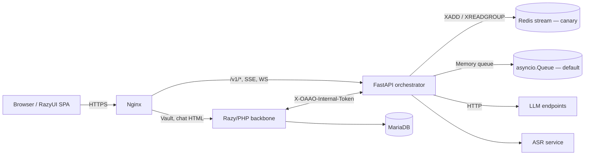

# W12-S1 — Architecture, Runbook & Rollback (Consolidated)

This is the operator-facing "one-page" entry point. Deep-dives live in the
linked specs.

## 1. Architecture (one diagram)

Key contracts: [contracts/v1/](../contracts/v1/) (error, chat-run.request, vault-job.envelope).

## 2. Runbook (top 6 procedures)

| Incident | Procedure |
| --- | --- |
| `bad_internal_token` spike | [W11_S1_SecretsRotationDrill.md](W11_S1_SecretsRotationDrill.md) §2 — verify both replicas read the same scheme |
| Queue depth growing unbounded | Check `OAAO_QUEUE_MAX_SIZE`; if memory backend, set cap. If Redis canary, `XLEN` + `XPENDING` |
| Stream returns 403 mid-session | [stream_token.py](../python/oaao_orchestrator/stream_token.py) — `OAAO_STREAM_TOKEN_TTL_SEC` likely exceeded |
| CORS preflight failing | [cors_config.py](../python/oaao_orchestrator/cors_config.py) — verify `OAAO_CORS_ALLOWED_ORIGINS` contains the exact scheme+host |
| Vault upload 500 | [vault.php](../backbone/sites/oaaoai/oaaoai/vault/default/controller/vault.php) → check `OAAO_VAULT_JOB_POLL_BASE_URL` reachability from orchestrator |
| Slow RAG retrieval | Enable `OAAO_PROFILING_ENABLED=1`; query `/v1/admin/profiling` for p95 |

## 3. Rollback matrix

| Change class | Rollback path | RTO |
| --- | --- | --- |
| Orchestrator code | Re-deploy previous tag, rolling restart | 5 min |
| Redis canary | `unset OAAO_QUEUE_BACKEND`; restart. Drain `XLEN` before unsetting last canary. | 10 min |
| Schema/contract bump | Revert contract file in `contracts/v1/`; PHP + Python re-deploy together | 15 min |
| Secret rotation | Restore `_NEXT` acceptance on PHP, revert orchestrator env | 5 min |
| CORS allowlist | `unset OAAO_CORS_ALLOWED_ORIGINS`; restart. Localhost defaults return. | 2 min |

## 4. Go/no-go criteria (gates the next release)

See [W13_S1_LoadTest_GoNoGo.md](W13_S1_LoadTest_GoNoGo.md).
