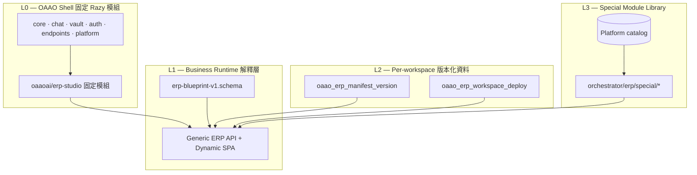
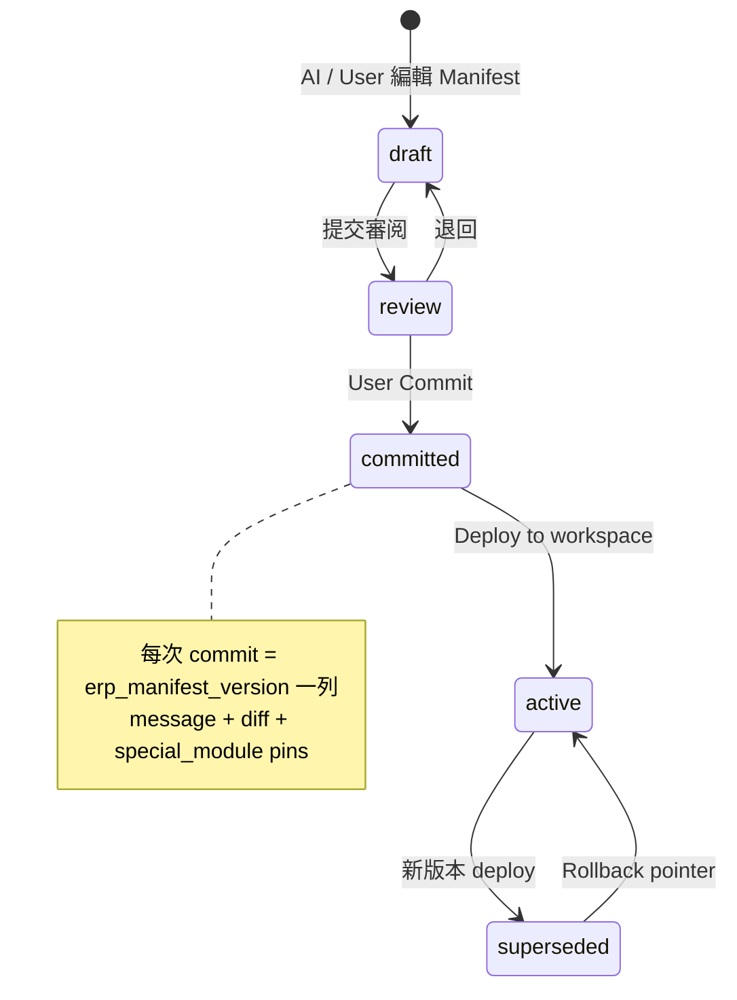
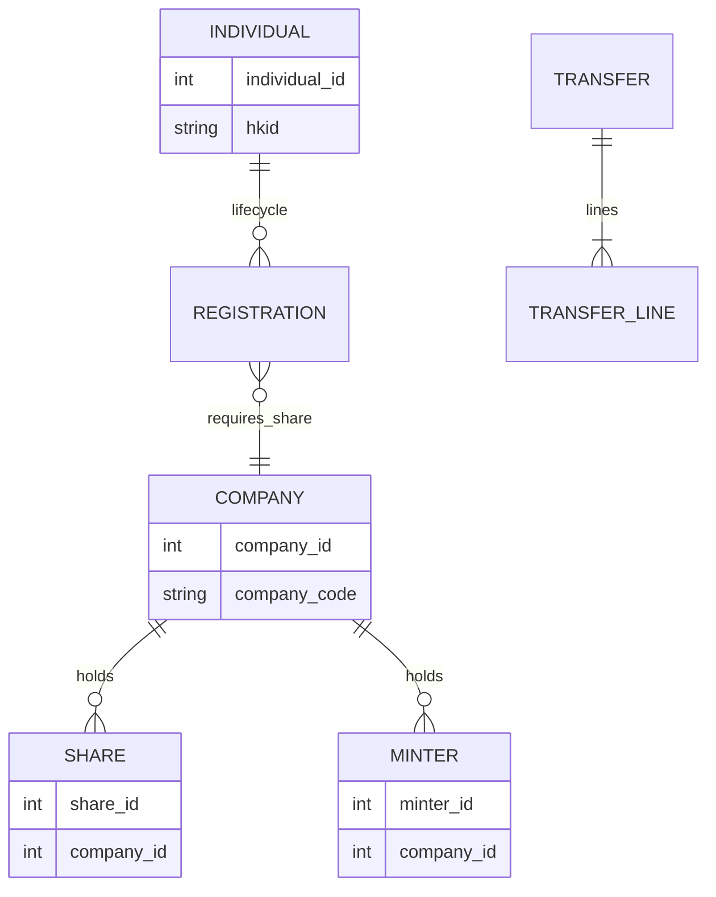
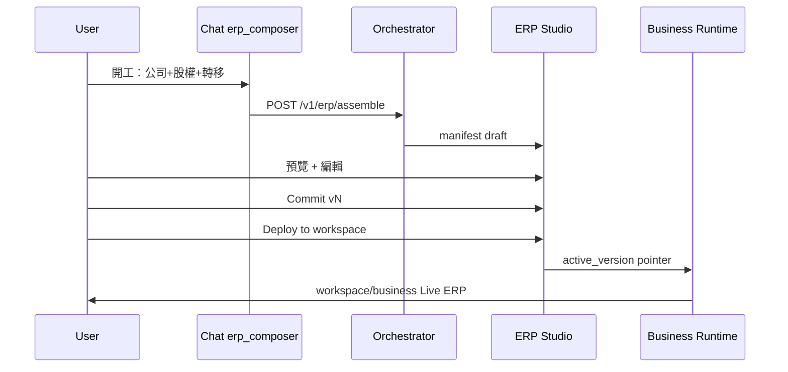
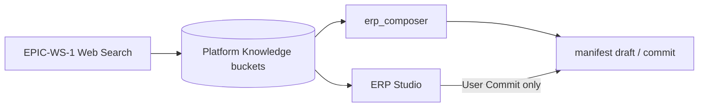
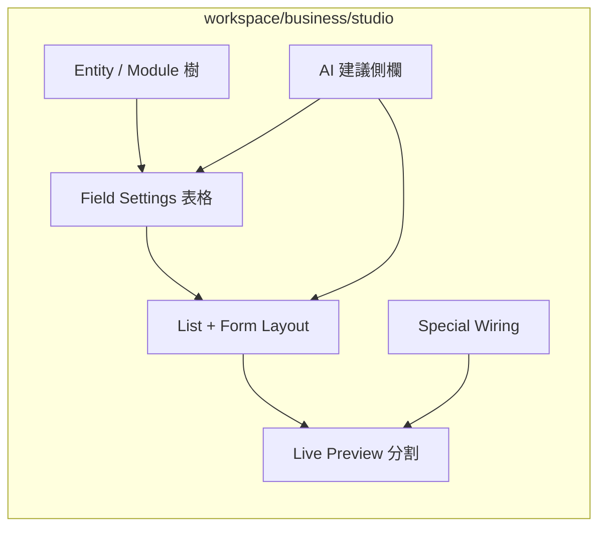

# Design pack — ERP Business Workspace (EPIC-BIZ)

| Field | Value |
|-------|--------|
| **Status** | v1.0 — frozen (design) |
| **Epic** | EPIC-BIZ-1 … EPIC-BIZ-6 |
| **Milestone** | **Business-ERP-2027**（OAAO 最後一條龐大產品線） |
| **Sprint** | BIZ-W1+（**Content Studio 2026 · EVOL Phase 8–11 · EPIC-WS-1 主線完成後**） |
| **Authoritative spec** | [OAAO_Content_Studio_Epics.md §17](../OAAO_Content_Studio_Epics.md) |
| **Legacy reference** | `../Razy-Dev/sites/main/dev/*`（Membership / 會計域 blueprint 來源，**不** import runtime） |

---

## 1. 產品定位（凍結）

**Business Workspace** 是 OAAO.ai 在 Intelligence 能力（Chat、Vault、Corpus、Library…）之上的 **第二工作平面**：

> 進入 `workspace/business` 後，企業 ERP = **使用者已 commit 的功能版本**（Manifest JSON + 已掛載 Special Module）所組成；AI 只產 **draft**，**User commit** 才進 Live ERP。

| 平面 | 入口 | 變更方式 |
|------|------|----------|
| **Intelligence**（現有） | Chat、Vault、Corpus、Library、Calendar… | 平台發版 |
| **Business**（本 pack） | `workspace/business` · `workspace/business/studio` | AI draft → User commit → deploy / rollback |

**三個固定名詞：**

| 名詞 | 含義 |
|------|------|
| **Blueprint Schema** | `contracts/v1/erp-blueprint-v1` — 定義 entity / fields / api / ui / permissions 怎麼寫（**不是**預裝 company 模組庫） |
| **Generated Manifest** | Agent 或 User 產出的 JSON 實例（company、individual、share…）— Runtime **零 coding** 物化 |
| **Special Module Library** | 少而精的跨模組 / 合規 / 企業特規邏輯（code + contract + tests）；**大多需 AI coding + 人審** 後才可複用 |

**硬性原則（對齊 Content Studio §0.1）：**

- 結構性 CRUD（主檔、列表、表單、權限）→ **Manifest JSON**，禁止 per-tenant 生成 Razy PHP 模組。
- 跨實體 invariant、狀態機副作用、會計 post → **Special Module** 引用，禁止 LLM 自由寫借貸 / 轉移規則。
- Heavy 工作（assemble、validate-special、AI coding draft）→ **Python orchestrator**；PHP = auth、ACL、CRUD 轉發、commit 落庫、≤30s enqueue。

**Web Search 加成（EPIC-WS-1）：** OAAO 具備 **platform 級 Web Search → Knowledge buckets** 能力；Business ERP 可引用公開市場與法規趨勢（非 tenant 私有資料），在 `erp_composer` 與 ERP Studio 產出 **manifest / special module 優化建議**（新欄位、workflow、合規 wiring），使生成與迭代更貼近 **市場需求與 trending** — 建議仍為 **draft**，由 User **commit** 才進版本化 Live ERP。

**Module Studio（UI 可視化設定）：** 對標 SugarCRM **Studio** — 使用者在 UI **看見並編輯** 所有 module / entity / **field settings**（型別、必填、唯一、標籤、validation）、**layout**、relationship、enum、permissions、special wiring；比 Sugar **更現代**（JIT、即時 Preview、版本 Diff）且 **AI 化**（側欄建議、Web Search 優化、Chat 深鏈）；底層仍為 Manifest JSON，Advanced 可切 raw JSON（§9.1）。

---

## 2. 架構：單 Razy，三層解耦（非 nested Razy instance）



### 2.1 禁止 vs 允許

| ❌ 禁止 | ✅ 允許 |
|---------|---------|
| 每 tenant 生成 `oaaoai/company` PHP 打進 phar | 單一 `oaaoai/erp-studio` + catch-all 路由 |
| 每 entity `registerSpaPage` | `workspace/business` + 動態 nav 來自 active manifest |
| LLM 寫 `invoices/post.php` 分錄 | `special_id: membership.transfer_v1` 引用 |
| PHP-FPM 長時間 assemble / AI coding | orchestrator job + poll |

### 2.2 固定 Razy 路由（只加一個功能模組）

| 路由 / API | 職責 |
|------------|------|
| `registerSpaPage('workspace/business', …)` | Live ERP shell（動態 nav + entity 視圖） |
| `registerSpaPage('workspace/business/studio', …)` | Draft 預覽、diff、commit、deploy、rollback |
| `GET/POST /erp/api/*` | manifest CRUD、commit、deploy、generic entity CRUD |
| `POST /v1/erp/assemble` | orchestrator：NL → manifest draft |
| `POST /v1/erp/validate-special` | special module 契約 + scenario tests |

動態 entity 路由範例：`/erp/api/{entity_slug}/list|save|delete|…` — 由 **active manifest** 授權，非硬編路由表。

---

## 3. 工作流：Generate → Review → Commit → Deploy



| 狀態 | 寫入者 | 影響 Live ERP |
|------|--------|---------------|
| `draft` | AI + User | 否（Studio 沙箱預覽） |
| `committed` | User 確認 | 否（待 deploy） |
| `active` | deploy 動作 | **是** |
| `superseded` | 新 active 取代 | 否（可 rollback） |

---

## 4. JSON 生成域（≈80% 零 coding）

### 4.1 Blueprint Schema 覆蓋範圍

一份符合 `erp-blueprint-v1` 的 Manifest JSON **應覆蓋約 80% 工作量**：

| 區塊 | 占比 | Runtime 產物 |
|------|------|--------------|
| `entity` + `fields` | ~45% | PG 表 / 動態 row store、Validator |
| `api` | ~15% | Generic CRUD 端點 |
| `ui` | ~15% | Dynamic list / form（RazyUI + JIT） |
| `permissions` + `menu` | ~15% | fork 節點、Business nav 項目 |
| `logic[]` | ~10% | 僅 **引用** special_id / workflow atom |

**沒有「基礎模組庫」**：`company`、`individual` 等皆為 **當場生成或 fork 的 Manifest**，不是平台預裝模組包。相似度搜尋對象 = 同 tenant / Marketplace **歷史 manifest**，非內建 library。

### 4.2 Manifest 範例（company 精簡）

```json
{
  "manifest_version": 1,
  "module_slug": "company",
  "label": { "zh": "公司", "en": "Company" },
  "entity": {
    "table": "erp_dyn_company",
    "primary_key": "company_id",
    "soft_delete": "disabled",
    "scope": "workspace"
  },
  "fields": [
    { "id": "company_code", "type": "code", "required": true, "unique": true },
    { "id": "chinese_name", "type": "text", "required": true },
    { "id": "english_name", "type": "text", "required": true },
    { "id": "br_no", "type": "text", "required": true },
    { "id": "addresses", "type": "composite.addresses_v1" },
    { "id": "status", "type": "enum", "values": ["draft", "active"], "default": "draft" }
  ],
  "api": { "list": {}, "create": {}, "edit": {}, "delete": { "mode": "soft" }, "finalize": {} },
  "ui": {
    "list": { "columns": ["company_code", "chinese_name", "english_name", "status"] },
    "form": { "sections": [{ "fields": ["company_code", "chinese_name", "english_name", "br_no", "addresses"] }] }
  },
  "permissions": { "fork": "erp.company.{view,create,edit,delete,finalize}" },
  "logic": []
}
```

Field type registry（平台內建）：`code`, `text`, `date`, `money`, `enum`, `fk.*`, `composite.addresses_v1`, `phone_list`, … — 擴 type 才需平台發版，擴 entity 只需新 JSON。

---

## 5. Special Module Library（≈20%，AI coding 主戰場）

### 5.1 何時進庫

| 特徵 | 範例 | 原因 |
|------|------|------|
| 跨實體 invariant | 鑄金只能給 **有股權** 的公司 | 多表查詢 + 規則 |
| 狀態機 + 副作用 | Transfer A→B post 後搬移 share/minter 歸屬 | transaction + audit |
| 生命週期編排 | Registration 入職/轉職/離職/續牌 | 事件序列 + 前置條件 |
| 企業特規 | 某集團審批鏈、舊 ERP 對接 | 一次性 domain code |
| 會計 / 合規 | GL post、稅務 | 法律責任 — **禁止** NL 發明分錄 |

### 5.2 條目結構

```json
{
  "special_id": "membership.minter_requires_share_v1",
  "kind": "constraint",
  "applies_to": ["entity.license.minter", "entity.transaction.transfer"],
  "runtime": "python/oaao_orchestrator/erp/special/membership/minter_requires_share.py",
  "contract": "contracts/v1/erp-special-minter-requires-share.json",
  "tests": "python/tests/erp/test_minter_requires_share.py",
  "ai_codable": true,
  "human_review_required": true
}
```

Manifest 只 wiring：

```json
{
  "wiring": [
    { "special_id": "membership.minter_requires_share_v1" },
    { "special_id": "membership.transfer_v1" },
    { "special_id": "membership.registration_requires_share_v1" }
  ]
}
```

### 5.3 Marketplace

| 上架類型 | 內容 |
|----------|------|
| **Manifest 模板** | 脫敏 JSON — fork 後仍走 Runtime |
| **Special Module** | 審核過 code + contract + tests — `special_id` 授權 |

不賣「company 模組」— JSON 可生成；賣「香港會籍轉移合規包」等特殊模組。

---

## 6. 參考域 — Membership（Razy-Dev）



### 6.1 業務不變式（Special Module，非 JSON）

| ID | 規則 |
|----|------|
| **INV-1** | 鑄金牌照只能轉讓/賦予 **已有股權（Share）** 的公司 |
| **INV-2** | Transfer A→B：from 必須持有被轉出的 share/minter |
| **INV-3** | Transfer 直接賦予：to 須先有 share 才能收 minter |
| **INV-4** | Registration（入職/轉職/離職/續牌）前置：individual 對該 company 須有有效 share 關係 |
| **INV-5** | share_code / minter_code 全域唯一（Manifest validation + DB unique） |

### 6.2 模組歸類

| 功能 | JSON Manifest | Special Module |
|------|---------------|----------------|
| Individual / Company 主檔 | ✅ | — |
| Share / Minter 實體 | ✅（含 `company_id` fk） | — |
| Transfer A→B / 直接賦予 | 結構 ✅ | **membership.transfer_v1** |
| INV-1 … INV-4 | wiring 引用 | **constraint.\*** |
| 某券商獨有審批 | 部分 JSON | **enterprise.\*** AI coding |

---

## 7. Agent 整合



| Purpose（建議） | 消費者 | 任務 |
|-----------------|--------|------|
| `erp.manifest.compose` | `/v1/erp/assemble` | NL → Manifest draft |
| `erp.manifest.diff` | Studio | 與 active 比 diff |
| `erp.special.draft` | AI coding pipeline | 新 special module 草稿 |
| `erp.constraint.validate` | pre-commit | deterministic 驗證（非 LLM） |
| `erp.studio.ai_assist` | Module Studio 側欄 | 建議 field / layout / picklist → draft |
| `erp.market.research` | compose / optimize 前 | EPIC-WS-1 Knowledge 上下文 |

Credit：Manifest assemble 按 field/entity 數；Special Module AI coding 按複雜度 × 測試輪數；引用已有 special = install fee + 月維護。

### 7.1 Web Search → 市場貼合與模組優化

Business ERP 與 **EPIC-WS-1**（Web Search → platform Knowledge buckets）共用 OAAO 的公開情報層，**不**取代 tenant 私有 Vault / Corpus。

| 用途 | 行為 | 產出 |
|------|------|------|
| **Assemble 前** | `erp_composer` 依產業 / 地域 / 法規關鍵字检索 Knowledge | Manifest draft 欄位、enum、workflow 建議 |
| **Studio 迭代** | 對 active manifest 比對 trending 主題 | 「優化建議」diff（新 field、special wiring、Marketplace 模板） |
| **Special 優先序** | Platform 營運 / tenant admin 看 sector 熱度 | Special Module Library 開發與上架優先級 |
| **合規提示** | 法規 / 申報窗口變更 | constraint 或 manifest 修訂 **draft**（禁自動 deploy） |



**原則：** Web Search 只影響 **建議與 draft**；市場情報經 ACCS / 人審後才可進 Special catalog 或 commit。**禁止**因 trending 自動改 active ERP。

建議 purpose：`erp.market.research`（compose / optimize 前检索）· 可复用 `knowledge.search_plan` / `knowledge.distill` pipeline（見 [web-search-knowledge-evolution.md](./web-search-knowledge-evolution.md)）。

---

## 8. 資料模型（PostgreSQL）

| 表 | 用途 |
|----|------|
| `oaao_erp_manifest` | 邏輯模組 slug（company、transfer…） |
| `oaao_erp_manifest_version` | 每次 commit 的 JSON snapshot + message + diff_meta |
| `oaao_erp_draft` | 未 commit 的 AI/User 草稿 |
| `oaao_erp_workspace_deploy` | `workspace_id` → `active_version_id`（可含 entity 級 pin） |
| `oaao_erp_special_catalog` | Platform special module 登錄 |
| `oaao_erp_special_install` | workspace 掛載 `special_id` + semver |
| `oaao_erp_dyn_*` | Runtime 依 manifest 物化或 EAV row store |

Rollback = 更新 deploy pointer；schema **向前兼容**，不刪歷史 version。

---

## 9. UX & shell

| Item | Pattern |
|------|---------|
| Rail | `#workspace-rail-business` — 與 corpus/library 并列 |
| Live | `workspace/business` — 左 nav 來自 active manifest entities |
| Studio | `workspace/business/studio` — **Module Studio** + draft / diff / commit / deploy / history |
| Chat | `erp_composer` agent；commit 前 Dialog 確認（constraints + credit） |
| JIT | Dynamic form/list 用 utility + `JIT.hydrate(mount)` |
| Scope | **workspace-bound**（`FeatureScopeRegister::LEVEL_WORKSPACE`） |

### 9.1 Module Studio — SugarCRM Studio 概念，現代 + AI 化

**定位：** 非技術 admin 與 power user 在 **同一 UI** 管理 ERP 結構，無需手改 PHP；Manifest JSON 為 **持久化格式**，預設 **視覺化編輯器**，Advanced 可切 JSON。

**對標 SugarCRM Studio vs OAAO Module Studio：**

| SugarCRM Studio | OAAO Module Studio |
|-----------------|-------------------|
| Module Builder | Entity 列表（manifest 內 module_slug） |
| Field Editor | Field grid：type / label / required / unique / default / validation |
| Dropdown Editor | Enum & composite field 子編輯 |
| Layout Editor | List columns + Form sections（drag reorder） |
| Relationship | FK picker（`fk.company` 等）+ 關聯線圖（v2） |
| Logic Hooks（有限） | **Special wiring** 面板：enable `special_id`、唯讀看 constraint |
| 無 AI | **AI 側欄**：建議欄位、排版、Web Search 優化、一鍵套用 draft |
| Deploy 模糊 | **明確** draft → preview → commit → deploy / rollback |



**UI 分區（JIT-first）：**

| 分區 | 內容 | 編輯對象（manifest 路徑） |
|------|------|---------------------------|
| **Modules** | 所有 entity / 模組樹 | `entities[]` |
| **Fields** | 欄位名、型別、i18n label、required、unique、min/max | `fields[]` |
| **Layouts** | 列表欄順序、表單 section / 欄位順序 | `ui.list` · `ui.form` |
| **Relationships** | FK 目標 entity、cardinality | `fields[].type` = `fk.*` |
| **Picklists** | enum 值、預設、排序 | `fields[].values` |
| **Access** | 權限 fork 預覽（對齊 group） | `permissions.fork` |
| **Logic** | 已掛 special module、workflow atom | `logic[]` · `wiring[]` |
| **Advanced** | Monaco / textarea raw JSON | 整份 manifest |
| **AI Assist** | 「加效期欄位」「依 HK 慣例改 label」 | 寫入 **draft** only |

**互動原則：**

- 所有變更先寫 **draft**；**Preview** 用沙箱 render Dynamic form/list，不影響 Live。
- 欄位型別僅能選 **Field type registry** 內項目（防幻覺）；AI 建議新 type 需 platform 擴 registry。
- Commit 前 **Diff** 高亮：+field、~layout、+wiring。
- Live ERP（`workspace/business`）可進 **「查看設定」**（read-only Module Studio）看 active 版 field/layout，需 **「在 Studio 編輯」** 才 fork draft。

**RazyUI：** Field 列用 `Input` / `Select` / `Dropdown`；layout drag 可用 sortable list；Dialog 用於 delete field 確認；**禁止** hand-written BEM 取代 JIT layout。

---

## 10. Runtime 分工

| 層 | PHP (`oaaoai/erp-studio`) | Python (`oaao_orchestrator/erp/`) |
|----|---------------------------|----------------------------------|
| Auth / ACL | ✅ | — |
| Manifest CRUD / commit / deploy | ✅ | — |
| Generic entity CRUD | ✅ | — |
| NL → draft | enqueue | ✅ assemble |
| Special validate / post hooks | 轉發 | ✅ |
| AI special coding | enqueue | ✅ draft + tests |

---

## 11. Epic 對照

| Epic | 摘要 |
|------|------|
| **EPIC-BIZ-1** | Business shell + manifest version + commit/deploy/rollback |
| **EPIC-BIZ-2** | `erp-blueprint-v1` schema + Assembly Runtime |
| **EPIC-BIZ-3** | ERP Studio UI（**Module Studio** 視覺化 field/layout + draft、diff、commit） |
| **EPIC-BIZ-4** | Chat `erp_composer` + orchestrator assemble |
| **EPIC-BIZ-5** | Special Module Library + AI coding + 入庫 |
| **EPIC-BIZ-6** | Membership 垂直首包（transfer + registration constraints） |

詳細 Story 見 [OAAO_Content_Studio_Epics.md §17](../OAAO_Content_Studio_Epics.md)。

---

## 12. 依賴（硬性）

| 前置 | 原因 |
|------|------|
| Content Studio 2026 主線（CS-W12） | 平台 SPA / credit / contract 慣例 |
| EPIC-PLAT-2 | Tenant 身份與 invitation |
| EPIC-EVOL-1（ACCS） | Special module 上架門檻 |
| EPIC-INFRA-1 | `erp.*` purpose 掛載 |
| **EPIC-WS-1** | Web Search Knowledge — `erp.market.research` / compose 前市場上下文 |
| Credit ledger ✅ | assemble / coding 計費 |

---

## 13. 風險

| 風險 | 緩解 |
|------|------|
| 動態 ERP 查詢性能 | 熱 entity 物化 PG 表；冷数据 EAV |
| Manifest fork 爆炸 | Marketplace upstream；Studio diff 合併 |
| Special module 幻覺 | ACCS + 自動 tests + 人審；會計禁 NL |
| 與 Intelligence 定位混淆 | Business rail 獨立；文档分界 |
| per-tenant PHP 誘惑 | 架构 review 紅線；只允許 erp-studio 固定模組 |
| Module Studio 視覺/JSON 分叉 | 雙向 binding；draft 單一來源；commit 前 diff |
| Sugar 式 layout 範圍膨脹 | v1：field grid + list/form reorder；進階畫布 v2+ |
| 版本 rollback 資料不一致 | forward-compatible schema；migrate plan 人工核准 |

---

## 14. Out of scope（v1）

- Per-tenant Razy phar 模組 codegen（EPIC-BIZ-7+ 研究項）
- 完整 acc-* 會計包自動生成（僅 Membership + 手選 special）
- Business 與 Vault RAG 自動混用（v1 手動 @ 引用）

---

## 15. KPI（GTM 後）

| KPI | 目標 |
|-----|------|
| Manifest entity 上線時間 | ≤15 min（零 coding path） |
| Commit → deploy | ≤1 min pointer swap |
| Special module 首次通過 tests | ≥90%（含 AI draft + 人審） |
| Rollback | ≤1 min，零 downtime |

---

## 16. Sign-off

- [ ] cto — 架構（單 Razy + manifest runtime）
- [ ] php-lead — erp-studio 模組邊界
- [ ] python-lead — orchestrator erp/* + special pipeline
- [ ] product — Business vs Intelligence 產品分界
