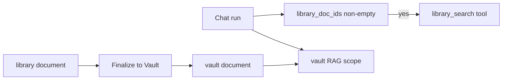

# Design pack — Library + AI Block Editor (EPIC-CS-2)

| Field | Value |
|-------|--------|
| **Status** | v1.0 — ready to implement |
| **Epic** | EPIC-CS-2 |
| **Milestone** | Content-Studio-2026 |
| **Sprint** | CS-W3 (S1–S3) · CS-W5–W6 (S4–S9) · CS-W7 (S10–S11) |
| **Depends on** | EPIC-CS-1 (Corpus picker in editor — CS-2-S6); Corpus **not** blocking S1–S5 |
| **Authoritative spec** | [OAAO_Content_Studio_Epics.md §4](../OAAO_Content_Studio_Epics.md) |

---

## 1. Scope

### In scope

- **`workspace/library`** — document list + open editor.
- Module **`oaaoai/library`**.
- `library_document` + `library_revision` (blocks JSON + optional `markdown_mirror`).
- Upload → orchestrator **`POST /v1/library/convert`** → blocks v1.
- RazyUI Block Editor (or thin wrapper per §6 spike).
- Soft-RAG: Qdrant collection `library_{tenant_id}`; search only when IDs attached.
- Chat: **hard rule** — no library RAG without `library_doc_ids` (CS-2-S8).
- **Finalize to Vault** → vault document + embed job (CS-2-S9).

### Out of scope

- Corpus analyze pipeline (CS-1).
- Office agent export menu (CS-3-S7).
- Legacy Go Library gRPC port ([MIGRATION_LEGACY_OAAO.md §Phase 4](../MIGRATION_LEGACY_OAAO.md)).

### Pre-GTM

- Full `contracts/v1` library schemas if not done in CS-2-S11.
- Lance / multimodal image pipeline.

---

## 2. UX & shell

| Item | Pattern |
|------|---------|
| Layout | **Split** — document list in `#workspace-library-sidebar-section`, block editor in main `#workspace-module-mount` (CS-2-S4). |
| List | FetchTable-style list or lightweight custom (JIT tokens) |
| Editor | Full-height panel; autosave revision deltas |
| Chat composer | `@library` typeahead (CS-2-S10) — distinct badge from `@vault` |

---

## 3. Data model

### `oaao_library_document`

| Column | Notes |
|--------|--------|
| document_id | PK |
| tenant_id, workspace_id | |
| title | |
| corpus_id | nullable FK (applied style for AI ops) |
| current_revision_id | |
| created_at, updated_at | |

### `oaao_library_revision`

| Column | Notes |
|--------|--------|
| revision_id | PK |
| document_id | FK |
| parent_revision_id | nullable (branch v2) |
| blocks_json | array of block objects |
| markdown_mirror | optional |
| created_by, created_at | |

### Block types v1

`paragraph`, `heading` (level 1–3), `bullet_list`, `numbered_list`, `code`, `divider`, `table` (rows for later xlsx export).

---

## 4. API surface

### PHP

| Story | Endpoint |
|-------|----------|
| CS-2-S2 | `library_documents_list`, `library_document_save`, `library_document_delete` |
| CS-2-S2 | `library_revision_commit` (optimistic lock: `base_revision_id`) |
| CS-2-S9 | `library_finalize_to_vault` |
| CS-2-S10 | `library_documents_search` (title/typeahead, not vector) |

### Orchestrator

| Story | Route |
|-------|-------|
| CS-2-S3 | `POST /v1/library/convert` |
| CS-2-S5 | `POST /v1/library/ai/transform` (selection + action) |
| CS-2-S7 | `POST /v1/library/embed` (enqueue) · `POST /v1/library/search` |
| CS-2-S8 | Enforced in `run_executor` / planner: skip library search if `library_doc_ids` empty |

**Collection naming:** `library_{tenant_id}` (document in CS-2-S7 implementation note).

---

## 5. RAG rules (hard contract)

| Path | Auto RAG in planner? |
|------|----------------------|
| Vault (in scope) | Yes (existing) |
| Library | **No** — only when composer attached IDs |
| After Finalize | Library content discoverable via **Vault** only |

**Test:** CS-2-S11 must include regression: message without attach → zero library chunks in envelope.

---

## 6. Editor spike (required before CS-2-S4 code merge)

| Option | Effort | Decision criteria |
|--------|--------|-------------------|
| **A. RazyUI BlockEditor** | Low if component exists | A11y + keyboard + save events OK in 1-day spike |
| **B. ProseMirror thin wrap** | Medium | Choose if A missing blocks or undo model |

**Spike output:** 1 paragraph in this file §6 + checkbox in PR. **Owner:** php-lead · **Timebox:** 1 day · **Due:** before CS-W5 starts.

**Spike result (fill on completion):**

- [x] Option **A** (RazyUI BlockEditor) chosen — CS-2-S4 wired in `library-panel.js`
- [x] Undo model: BlockEditor operational undo + revision autosave (800ms debounce)
- [x] Notes: `library-block-adapter.js` maps snake_case library blocks ↔ RazyUI kebab-case; extended types (todo, quote, callout, toggle, image) round-trip via `meta.ruType`; table via `code` + `meta.libraryType=table`

---

## 7. Task breakdown → Jira

| Sprint | Stories | Deliverable |
|--------|---------|-------------|
| **CS-W3** | CS-2-S1…S3 | Module, schema, convert |
| **CS-W5** | CS-2-S4…S6 | Editor + AI sidebar + corpus toolbar |
| **CS-W6** | CS-2-S7…S9 | Embed, search, chat contract, finalize |
| **CS-W7** | CS-2-S10…S11 | @library UX, tests, i18n |

---

## 8. KPI & acceptance

| KPI ID | Definition | Target | Measured |
|--------|------------|--------|----------|
| **cs2_convert_ok** | docx/pdf/md upload → valid blocks | ≥ 95% golden files | integration |
| **cs2_editor_save** | 50 edits without revision conflict lost | 0 data loss | stress test |
| **cs2_soft_rag_isolation** | run without `library_doc_ids` | 0 library hits | contract test |
| **cs2_attach_rag_hit** | run with attach | ≥ 1 chunk in fixture | contract test |
| **cs2_finalize_vault** | finalize → vault embed complete | vault RAG hits within 5 min staging | E2E |
| **cs2_ai_rewrite_p95** | selection rewrite | P95 ≤ 30s | orchestrator log |

**Epic DoD:** Edit + AI + optional Corpus; Chat @library only; Finalize → Vault RAG.

---

## 9. Dependencies & risks

| Risk | Mitigation |
|------|------------|
| Block Editor immature | §6 spike; fallback B |
| Library/Vault RAG confusion | CS-2-S8 tests + composer labels |
| Large doc convert OOM | chunk convert; size cap in API |
| Dual-write revision conflicts | optimistic lock + 409 response |

---

## 10. Implementation order

1. CS-2-S1 SPA + list  
2. CS-2-S2 schema + revision API  
3. CS-2-S3 convert route  
4. **Spike §6** then CS-2-S4 editor  
5. CS-2-S7–S9 before CS-2-S10 UX polish  

**Parallel with CS-W3:** PLAT-2-S6 admin UI does not block library.
