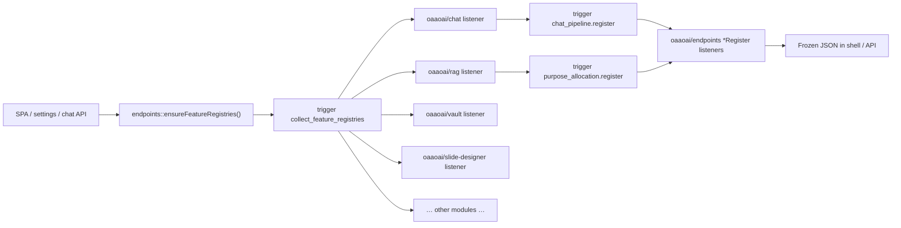

# Module hooks & pipeline registry

> **Audience:** AI agents and reviewers auditing modular boundaries.  
> **Related:** [chat-modular-architecture.md](./chat-modular-architecture.md) · [chat-ui-areas.md](./chat-ui-areas.md) · [sprint-module-boundary-charter.md](./sprint-module-boundary-charter.md) · [chat-send-pipeline.md](./chat-send-pipeline.md) · [razy-module-autoload.md](./razy-module-autoload.md) · [core.php](../../backbone/sites/oaaoai/oaaoai/core/default/controller/core.php) (layering notes)

Use this doc to answer:

1. Which **boot-time registry hooks** does each module emit?
2. Which **`chat.send.*` pipeline listeners** does each module register?
3. Where is logic still **hardcoded** or **cross-module** instead of isolated?

**Source of truth:** grep `collect_feature_registries.php`, `chat_send_*.php`, and `$agent->listen('oaaoai/chat:chat.send` in each module's `__onInit`.

---

## 1. Two hook families

| Family | When | Event namespace | Merge hub | Purpose |
|--------|------|-----------------|-----------|---------|
| **Feature registries** | Once per request (lazy) | `{module}:{hook}.register` on emitter module | `oaaoai/endpoints` listeners → `*Register` classes | Boot catalog: UI slots, planner agents, vault ingest, MM/ASR |
| **Chat send pipeline** | Every `POST /chat/api/send` | `oaaoai/chat:chat.send.{phase}` | `ChatSendContext` mutation + `mergePayloadFragment()` | Per-request send: scope, persist, orchestrator payload |

Registries answer *what exists at boot*. Chat send hooks answer *what happens on each send*.

---

## 2. Bootstrap flow



**Modules that listen** to `oaaoai/endpoints:collect_feature_registries`:

| Module | File |
|--------|------|
| chat | `chat/default/controller/event/collect_feature_registries.php` |
| rag | `rag/default/controller/event/collect_feature_registries.php` |
| vault | `vault/default/controller/event/collect_feature_registries.php` |
| slide-designer | `slide-designer/default/controller/event/collect_feature_registries.php` |
| endpoints | `endpoints/default/controller/event/collect_feature_registries.php` |
| research | `research/default/controller/event/collect_feature_registries.php` |
| mine | `mine/default/controller/event/collect_feature_registries.php` |
| sandbox-coder | `sandbox-coder/default/controller/event/collect_feature_registries.php` |
| live-meeting | `live-meeting/default/controller/event/collect_feature_registries.php` |

**Modules without** `collect_feature_registries` listener today: `user`, `auth`, `core`, `corpus`, …

---

## 3. Registry hook catalog

All `{hook}.register` events are **emitted on the owning module** (`$this->trigger(...)` inside that module's `collect_feature_registries` handler).  
`oaaoai/endpoints` **listens** on namespaced channels and merges into static registries.

| Hook | Registry class | Listener (endpoints) | Emit pattern | Purpose |
|------|----------------|----------------------|--------------|---------|
| `purpose_allocation.register` | `PurposeAllocationRegister` | `purpose_allocation_register_listener.php` | Per slot: `slot_id`, `purpose_key_prefix`, `module_code` | Settings → LLM routing keys (`chat.*`, `rag.*`, …) |
| `chat_pipeline.register` | `ChatPipelineRegister` | `chat_pipeline_register_listener.php` | `entry_id`, `kind`, `extras.module_code` | Composer slots, message blocks, step rails in chat UI |
| `planner_agent.register` | `PlannerAgentRegister` | `planner_agent_register_listener.php` | `agent_kind`, `planner_hint`, `intent_only`, … | Task planner agent catalog |
| `post_turn_action.register` | `PostTurnActionRegister` | `post_turn_action_register_listener.php` | `action_id`, `template_ref`, `sse_event`, `purpose_key_prefix` | Finalize async workers (Calendar/Todo classifiers) |
| *(chat API)* `setPlannerPrompt` | `PlannerPromptRegister` | — (modules call `api('chat')->setPlannerPrompt()` or future hook) | module, slot, content, numbered | Numbered planner system prompt lines → `planner_prompt_block` |
| `micro_skill_provider.register` | `MicroSkillsRegister` | `micro_skill_provider_register_listener.php` | `provider_id`, `kind` | Micro-skill sources (conversation, bound template) |
| `vault_document_hook.register` | `VaultDocumentHookRegister` | `vault_document_hook_register_listener.php` | `hook_id`, `kind`, `mime_prefixes` | Vault file ingest pipeline (embed, ASR, graph, …) |
| `tool_server.register` | `ToolServerRegister` | `tool_server_register_listener.php` | `server_id`, `base_url` | OpenAPI MCP tool servers (also loaded from JSON file) |
| `mm_python_module.register` | `MmPythonModuleRegister` | `mm_python_module_register_listener.php` | module id, Lance tasks | Python MM worker modules |
| `asr_user_preference.register` | `AsrUserPreferenceRegister` | `asr_user_preference_register_listener.php` | `field_id`, pref schema | User ASR polish preferences |

**Endpoints listener map** (hub): `endpoints/default/controller/endpoints.php` `__onInit` — search `$agent->listen([`.

**Direct registry writes** (no `{hook}.register` emit): `endpoints/.../collect_feature_registries.php` calls `PurposeAllocationRegister::add`, `MediaCapabilityRegister::add`, `MmPythonModuleRegister::add`, `AsrUserPreferenceRegister::addField` for platform-owned slots.

**Chat planner seed** (special case): `chat.php::oaao_chat_seed_planner_agents()` calls `PlannerAgentRegister::add()` directly for built-in agents (`vault_rag`, `sandbox_code`, `slides`, `image_gen`, `web_search`, `mcp_tool`) before module overrides via `planner_agent.register`.

**`intent_only` flag (2026-05-29):** When `extras.intent_only: true` on `planner_agent.register`:

- Row appears in `planner_intent_catalog[]` on orchestrator payload.
- Row is **excluded** from `allowed_agents`, `agent_catalog`, and Settings Task planner toggles (`dispatchableKinds()`).
- Used by **calendar** (`calendar_schedule`) and **todo** (`todo_extract`) — productivity is async via `post_turn_action`, not agent runners.

---

## 4. Chat send pipeline (`chat.send.*`)

**Entry:** `chat/default/controller/api/send.php` → `ChatSendPipeline::run()` on `oaaoai/chat`.

**Phase order:** `gate` → `prepare` → `message` → `scope` → `persist` → `conversation_settle` → `orchestrator_ready` → `run_start` → `respond`

**Orchestrator sub-stages** (`orchestrator_ready` only, via `payload['stage']`):

`bind` → `agents` → `core` → `slide` → `payload` → `personalize` → `finalize`

### 4.1 Phase × module matrix

| Phase / stage | chat | vault | slide-designer | endpoints | user |
|---------------|:----:|:-----:|:--------------:|:---------:|:----:|
| `gate` | ✓ | | | | |
| `prepare` | ✓ | ✓ | ✓ | | |
| `message` | ✓ | | ✓ | | |
| `scope` | ✓ | | | | |
| `persist` | ✓ (boundary) | | | | |
| `conversation_settle` | ✓ | | ✓ | | |
| `orchestrator_ready` / `bind` | ✓ | | | | |
| `orchestrator_ready` / `agents` | ✓ | | | | |
| `orchestrator_ready` / `core` | ✓ | | | | |
| `orchestrator_ready` / `slide` | | | ✓ | | |
| `orchestrator_ready` / `payload` | | ✓ | | ✓ | |
| `orchestrator_ready` / `personalize` | | | | | ✓ |
| `orchestrator_ready` / `finalize` | ✓ | | | | |
| `run_start` | ✓ (boundary) | | | | |
| `respond` | ✓ | | | | |

### 4.2 Listener registration (`$agent->listen`)

| Module | Registered events | Handler dir |
|--------|-------------------|---------------|
| **chat** | all `chat.send.*` (10 events; 3× `orchestrator_ready`) | `chat/default/controller/event/chat_send_*.php` |
| **vault** | `prepare`, `orchestrator_ready` | `vault/.../event/chat_send_*.php` |
| **slide-designer** | `prepare`, `message`, `conversation_settle`, `orchestrator_ready` | `slide-designer/.../event/chat_send_*.php` |
| **endpoints** | `orchestrator_ready` | `endpoints/.../event/chat_send_orchestrator_ready.php` |
| **user** | `orchestrator_ready` | `user/.../event/chat_send_orchestrator_ready.php` |

### 4.3 Per-listener responsibilities

| Listener | Library / behavior |
|----------|-------------------|
| `chat_send_gate` | `ChatSendGate` — credits, workspace scope |
| `chat_send_prepare` (chat) | `ChatSendComposer` — web search flag, attachment ids |
| `chat_send_prepare` (vault) | `VaultSendScope::parseComposerInput()` |
| `chat_send_prepare` (slide) | published template resolution |
| `chat_send_message` (chat) | `ChatSendMessage` — empty body, continue prompt |
| `chat_send_message` (slide) | `SlideSendTemplateSlug` — display vs orchestrator text |
| `chat_send_scope` | `ChatSendScopeResolver` — auto-RAG / teaching vault expansion (delegates to `VaultChatScope` / vault API) |
| `chat_send_conversation_settle` (chat) | `ChatSendConversationSettle` — title, inference meta |
| `chat_send_conversation_settle` (slide) | template user meta |
| `chat_send_orchestrator_ready` (chat) | `BIND`: `ChatSendOrchestratorBinding`; `AGENTS`: `ChatSendOrchestratorAgents` + `planner_intent_catalog`, `planner_prompt_block` |
| `chat_send_orchestrator_core` | `ChatSendOrchestratorCore` — tenant, attachments, thread context |
| `chat_send_orchestrator_finalize` | `ChatSendOrchestratorFinalize` — inference, corpus, library, run principal |
| `chat_send_orchestrator_ready` (endpoints) | `EndpointsSendOrchestratorPayload` — purpose LLM bindings |
| `chat_send_orchestrator_ready` (vault) | `VaultSendOrchestratorPayload` — profiles, glossary |
| `chat_send_orchestrator_ready` (slide) | `SlideSendOrchestratorPayload` — deck / materials |
| `chat_send_orchestrator_ready` (user) | `UserSendOrchestratorPayload` — personalization |
| `chat_send_persist` | boundary only; TX in `ChatSendPersist::execute()` |
| `chat_send_run_start` | boundary only; run in `ChatSendRunStarter::start()` |
| `chat_send_respond` | modules may mutate `ChatSendContext::$responsePayload` |

---

## 5. Per-module registry inventory

### 5.1 `oaaoai/chat`

**Listens:** `collect_feature_registries`, all `chat.send.*`

**Emits (`collect_feature_registries`):**

| Hook | IDs / keys | Purpose |
|------|------------|---------|
| *(direct)* | `PlannerAgentRegister::add` ×6 | Built-in planner agents (see §3) |
| `chat_pipeline.register` | `cp.chat.milestone_vertical`, `cp.chat.markdown_stream`, `cp.chat.task_files_cta`, `cp.chat.task_materials` | Chat UI blocks / rails |
| `micro_skill_provider.register` | `chat.conversation` | User-saved conversation micro skills |
| `purpose_allocation.register` | `pa-planning` → `planning.*` | Planner / step routing LLM slot |

**Chat send:** owner of pipeline orchestration + most stages (see §4).

---

### 5.2 `oaaoai/rag`

**Listens:** `collect_feature_registries`

**Emits:**

| Hook | IDs | Purpose |
|------|-----|---------|
| `purpose_allocation.register` | `pa-rag`, `pa-rerank`, `pa-vault`, `pa-polish`, `pa-graph` | RAG / rerank / vault summary / polish / graph LLM slots |
| `chat_pipeline.register` | `cp.rag.retrieval_rail`, `cp.rag.attachment`, `cp.rag.voice_input`, `cp.rag.attachment_rail`, `cp.rag.citation_block` | Composer attach/voice + citation UI |
| `vault_document_hook.register` | `vh.rag.audio_asr`, `vh.rag.document_embed`, `vh.rag.graph_index`, `vh.vault.rerank_pass`, `vh.vault.summary` | Vault ingest jobs |

**Chat send:** none (scope/payload via vault + chat listeners).

---

### 5.3 `oaaoai/vault`

**Listens:** `collect_feature_registries`, `chat.send.prepare`, `chat.send.orchestrator_ready`

**Emits:**

| Hook | IDs | Purpose |
|------|-----|---------|
| `purpose_allocation.register` | `pa-asr-summary`, `pa-embedding` | ASR summary + embedding slots (vault document mode) |
| `chat_pipeline.register` | `cp.vault.source_selector`, `cp.vault.scoped_retrieval_rail` | Composer vault picker + retrieval rail |

**Chat send:** prepare (scope parse), orchestrator payload (profiles/glossary).

**Module API (scope — 2026-05-29):** `api('vault')->scopeVaultIdsForRetrieval()`, `scopeFilterVaultIdsWithEmbeddedDocuments()`, `scopeComposerRefsMatchingMessage()`, `scopeDocumentIdsByVaultRefs()`, `scopeDocumentCitationCatalog()`. SQL in `vault/default/library/VaultChatScope.php`; `chat/ChatVaultScope.php` is a thin facade.

---

### 5.4 `oaaoai/slide-designer`

**Listens:** `collect_feature_registries`, `chat.send.prepare|message|conversation_settle|orchestrator_ready`

**Emits:**

| Hook | IDs | Purpose |
|------|-----|---------|
| `planner_agent.register` | `slide_designer` | Slide deck agent (overrides chat `slides` stub) |
| `chat_pipeline.register` | `cp.slide_designer.preview_strip`, `cp.slide_designer.template_import` | Slide preview block + legacy composer slot |
| `micro_skill_provider.register` | `slide_designer.bound_template` | Template-bound micro skills |
| `purpose_allocation.register` | `pa-slide-template` → `slide_template.*` | PPTX template LLM slot |

**Chat send:** template prepare, slug message, settle meta, SLIDE orchestrator stage.

---

### 5.5 `oaaoai/endpoints`

**Listens:** `collect_feature_registries`, all registry merge hooks (hub), `chat.send.orchestrator_ready`

**Emits (platform-owned, direct `*Register::add`):**

| Registry | Notable IDs | Purpose |
|----------|-------------|---------|
| `PurposeAllocationRegister` | `pa-chat`, `pa-uiqe`, `pa-knowledge-*`, `pa-asr`, `pa-asr-live`, `pa-mm-*`, `pa-other` | Core LLM routing slots |
| `MediaCapabilityRegister` | `x2t_image`, `t2i`, … | Lance MM capability catalog |
| `MmPythonModuleRegister` | `mm_lance` | Lance worker module |
| `AsrUserPreferenceRegister` | `polish_style` field | Default ASR polish preference schema |
| `planner_agent.register` | `mm_understand`, `mm_generate`, `mm_edit` | Multimodal planner agents |

**Chat send:** PAYLOAD stage — purpose bindings via `EndpointsSendOrchestratorPayload`.

---

### 5.6 `oaaoai/sandbox-coder`

**Listens:** `collect_feature_registries`

**Emits:**

| Hook | IDs | Purpose |
|------|-----|---------|
| `planner_agent.register` | `sandbox_code` | Overrides chat built-in sandbox agent hints |

**Chat send:** none.

---

### 5.7 `oaaoai/research`

**Listens:** `collect_feature_registries`

**Emits:** `purpose_allocation.register` — `pa-research-discover`, `pa-research-summary`, `pa-research-match`

**Chat send:** none (batch/cron domain).

---

### 5.8 `oaaoai/mine`

**Listens:** `collect_feature_registries`

**Emits:** `purpose_allocation.register` — `pa-mine` → `mine.*`

**Chat send:** none.

---

### 5.9 `oaaoai/live-meeting`

**Listens:** `collect_feature_registries`

**Emits:** `asr_user_preference.register` — `polish_style` (duplicate schema with endpoints; module_code differs)

**Chat send:** none (**gap:** ASR extras may still route through chat API — see §6).

---

### 5.10 `oaaoai/user`

**Listens:** `chat.send.orchestrator_ready` only

**Emits:** none via `collect_feature_registries` (endpoints listens `oaaoai/user:purpose_allocation.register` but user module does not emit yet)

**Chat send:** PERSONALIZE stage — calls `api('todo')->openItemsForConversation()` then `UserSendOrchestratorPayload` (no todo SQL in user module).

---

### 5.11 `oaaoai/calendar`

**Listens:** `collect_feature_registries`

**Emits:**

| Hook | IDs | Purpose |
|------|-----|---------|
| `planner_agent.register` | `calendar_schedule` **`intent_only: true`** | Intent hint only — not dispatchable |
| `post_turn_action.register` | `calendar_event_suggested` | Async post-turn LLM classifier → **`[strip]`** UI |
| `purpose_allocation.register` | `pa-productivity-calendar` | Future purpose slot for classifier LLM |

**Chat send:** none (payload via `post_turn_actions[]` on finalize).

**UI attach:** `conversation-calendar-suggest.js` → `[data-oaao-chat-area="strip"]`; SSE `ui_stage` or legacy `calendar_event_suggested`.

---

### 5.12 `oaaoai/todo`

**Listens:** `collect_feature_registries`

**Emits:**

| Hook | IDs | Purpose |
|------|-----|---------|
| `planner_agent.register` | `todo_extract` **`intent_only: true`** | Intent hint only |
| `post_turn_action.register` | `todo_items_suggested`, `todo_resolve_suggested` | Async classifiers → **`[strip]`** |
| `purpose_allocation.register` | `pa-productivity-todo` | Future purpose slot |

**Module API:** `api('todo')->openItemsForConversation($pdo, $tenantId, $userId, $conversationId)` — SQL in `todo/default/library/TodoOpenItemsForConversation.php`.

**Chat send:** none directly; user PERSONALIZE stage fetches open todos via API.

---

### 5.13 `oaaoai/core`

**Registration style:** imperative `api('core')->registerSpaPage` / `registerSettingsSection` / `registerPreferencesSection` / `registerFeatureScope` from each module's `__onInit` — **not** `{hook}.register` events.

See `core/default/controller/core.php` docblock for axes.

---

## 6. Isolation audit checklist

Use when reviewing a change or hunting cross-module coupling.

### 6.1 Rules (should hold)

| Rule | Check |
|------|-------|
| No foreign `require_once` in `send.php` | Only `oaaoai\chat\*` imports |
| Domain parsing lives in owning module library | e.g. vault refs → `VaultSendScope`, not `send.php` |
| Cross-module data via `$this->api('module')` or hooks | Not direct SQL against foreign tables from chat |
| New boot catalog entry → `{hook}.register` in owning module | Not hardcoded in `endpoints.php` unless platform-owned |
| New send behavior → `chat.send.{phase}` listener | Not new blocks in `send.php` |

### 6.2 Known gaps / debt

| Area | Status | Notes |
|------|--------|-------|
| `send.php` request parsing | ⚠ partial | `planner_mode`, `inference_mode`, `model_params` still inline — candidate `ChatSendRequestParser` |
| `oaao_chat_gate_workspace_scope()` in `chat.php` | ⚠ duplicate | Parallel to `ChatSendGate::workspaceDenial()` — DRY candidate |
| `sandbox_code` planner agent | ⚠ dual register | Seeded in chat **and** overridden in sandbox-coder |
| `polish_style` ASR preference | ⚠ dual register | endpoints + live-meeting both register same field id |
| `corpus` module | ❌ no `chat.send` | `corpus_id` handled in chat `orchestrator_finalize` — should move to corpus listener |
| Calendar/Todo regex classifiers | ⚠ removed | Use `post_turn_action.register` + LLM templates only |
| Todo bullet heuristic | ⚠ debt | `todo_item_candidate.py` — migrate to purpose slot + remove regex |
| `live-meeting` | ❌ no `chat.send` | ASR/stream extras not isolated |
| `user` purpose slots | ❌ listener wired, no emitter | `oaaoai/user:purpose_allocation.register` listened but unused |
| `tool_server.register` | ⚠ mostly file-backed | Modules can emit hook; today loaded from `tool_servers.json` |
| `rag` chat send | — intentional | Uses vault prepare + payload hooks instead |

### 6.3 Quick grep commands (for AI)

```bash
# All chat.send listeners
rg "chat\.send\." backbone/sites/oaaoai/oaaoai --glob "*.php"

# Registry emits per module
rg "trigger\('.*\.register'\)" backbone/sites/oaaoai/oaaoai/*/default/controller/event/collect_feature_registries.php

# Hub listeners
rg "->listen\(\[" backbone/sites/oaaoai/oaaoai/endpoints/default/controller/endpoints.php -A 40

# send.php cross-module requires (should be empty)
rg "^use oaaoai\\\\(?!chat\\\\)" backbone/sites/oaaoai/oaaoai/chat/default/controller/api/send.php
```

---

## 7. Adding a new hook (templates)

### Boot registry (feature module)

1. Add row in `{module}/default/controller/event/collect_feature_registries.php` via `$this->trigger('{hook}.register')->resolve([...])`.
2. Ensure `{module}/default/controller/{module}.php` listens to `oaaoai/endpoints:collect_feature_registries`.
3. If new hook type: add listener in `endpoints.php` + `*Register` class.

### Chat send extension

1. Add library in **owning** module: `{Module}Send*.php`.
2. Add `event/chat_send_{phase}.php` listener; guard on `ChatSendContext` + optional `stage`.
3. Register: `$agent->listen('oaaoai/chat:chat.send.{phase}', 'event/chat_send_{phase}');`
4. Update §4 matrix in this doc + [chat-send-pipeline.md](./chat-send-pipeline.md).

---

## 8. Change log

| Date | Change |
|------|--------|
| 2026-05-29 | `intent_only`, vault/todo module APIs, `PlannerPromptRegister`, orchestrator payload fields, UI strip area |
| 2026-05-29 | Add `post_turn_action.register`, calendar/todo module inventory, productivity three-layer model |
| 2026-05-29 | Initial inventory after chat send pipeline refactor (`9ac1b4d`…`a274bda`) |
