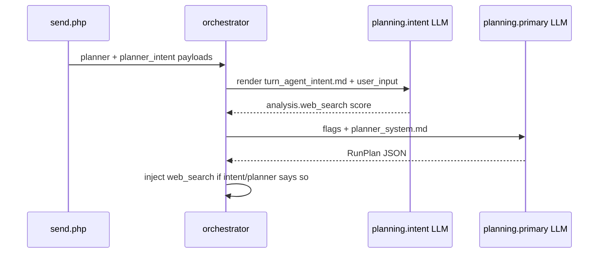

# Purpose + Prompt contract

Each **Purpose** row (`purpose_key`, endpoint, `meta_json`) owns **model routing and behavior**. Prompt text lives in **markdown refs** declared on the purpose, not in the chat composer.

## `meta_json.prompt` schema

```json
{
  "prompt": {
    "kind": "conversation",
    "system_ref": "materials/prompts/planning/planner_system.md",
    "assistant_ref": null
  }
}
```

```json
{
  "prompt": {
    "kind": "command_template",
    "template_ref": "materials/prompts/planning/turn_agent_intent.md",
    "variables": ["user_input"],
    "response_format": "json"
  }
}
```

| Field | Required | Meaning |
|-------|----------|---------|
| `kind` | yes | `conversation` or `command_template` |
| `system_ref` | conversation | Markdown path (under `OAAO_MATERIALS_ROOT`) for planner/chat system role |
| `assistant_ref` | no | Optional assistant preamble |
| `template_ref` | command | Markdown with `{{var}}` placeholders |
| `variables` | no | Documented variable names for Settings UI |
| `response_format` | no | `json` when the hook parses structured output |

## Prompt kinds

| Kind | API shape | User-visible thread | Examples |
|------|-----------|---------------------|----------|
| `conversation` | `messages[]` with `system` (+ optional `assistant`) | N/A (internal) | `planning.primary` → task planner |
| `command_template` | Single rendered user message (no history) | **Never** | `planning.intent`, `polish.*`, IQS/ACCS workers |

Command templates must **not** be pasted into the composer as user messages.

## Orchestrator payload

PHP merges `meta_json.prompt` into purpose bindings via `PurposePromptConfig::orchestratorPromptFromMeta()` and `LlmOrchestratorPayload::fromBinding()`:

- `planner` — `planning.primary` (+ `prompt` when set)
- `planner_intent` — `planning.intent` (command hook before `build_run_plan`)

Python loads templates with `oaao_orchestrator.prompt_template` (shared resolver for polish, workers, planning).

## Purpose keys (chat run)

| Purpose | Prompt role |
|---------|-------------|
| `planning.primary` | Task planner system (`conversation`) |
| `planning.intent` | Per-turn agent scores (`command_template` → JSON) |
| `polish.*` | ASR polish (`command_template`, `{{raw}}`) |
| `uiqe.*` | Post-stream workers (`command_template`) |

## Mounting templates

- **In image**: `python/materials/prompts/**`
- **Host override (polish / intent)**: `OAAO_POLISH_TEMPLATES_DIR` (docker `docker/polish-templates`)
- **Root**: `OAAO_MATERIALS_ROOT` (default `/app`)

## Turn intent hook flow



## Settings workflow

1. Assign endpoint on the purpose row.
2. Set `meta_json.prompt` (or use bootstrap defaults on `planning.primary` / `planning.intent`).
3. Edit the referenced `.md` on disk (or bind-mounted dir).
4. No orchestrator redeploy required when only markdown changes (bind mount / materials volume).
