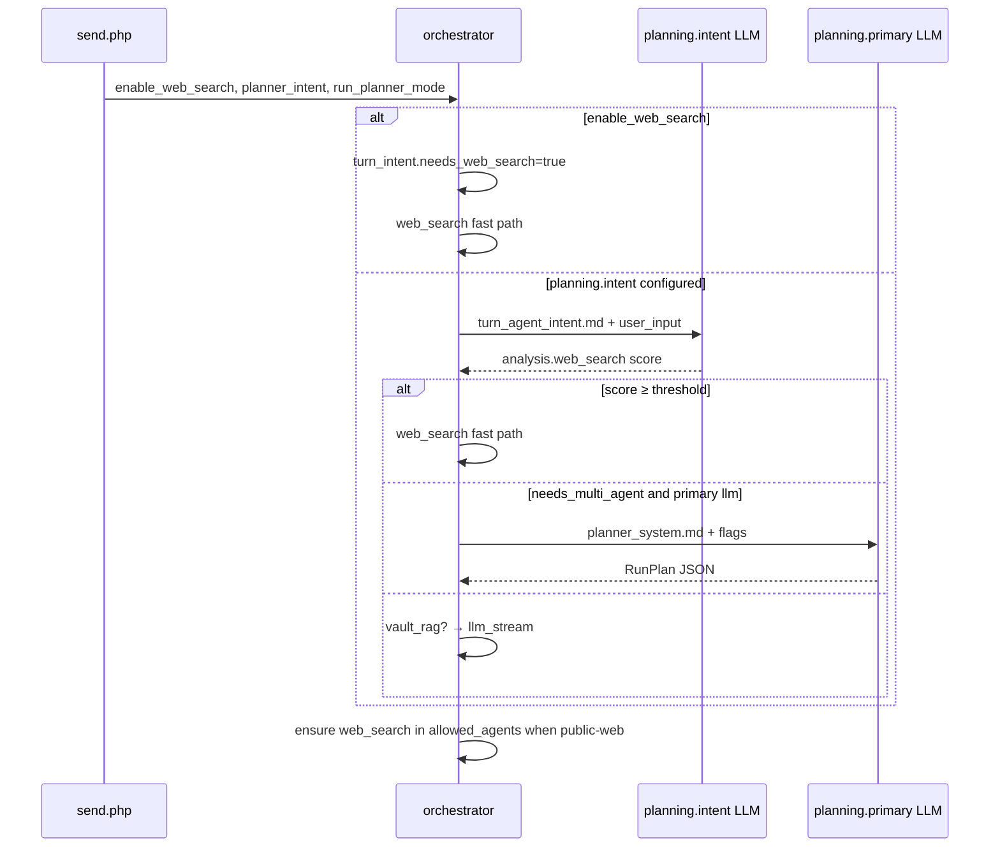

# Purpose + Prompt contract

Each **Purpose** row (`purpose_key`, endpoint, `meta_json`) owns **model routing and behavior**. Prompt text lives in **markdown refs** declared on the purpose, not in the chat composer.

## `meta_json.prompt` schema

```json
{
  "prompt": {
    "kind": "conversation",
    "system_ref": "materials/prompts/planning/planner_system.md",
    "assistant_ref": null
  }
}
```

```json
{
  "prompt": {
    "kind": "command_template",
    "template_ref": "materials/prompts/planning/turn_agent_intent.md",
    "variables": ["user_input"],
    "response_format": "json"
  }
}
```

| Field | Required | Meaning |
|-------|----------|---------|
| `kind` | yes | `conversation` or `command_template` |
| `system_ref` | conversation | Markdown path (under `OAAO_MATERIALS_ROOT`) for planner/chat system role |
| `assistant_ref` | no | Optional assistant preamble |
| `template_ref` | command | Markdown with `{{var}}` placeholders |
| `variables` | no | Documented variable names for Settings UI |
| `response_format` | no | `json` when the hook parses structured output |

## Prompt kinds

| Kind | API shape | User-visible thread | Examples |
|------|-----------|---------------------|----------|
| `conversation` | `messages[]` with `system` (+ optional `assistant`) | N/A (internal) | `planning.primary` → task planner |
| `command_template` | Single rendered user message (no history) | **Never** | `planning.intent`, `polish.*`, IQS/ACCS workers |

Command templates must **not** be pasted into the composer as user messages.

## Orchestrator payload

PHP merges `meta_json.prompt` into purpose bindings via `PurposePromptConfig::orchestratorPromptFromMeta()` and `LlmOrchestratorPayload::fromBinding()`:

- `planner` — `planning.primary` (+ `prompt` when set)
- `planner_intent` — `planning.intent` (command hook before `build_run_plan`)

Python loads templates with:

- `oaao_orchestrator.planning_prompt` — planner / report **conversation** system prompts
- `oaao_orchestrator.agent_intent_hook` — registry-driven **command_template** for intent scores
- `oaao_orchestrator.polish_prompt` — ASR polish command template
- `oaao_orchestrator.prompt_template` — shared resolver

## Purpose keys (chat run)

| Purpose | Prompt role |
|---------|-------------|
| `planning.primary` | Task planner system (`conversation` → `planner_system.md`) |
| `planning.intent` | Per-turn agent scores (`command_template` → `turn_agent_intent.md`) |

### Endpoint split (recommended)

| Role | Purpose | Model class | Context use |
|------|---------|-------------|---------------|
| **Compose / answer** | `chat.primary` + chat profile (e.g. Fast) | Large-context (e.g. Gemma 26B) | Full thread + RAG inject → `LLM_STREAM` |
| **Task planner** | `planning.primary` | Small/fast (e.g. Gemma E4B) | **No** full history — system + turn flags + last user line (~4k chars), `max_tokens` ≤512 |
| **Intent hook** | `planning.intent` | Same as planner or E4B | Single command template, no thread |

If `planning.primary` points at the 26B host, planner still sends a **small** prompt, but you waste the wrong SKU and may confuse ops. If **Fast** points at E4B (16k), compose hits context limits — point **Fast** at 26B and **planning** at E4B.
| `polish.*` | ASR polish (`command_template`, `{{raw}}`) |
| `uiqe.*` | Post-stream workers (`command_template`) |

## Mounting templates

- **In image**: `python/materials/prompts/**`
- **Host override (polish / intent)**: `OAAO_POLISH_TEMPLATES_DIR` (docker `docker/polish-templates`)
- **Root**: `OAAO_MATERIALS_ROOT` (default `/app`)

## Agent registry intent hook

``planning.intent`` is a **command_template** (like ``polish.*``): one rendered user message, JSON out, never shown in chat.

| Module | Role |
|--------|------|
| `agent_intent_hook.py` | Build schema + rules from `allowed_agents` / `agent_catalog` |
| `turn_agent_intent.md` | Template with `{{agent_registry_list}}` + `{{agent_analysis_schema}}` |
| `turn_knowledge_gap.py` | Resolves `llm_knowledge_cutoff` + `current_date` for intent template context only |

Each allowed `agent_kind` gets an independent confidence score in `analysis.{agent_kind}`.
Routing today uses `web_search` ≥ threshold; other scores are available for planner flags / future hooks.

Edit ``turn_agent_intent.md`` or bind-mount ``materials/prompts/planning/`` — no Python redeploy.

## Composer controls vs orchestrator routing

Composer icons are **not** the same as Settings → Task planner. Use this matrix when debugging “no web search”.

| UI control | Payload / storage | Affects routing? | Meaning |
|------------|-------------------|------------------|---------|
| **Globe** (Force web search) | `enable_web_search: true` on send | **Yes** | Force public-web turn → `web_search → llm_stream` (skips `planning.primary`) |
| **Pipeline icon** (Show pipeline steps) | `localStorage` only | **No** | Show/hide inline checklist in the thread — UI only |
| **Planner mode dropup** (default / ToT / DDTree) | `planner_mode_id` on send | **Expansion only** | How primary planner branches when agent mode runs |
| **Settings → Task planner** | `run_planner_mode: llm \| stub` | **Yes** | Whether `planning.primary` LLM runs in agent mode |
| **Settings → allowed agents** | `allowed_agents[]` | **Yes** | Registry for intent + planner; orchestrator **forces** `web_search` onto the list when globe or intent requires it |

i18n keys: `workspace.composer.web_search` / `show_pipeline` (tooltips: `*_hint`).

## Run routing matrix

Legend: **Intent** = `planning.intent` LLM (`turn_agent_intent.md`). **Primary** = `planning.primary` LLM (`planner_system.md`).

| Globe | Intent `web_search` score | Agent turn?¹ | Primary enabled² | Hooks run | Resulting plan (typical) |
|:-----:|:-------------------------:|:------------:|:----------------:|-----------|-------------------------|
| OFF | — (no intent payload) | no | * | none | `vault_rag? → llm_stream` |
| OFF | ≥ 0.65 | no | * | Intent | `web_search → llm_stream` |
| OFF | &lt; 0.65 | no | * | Intent | `vault_rag? → llm_stream` |
| **ON** | * | no | * | Globe (+ optional Intent skipped) | `web_search → llm_stream` |
| OFF | ≥ 0.65 | yes | llm | Intent → Primary³ | Primary JSON + inject web; or fast web if intent wins first |
| OFF | &lt; 0.65 | yes | llm | Intent → Primary | Multi-agent `RunPlan` from primary |
| OFF | * | yes | stub | Intent | Deterministic default plan + intent inject |
| * | * | yes | llm | Intent → Primary | Slides / template / auto-vault multi-step |

¹ **Agent turn** = `needs_multi_agent_turn(req)` (slides, template, continuation, auto-vault LLM planner, etc.). Globe and intent web both set this to **false** (fast path).

² **Primary enabled** = Settings `run_planner_mode` not `stub` (`planner_enabled(req)`).

³ When globe or intent triggers public-web, orchestrator usually takes the **fast path** before primary (`run_planner_turn_intent_web_fast` / `run_planner_composer_web_fast`).

### Public-web allow list

When `enable_web_search` **or** `turn_intent.needs_web_search`, Python calls `ensure_web_search_allowed_for_public_web()` so `web_search` is scheduled even if Settings unchecked it for the registry.

### Quick vs agent mode (product)

| Mode | When | LLM calls |
|------|------|-----------|
| **Quick** | Normal Q&A, temporal/news questions | Intent only → optional web fast path → `llm_stream` |
| **Agent** | Decks, office, sandbox, explicit multi-step | Intent + Primary → agent tasks → `llm_stream` |

## Turn intent hook flow



## Settings workflow

1. Assign endpoint on the purpose row.
2. Set `meta_json.prompt` (or use bootstrap defaults on `planning.primary` / `planning.intent`).
3. Edit the referenced `.md` on disk (or bind-mounted dir).
4. No orchestrator redeploy required when only markdown changes (bind mount / materials volume).
