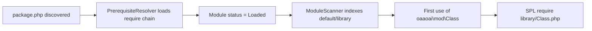

# Razy module autoload (oaao.ai)

How PHP library classes under `backbone/sites/oaaoai/oaaoai/**` are discovered and loaded.

**Related:** [Audit_Report.md](../Audit_Report.md) §6 (cross-module `require` rules) · [Debug_Guide.md](../Debug_Guide.md) §1 / §7

---

## 1. Call chain

On first HTTP hit, `backbone/scripts/razy-app.php` registers SPL autoload:

```
spl_autoload_register
  → Domain::autoload($className)
  → Distributor::autoload()          (per site / distributor)
  → ModuleScanner::autoload()        (Razy.phar — indexes Loaded modules)
```

Implementation hooks (repo copies of Razy sources):

- `backbone/scripts/razy-app.php` — SPL registration
- `backbone/scripts/razy-distributor.php` — `autoload()` delegates to scanner
- `backbone/scripts/razy-registry.php` — `isLoadable()` / `ModuleStatus::Loaded`

---

## 2. Library class convention

| Piece | Example |
|--------|---------|
| Module code (`package.php`) | `oaaoai/chat`, `oaaoai/slide-designer` |
| Library namespace | `oaaoai\chat\…`, `oaaoai\slide_designer\…` (underscore, not hyphen) |
| File path | `{module}/default/library/{ClassName}.php` |
| FQCN → file | `oaaoai\chat\ChatContextUsage` → `oaaoai/chat/default/library/ChatContextUsage.php` |

**Rules:**

- One primary class per file; class name matches filename.
- Namespace segment after `oaaoai\` uses the module **`api_name`** from `package.php` (e.g. `slide_designer`), not the hyphenated folder name.
- The owning module must be **`Loaded`** before autoload can resolve its library classes.

Cross-module library use requires declaring the dependency in `package.php`:

```php
// oaaoai/slide-designer/default/package.php
'require' => [
    'oaaoai/auth'      => '*',
    'oaaoai/core'      => '*',
    'oaaoai/endpoints' => '*',
    'oaaoai/chat'      => '*',
],
```

Without `require`, referencing `oaaoai\endpoints\…` from another module may fail even if the file exists on disk.

---

## 3. Two namespace layers

| Layer | Namespace | Loaded by |
|--------|-----------|-----------|
| Razy controllers | `Module\oaao\{api_name}` | Razy route / controller loader |
| Business library | `oaaoai\{api_name}\{ClassName}` | ModuleScanner on first `use` / type reference |

Controllers extend `Razy\Controller` and expose capabilities via `$this->api('chat')` etc. Library classes hold domain logic and are shared via autoload (or module bootstrap).

**Contract test:** `python/tests/test_php_namespace_use_contract.py` — controllers using library types must have explicit `use oaaoai\…` imports.

---

## 4. What autoload covers (and what it does not)

### Autoloaded

- Classes under `{module}/default/library/*.php` matching the `oaaoai\{api_name}\{Class}` convention, when the module is **Loaded**.

**Preferred API pattern (chat):**

```php
// controller/api/context_usage.php — no require_once for library
use oaaoai\chat\ChatContextUsage;
```

First reference to `ChatContextUsage` triggers ModuleScanner.

### Not autoload entry points

1. **`controller/api/*.php` route files** — they `return function (): void { … }`. Razy includes them directly; they are not classes.
2. **Library load inside a closure** — classes load only when the closure runs and references them (unless bootstrap eager-loads first).

Some modules (slide-designer, live-meeting) use **`library/_bootstrap.php`** so every API closure starts with predictable library availability:

```php
// slide-designer/default/library/_bootstrap.php
require_once __DIR__ . '/SlideTemplateStoragePaths.php';
require_once __DIR__ . '/SlideTemplateScope.php';
require_once __DIR__ . '/SlideTemplateStorageHtml.php';
require_once __DIR__ . '/SlideTemplateStorage.php';
// …
```

Each slide API file:

```php
require_once dirname(__DIR__, 2) . '/library/_bootstrap.php';
use oaaoai\slide_designer\SlideProjectRegistry;
```

---

## 5. When to use what

| Situation | Approach |
|-----------|----------|
| Chat-style API; module Loaded; standard library class | `use oaaoai\{mod}\Class` only — rely on autoload |
| Module whose API routes are all closures (slide-designer) | `require_once …/_bootstrap.php` at top of each API file |
| Split library files with parse-time dependency (W9-S2) | Keep load order in `_bootstrap.php` only — do not duplicate `require_once` in the parent class file |
| Class from **another** module | `package.php` `require` + `$this->api('module')` — **never** `require_once` their `library/` |

### Split-library pitfall (SlideTemplateStorage*)

If `_bootstrap.php` loads `SlideTemplateStorage.php` but not `SlideTemplateStorageHtml.php`, runtime calls into the Html helper can throw **class not found**.

**Fix pattern:** bootstrap order `Paths → Scope → Html → Storage` in `_bootstrap.php` (single source of truth). API routes and module controllers use `use oaaoai\slide_designer\…` — ModuleScanner loads siblings on first reference.

---

## 6. Cross-module boundary (audit rule)

From [Audit_Report.md](../Audit_Report.md):

- **`require_once` another module's `library/` or `controller/`** = boundary violation (P0). Use published Module API (`addAPICommand`) or hook/register patterns instead.
- **`core/default/library/*`** is platform kernel — still prefer `$this->api('core')` long term.

**Gate test:** `bash scripts/sandbox_check.sh --gate` — chat, live-meeting, slide-designer must not peer-`require` other modules' library/controller trees (core/auth allowed).

---

## 7. Load lifecycle (mental model)



---

## 8. Checklist for new library code

1. Add class under `{module}/default/library/`.
2. Namespace: `oaaoai\{api_name_with_underscores}\{ClassName}`.
3. In controllers/API: `use oaaoai\…\ClassName`.
4. Cross-module: add `require` in `package.php`; call via `$this->api('…')`.
5. New slide-designer (or live-meeting) API route: register in `_bootstrap.php` if needed on every request.
6. Do not `require_once` peer module library files.

---

## 9. Symptoms → autoload issues

| Symptom | Likely cause |
|---------|----------------|
| `Class "oaaoai\slide_designer\SlideTemplateStorageHtml" not found` | Missing bootstrap / sibling `require_once` after library split |
| `Class "oaaoai\endpoints\…" not found` from chat code | Missing `package.php` `require` or module not Loaded |
| Works in one route, 500 in another | One API file has `_bootstrap.php`, another does not |
| CI gate failure | Peer cross-module `require_once` in library/controller |

See [Debug_Guide.md](../Debug_Guide.md) for broader pipeline debugging.
