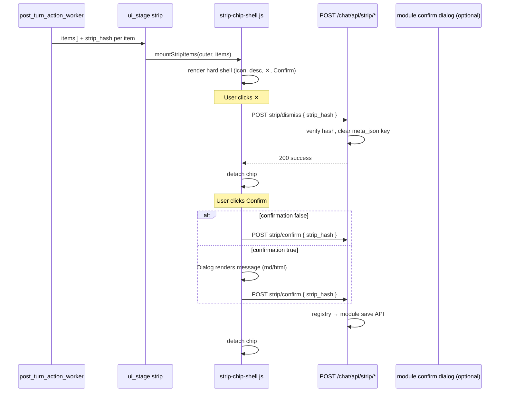

# Strip chip hard shell — unified `[strip]` action UI

> **Audience:** Module authors (Calendar, Todo, Skills), chat shell maintainers.  
> **Related:** [chat-ui-areas.md](./chat-ui-areas.md) · [productivity-agents.md](./productivity-agents.md) · [module-hooks-registry.md](./module-hooks-registry.md) · [run-footprint-contract.md](./run-footprint-contract.md)

One **chat-owned** chip shell for all ephemeral `[strip]` actions. Modules emit normalized items + signed `strip_hash`; the shell renders icon, description, Dismiss (✕), and Confirm — no per-module insert JS.

---

## 1. Problem (today)

| Module | Insert JS | Duplication |
|--------|-----------|-------------|
| Calendar | `conversation-calendar-suggest.js` | chip DOM, Dismiss, Confirm, mount |
| Todo | `conversation-todo-suggest.js` | same ×3 variants |
| Skills | `conversation-skill-suggest.js` | same |

`productivity-strip-host.js` only resolves the strip container. `applyProductivityChipsFromRunMeta` in `chat-panel.js` hard-codes meta key branches.

---

## 2. Target architecture



**Owner:** chat module (`strip-chip-shell.js`, `POST /chat/api/strip/*`).  
**Modules:** registry row + Python worker payload + optional confirm dialog ESM only.

---

## 3. DOM contract (hard shell)

Mount target: `[data-oaao-chat-area="strip"]` inside `.oaao-chat-assistant-row`.

```html
<div class="oaao-strip-chip oaao-strip-chip--calendar_schedule"
     data-oaao-strip-chip
     data-oaao-strip-agent="calendar_schedule"
     data-oaao-strip-action="calendar_event_suggested"
     data-oaao-conversation-id="123"
     data-oaao-message-id="456"
     data-oaao-strip-hash="v1.eyJ…sig">
  <span class="oaao-strip-chip__icon" data-oaao-strip-icon aria-hidden="true"></span>
  <span class="oaao-strip-chip__desc" data-oaao-strip-desc>Add to calendar? · Fri 10:00</span>
  <button type="button" class="oaao-strip-chip__dismiss" data-oaao-strip-dismiss aria-label="Dismiss">✕</button>
  <button type="button" class="oaao-strip-chip__confirm" data-oaao-strip-confirm>Add to calendar</button>
</div>
```

| Attribute | Required | Notes |
|-----------|:--------:|-------|
| `data-oaao-strip-chip` | yes | Row marker; dedupe by `strip_hash` |
| `data-oaao-strip-agent` | yes | Planner / registry agent kind (`calendar_schedule`, `todo_extract`, …) |
| `data-oaao-strip-action` | yes | `post_turn_action.action_id` / meta key |
| `data-oaao-conversation-id` | yes | Conversation scope |
| `data-oaao-message-id` | yes | Assistant message row |
| `data-oaao-strip-hash` | yes | Signed token — sole client credential for dismiss/confirm |

Icon: resolved from `oaao-agent-catalog.js` by `agent` id, or registry `icon` override.

---

## 4. `ui_stage` / SSE payload (normalized)

**Canonical** `ui_stage` strip envelope:

```json
{
  "area": "strip",
  "items": [
    {
      "agent": "calendar_schedule",
      "action_id": "calendar_event_suggested",
      "description": "Add to calendar? · Team sync Fri 10:00",
      "strip_hash": "v1.eyJ…sig",
      "confirm_label": "Add to calendar",
      "dismiss_label": "Dismiss",
      "confirmation": true,
      "message": "**Team sync**\n\nFri 10:00–11:00 · Room A",
      "message_format": "markdown",
      "payload": {
        "title": "Team sync",
        "start_at": "2026-05-30T10:00:00+08:00",
        "end_at": "2026-05-30T11:00:00+08:00"
      }
    }
  ]
}
```

| Field | Type | Notes |
|-------|------|-------|
| `agent` | string | Registry agent kind |
| `action_id` | string | Matches `PostTurnActionRegister` row |
| `description` | string | Chip one-liner (strip row) |
| `strip_hash` | string | HMAC token — see §5 |
| `confirm_label` | string? | Chip Confirm button |
| `dismiss_label` | string? | ✕ `aria-label` |
| `confirmation` | boolean | **`true`** → shell preview dialog before execute |
| `message` | string | Preview body when `confirmation: true` |
| `message_format` | `"markdown"` \| `"html"` | Default `markdown` |
| `payload` | object | Bound in hash; server uses on final confirm |

**Legacy (migration):** flat meta keys … normalized to `items[]` in `strip-chip-shell.js`.

### Confirm flow (unified — target)

| `confirmation` | Chip Confirm click | Second step |
|:--------------:|--------------------|-------------|
| `false` | `POST /chat/api/strip/confirm { strip_hash }` | none — server executes |
| `true` | Shell **RazyUI Dialog** renders `message` (md/html) | user confirms again → same `POST strip/confirm` |

Modules **do not** ship `confirmTodoItemSuggestion()`-style wrappers. Worker (or PHP enrich) sets `confirmation` + `message`; shell owns preview UI; **`strip/confirm`** owns execution (routes to calendar/todo API server-side via registry).

**Interim (v153):** `strip-confirm-router.js` + module edit dialogs — **removed in v154**.

**Exception (optional later):** `confirmation: "form"` + `fields[]` only when preview+edit is required (e.g. calendar datetime). Default path is preview-only.

---

## 5. `strip_hash` token

Same transport pattern as `run_principal` (`ChatRunPrincipal`): `base64url(json).hmac_sha256`.

Payload (v1):

| Field | Type | Notes |
|-------|------|-------|
| `v` | int | `1` |
| `user_id` | int | Must match session on dismiss/confirm |
| `conversation_id` | int | |
| `message_id` | int | Assistant message id |
| `action_id` | string | Meta key to clear on dismiss |
| `payload_digest` | string | `sha256:` + hex of canonical JSON payload |
| `exp` | int | Unix expiry (default 7d) |

Implementation: `ChatStripHash` (`chat/default/library/ChatStripHash.php`).

**Issue:** Python post_turn worker or PHP meta attach (when persisting suggestion).  
**Verify:** `POST /chat/api/strip/dismiss` and `POST /chat/api/strip/confirm` (session user must match `user_id`; conversation ownership checked via split DB).

---

## 6. HTTP API

### `POST /chat/api/strip/dismiss`

Session-authenticated (browser). **Stub:** `controller/api/strip/dismiss.php`.

**Request:**

```json
{ "strip_hash": "v1.…" }
```

**Success (200):**

```json
{ "success": true, "action_id": "calendar_event_suggested", "message_id": 456 }
```

**Behavior:** verify token → unset `action_id` key from assistant `meta_json` → idempotent if already cleared.

### `POST /chat/api/strip/confirm`

Same request: `{ "strip_hash": "v1.…", "workspace_id"?: int }`.

Server verifies hash → reads `action_id` + bound `payload` → dispatches via registry (`confirm_api` / module handler) → clears meta → returns `{ success: true }`.

Client: if item had `confirmation: true`, show shell preview dialog **before** this POST; no module ESM required.

---

## 7. Registry extension (`strip_action.register`)

Extends or aligns with `post_turn_action.register`:

| Field | Example | Purpose |
|-------|---------|---------|
| `action_id` | `calendar_event_suggested` | Worker + meta key |
| `agent_kind` | `calendar_schedule` | Icon + catalog |
| `confirmation_default` | `true` | Default preview-before-execute |
| `confirm_api` | `/calendar/api/calendar_events_save` | **`strip/confirm` server dispatch** |
| `meta_key` | `calendar_event_suggested` | Key cleared on dismiss |

Modules **do not** register strip mount or confirm ESM handlers (preview is shell-owned).

---

## 8. JS modules

| File | Role |
|------|------|
| `productivity-strip-host.js` | `resolveProductivityOuter`, strip container host |
| `strip-chip-shell.js` | Hard shell + **generic confirmation dialog** (`confirmation` + `message`) |
| `chat-panel.js` | `applyUiStageEnvelope` → `mountStripItems` |
| `conversation-todo-suggest.js` | **`todoApiUrl` only** (legacy chip render removed) |

### Public ESM API (`strip-chip-shell.js`)

```js
mountStripItems(outer, items, ctx?)
normalizeStripItemsFromMeta(meta)
dismissStripChip(chipEl, opts?)
confirmStripChip(chipEl, opts?)  // stub → strip/confirm
```

---

## 9. Migration checklist

- [x] Design contract (this doc)
- [x] `strip-chip-shell.js` skeleton
- [x] `POST /chat/api/strip/dismiss` stub + `ChatStripHash`
- [x] Worker emits `items[]` + `strip_hash` on `ui_stage strip`
- [x] Wire `chat-panel.js` to `mountStripItems`
- [x] `strip-confirm-router.js` — module confirm dialogs (calendar/todo) *(v153; removed v154)*
- [x] `POST /chat/api/strip/confirm` + registry server dispatch
- [x] Shell generic dialog: `confirmation: true` + `message` / `message_format`
- [x] Worker emits `confirmation` + `message` (replace `confirmTodoItemSuggestion` path)
- [x] Remove `strip-confirm-router.js` + module confirm wrappers
- [x] `bubble-chat.js` → strip shell
- [x] Bump `OAAO_CHAT_SHELL_ASSET_REV` → `20260529-strip-shell-v154`

---

## 10. Change log

| Date | Change |
|------|--------|
| 2026-05-29 | Strip shell v154: `strip/confirm` + registry, preview dialog, bubble-chat strip shell, delete legacy chip JS |
| 2026-05-29 | Strip shell v153: wire chat-panel, worker `items[]`, confirm router, messages enrich |
| 2026-05-29 | Initial strip hard shell contract + dismiss stub + JS skeleton |
