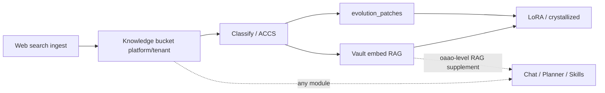
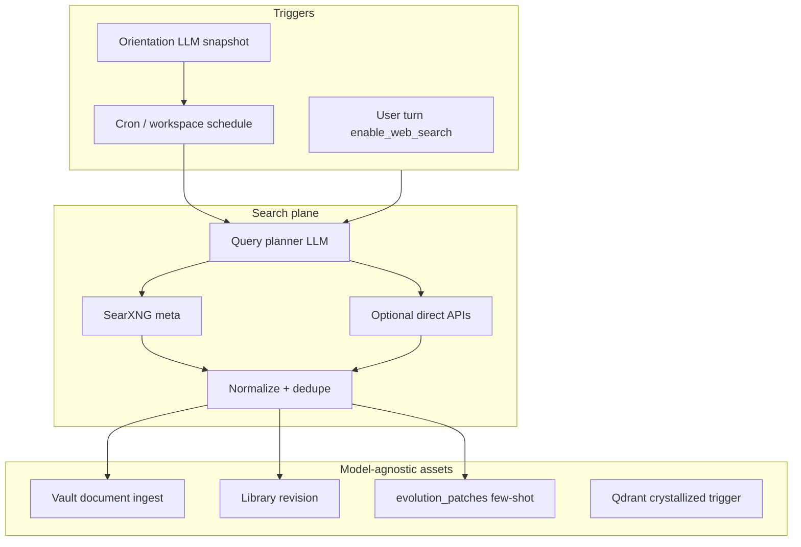

# Web Search Agent — 多引擎與自我知識補元（設計草案）

| Field | Value |
|-------|--------|
| **Status** | Draft — EPIC-WS-1 規劃 |
| **Epic** | EPIC-WS-1（建議與 EPIC-EVOL-2/3 對齊） |
| **現況** | `WebSearchAgent` + `tools/web_search.py`（單一 SearXNG） |

---

## 1. 產品目標

在 **不綁定單一 LLM 權重** 的前提下，讓 **oaao.ai 平台自身** 的 **Knowledge 演化** 驅動能力升級 — **不是** 面向租戶終端使用者的產品功能；**tenant 管理員與 workspace 設定中不可見**。訊號來自 **跨租戶對話、話題與關鍵字重要分數**；僅 **platform admin** 可調營運參數（vault、定時間隔、合規 opt-out）。workspace / tenant_id **僅歸因**（哪次對話貢獻了訊號），不作知識分區。

1. **即時**：使用者開啟 web search 或 planner 排入 `web_search` agent。
2. **定時**：背景依 **對話主題 / 關注實體** 週期性搜尋新資料（Corpus profile 可選作取向訊號，但 **不** 與 Corpus 文員路線混用）。
3. **沉澱**：命中內容進入 **Knowledge buckets**（見 §1.1），再經分類、精華、訓練管線晉升為更高效形態（Vault embed、`evolution_patches`、可選 LoRA / CrystallizedSkill）。

**Web search** 是 **擷取管道**（中立、公開來源）；**Knowledge buckets** 是 **oaao.ai 級 RAG 補充目錄** — **全系統模組**（Chat、Planner、Vault RAG 合併、Crystallization、日後 Corpus 參考公開事實）皆可引用，與「單一 workspace 的 vault 勾選」或「使用者個人化 knowledge 文字」不同軸。

這與 **IQS/ACCS 演化**、**Crystallization** 同一產品線（見 [OAAO_Content_Studio_Epics.md §2.1](../OAAO_Content_Studio_Epics.md)），不是 Corpus regex 路線。

### 1.1 Knowledge buckets（產品詞彙）

| 概念 | 定義 |
|------|------|
| **Bucket** | **platform** 級目錄為主 — `orchestrator-knowledge-assets/platform/`；內含 `WebKnowledgeAssetV1`（`tenant_{id}/` 僅 legacy / `OAAO_KNOWLEDGE_REFRESH_SCOPES=all`） |
| **擷取** | SearXNG / 多 provider → `persist_web_search_capture()` |
| **中立性** | 來源為公開 web；**不** 當作租戶機密文件；寫入前後仍走 IQS/ACCS 與合規 `do_not_search` |
| **晉升 lane** | `tier`：`session` → catalog（`tenant` tier 檔）→ `vault`（tenant/platform knowledge vault embed）→ `evolution` → `crystallized` |
| **定時精煉** | oaao 背景：再分類、摘要精華、高 ACCS 寫 patch；長期可掛 **purpose** LoRA（`knowledge.orientation` / `knowledge.search_plan` 已用；`knowledge.classify` / `knowledge.distill` 規劃中） |
| **消費者** | Chat `web_search` agent、post-stream 合併、Vault 向量檢索、planner orientation、EVOL patches；**非** workspace 專屬設定 |

### 1.2 Env vs Settings（商品化）

| 類型 | 放哪裡 | 範例 |
|------|--------|------|
| **基礎設施 / 密鑰** | `docker/env`、secret manager | `OAAO_ORCH_SHARED_SECRET`、`OAAO_PG_URL`、`OAAO_QDRANT_URL`、資料目錄 bind |
| **持續營運 / 模組行為** | **Platform console only**（`admin.localhost`） | **Platform → Knowledge**：refresh 間隔、合規 opt-out、`platform_vault_id`、`refresh_user_id` |
| **Bootstrap 覆寫** | env **僅在 Settings 未填時** | `OAAO_KNOWLEDGE_PLATFORM_VAULT_ID`、`OAAO_KNOWLEDGE_REFRESH_USER_ID` — 第一輪安裝或 CI 種子 |

**Tenant 不可見**：租戶管理員 Settings、workspace 對話 UI **不出現** Knowledge buckets；使用者 **preferences → knowledge** 仍是個人化文字，與 WS-1 無關。

#### 三個常見 env 的業務含義（建議改在 Settings 填）

| 欄位 | 用途 |
|------|------|
| **platform_vault_id** | **平台級** Knowledge Vault：公開 web 精華 embed 後供 **全系統 RAG** 補充 |
| **tenant_vault_id** | **已棄用於產品面** — 僅 env bootstrap 向後相容 |
| **refresh_user_id** | **服務帳號** `user_id`：cron / promotion 呼叫 Vault API 時的 **文件擁有者**（需對該 vault 有 ingest 權限），不是一般聊天使用者 |

### 1.3 與其他「知識」軸線區分

| 軸線 | 分區 | 內容性質 |
|------|------|----------|
| **Knowledge buckets（WS-1）** | **platform**（oaao 自我演化） | 公開 web → 平台級 RAG 補充 + 演化資產；tenant 不可設定 |
| **Workspace Vault RAG** | vault / folder / 使用者勾選 | 租戶上傳文件、embedded 私有材料 |
| **Corpus Studio（CS-1）** | corpus profile | 企業文件結構／風格學習（編輯器／文員替代） |
| **User preferences `knowledge`** | 使用者設定 | 個人化文字，非 WS-1 bucket |

---

## 2. 現況（repo）

| 元件 | 行為 |
|------|------|
| `tools/web_search.py` | `OAAO_SEARXNG_URL` → JSON `/search`；**單一聚合端點**（SearXNG 可配置多 engine，但應用層未顯式路由） |
| `agents/web_search.py` | 最後一則 user 訊息為 query；結果注入 `ctx.messages` system block |
| `planner.py` | `enable_web_search` → 允許 agent + `needs_multi_agent_turn` |
| Chat `send.php` | `enable_web_search` 來自 Task planner 設定 |

**缺口：** 無 conversation orientation 模型、無 cron/worker、無寫回 Vault、無多 provider 契約、無與 ACCS 閉環。

---

## 3. 目標架構

### 3.0 作用域（Scope）— 全域資產

| 層級 | 分區鍵 | 用途 |
|------|--------|------|
| **platform** | `platform.json` / `platform/` | 跨 tenant 的產品級主題（罕用；需 `OAAO_KNOWLEDGE_PLATFORM_ENABLED`） |
| **tenant** | `tenant_{id}.json` | **Legacy** — 僅 `OAAO_KNOWLEDGE_REFRESH_SCOPES=all` 時 cron 掃描 |
| **workspace** | 欄位 `workspace_id` | **僅歸因**（哪次對話觸發擷取），不建 ws 分區檔 |

**寫入預設** = `platform`（`scope_ref_from_request`）。對話尾隨 orientation 更新 **合併進 `platform.json`**。RAG 有效取向仍可 `merge(platform, tenant)` 讀取 legacy 檔。

### 3.1 Orientation（對話取向）

**platform** 維護 `orientation_json`（`platform.json`）：

- `topics[]`、`entities[]`、`language`、`recency_days`
- `search_queries_suggested[]`（LLM 每 N 輪或每日刷新）
- `topic_signals{}`（WS-1-S10：重要分數、搜尋次數、yield、pause 狀態）
- `do_not_search[]`（合規 — **platform operator** opt-out，非租戶自助）

來源：**跨租戶** workspace 最近 K 輪對話（話題／關鍵字聚合）+ 可選 Corpus 訊號；**不** 暴露給 tenant 設定 UI。

### 3.2 多搜索引擎

| 層 | 做法 |
|----|------|
| L0 | SearXNG 已聚合多 engine — 配置 `engines` 類別（general / news / science） |
| L1 | `SearchProvider` 介面：`searxng`、`bing`（若授權）、`custom` |
| L2 | Query router LLM：依 orientation 選 provider + `site:` 修飾 |

**禁止** 在 Python 用關鍵字決定「用哪個引擎」；用 **schema + router LLM** 或設定檔 `provider_priority[]`。

### 3.3 定時補元（scheduled）

- Worker：`POST /v1/knowledge/refresh`（body：`tenant_id?`, `scope?`, `force`, `classify_after`）。
- Cron 範例：`curl -X POST -H "Authorization: Bearer $OAAO_INTERNAL_TOKEN" http://orchestrator:8080/v1/knowledge/refresh -d '{"classify_after":true}'`
- **Platform → Knowledge**（platform operator）：`scheduled_enabled`、`interval_hours`、`classify_after`、`merge_recall`、`do_not_search[]` — `knowledge.platform.primary` / `meta_json.knowledge_refresh`
- **Auto search 門檻**（S10）：`topic_lifecycle.py` — 依重要分數納入 cron query；多次搜尋後 **yield 過低 / 話題性衰退 / 時效過期** → `paused_*`，除非 **breakthrough_links** 關聯新話題
- Env：`OAAO_KNOWLEDGE_TOPIC_IMPORTANCE_MIN`、`OAAO_KNOWLEDGE_TOPIC_LOW_YIELD_RUNS`、`OAAO_KNOWLEDGE_REFRESH_SCOPES=platform|all`
- **S11 批次訊號**：`KnowledgeConversationSignalAggregator` 掃描 adjunct `oaao_message`（7 日可調）→ `POST /v1/knowledge/signals/merge` 寫入 `platform.json` `topic_signals`
- **S11 Vault**：`KnowledgePlatformVaultProvisioner` 在 platform tenant 建立 `OAAO Knowledge` vault → 寫入 `knowledge.platform.*` `platform_vault_id`；觸發點：Platform → Knowledge 載入、cron、`POST /endpoints/api/knowledge_platform_bootstrap`
- API：`GET/POST /endpoints/api/knowledge_settings(_save)`；cron：`POST /endpoints/api/knowledge_cron_run`
- Env：`OAAO_KNOWLEDGE_CRON_POLL_INTERVAL_SEC`（orchestrator poll，預設 3600）、`OAAO_KNOWLEDGE_CRON_DISABLE`、`OAAO_KNOWLEDGE_REFRESH_USER_ID`、`OAAO_KNOWLEDGE_REFRESH_MAX_QUERIES=4`
- Host：`scripts/oaao_knowledge_refresh_cron.sh`；Compose profile：`knowledge-cron`（`docker/knowledge-refresh-cron/`）
- 頻率：依 orientation `updated_at` 與 interval；`force=true` 跳過冷卻。
- 冪等：`content_hash` 去重；ACCS 低分結果不寫入資產。

### 3.4 與演化閉環

| 階段 | 工具 |
|------|------|
| 寫入前 | IQS：query 是否夠具體 |
| 寫入後 | ACCS：摘要 vs 來源 snippet 對齊 |
| 長期 | Phase 11 `evolution_patches` 吸收高頻成功 query→snippet 模式 |
| 重用 | Crystallization：高 ACCS 的 web+vault 工具鏈 |

### 3.5 Knowledge buckets — 存放與晉升（已落地 stub）

Web search 結果不應只留在當輪 `system` 訊息；先進 **bucket 目錄**，再依 **tier（晉升 lane）** 精煉，模型無關、可回放：

| Tier / 元件 | 儲存 | 路徑／集合 | 用途 |
|-------------|------|------------|------|
| **session** | 僅 `RunContext.messages` 注入 | — | 當輪回答（既有） |
| **bucket catalog** | 檔案 JSON | `…/tenant_{id}/`、`…/platform/` | **Knowledge bucket** 條目（`WebKnowledgeAssetV1`；`tier=tenant` 表示在目錄中、尚未 vault 晉升） |
| **orientation** | 檔案 JSON | `tenant_{id}.json` ⊕ `platform.json` | 驅動 search plan / 定時 refresh；effective = merge |
| **vault** | PG + embed job | `document_upload_text` + ingest queue | ACCS ≥ gate → **oaao 級** 向量 RAG 補充（`OAAO_KNOWLEDGE_TENANT_VAULT_ID` / platform vault） |
| **evolution** | Arango `evolution_patches` | `knowledge/promotion.py` | `type=web_search_fewshot`；訓練／行為 patch 候選 |
| **crystallized** | Qdrant / skill 觸發 | EPIC-EVOL Phase 11 | 高頻工具鏈；可接 LoRA 掛載 |

**實作（repo）：**

- `knowledge/asset_models.py` — `WebKnowledgeAssetV1` / `WebKnowledgeHitV1`
- `knowledge/asset_store.py` — `persist_web_search_capture()`；`WebSearchAgent` 搜尋後寫入 **tenant/platform bucket**（`scope_ref_from_request`）
- `knowledge/promotion.py` — ACCS gate → Vault ingest → `record_evolution_patch`
- `POST /v1/knowledge/assets/{asset_id}/promote` — 手動／cron 重試晉升
- `POST /v1/knowledge/refresh` — WS-1-S5 定時／強制 orientation 搜尋寫入 bucket（`OAAO_KNOWLEDGE_REFRESH_*`）
- `GET /v1/knowledge/recall/context` — WS-1-S8 精華摘要文字塊（非 Vault 消費者）
- `POST /v1/knowledge/assets/{id}/classify`、`POST …/classify-batch` — WS-1-S9
- `knowledge/recall.py` — Vault RAG 預設合併 `recall_vault_profiles` / tenant+platform vault
- PHP `resolveKnowledgeRecallVaultProfiles()` → `knowledge.recall_vault_profiles`
- `GET /v1/knowledge/assets/{workspace_id}` — 列出資產（internal token）
- **API：** `GET /v1/knowledge/orientation/effective?tenant_id=`、`GET …/assets/tenant/{id}`
- **Env：** `OAAO_KNOWLEDGE_TENANT_VAULT_ID`（或 legacy `OAAO_KNOWLEDGE_WEB_VAULT_ID`）、`OAAO_KNOWLEDGE_PLATFORM_VAULT_ID`、`OAAO_KNOWLEDGE_ACCS_MIN`、`OAAO_KNOWLEDGE_VAULT_INGEST`
- `OAAO_KNOWLEDGE_ASSET_PERSIST=0` 可關閉寫入

**PHP → Python：** `send.php` 傳 `knowledge.orientation` / `knowledge.search_plan` llm_cfg（Settings → Purpose allocation）。

---

## 4. EPIC-WS-1 Stories（建議）

| Story | Summary | Priority |
|-------|---------|----------|
| **WS-1-S1** | `SearchProvider` 抽象 + SearXNG 適配器保留 | P0 |
| **WS-1-S2** | `orientation_json` schema + 對話尾隨 LLM 更新 | P0 |
| **WS-1-S3** | Planner：依 orientation 生成 search plan（非 user 原文當 query） | P1 |
| **WS-1-S4** | 結果寫入 Vault + ACCS → `evolution_patches` | ✅ |
| **WS-1-S5** | Scheduled worker + tenant 開關 | P1 |
| **WS-1-S6** | Platform console → Knowledge UI + `knowledge.platform.*` meta | ✅ |
| **WS-1-S7** | contracts + tests + ACCS gate | ✅ `web_search_fewshot` |
| **WS-1-S8** | 全系統 recall hook（bucket + vault 合併檢索 API） | ✅ |
| **WS-1-S9** | 定時分類／精華 worker + `knowledge.classify` / `knowledge.distill` purpose | ✅ |
| **WS-1-S10** | 話題重要分數 + 生命週期（低 yield / 過時 / breakthrough） | ✅ |
| **WS-1-S11** | 對話表批次累積 importance + platform vault 自動 provision | ✅ |

---

## 5. Runtime 分工（硬性）

| 層 | 職責 |
|----|------|
| **Python orchestrator** | search、orientation LLM、ingest、job |
| **PHP** | CRUD orientation、enqueue refresh、ACL |
| **禁止** | PHP-FPM 長時間 curl 多引擎 |

---

## 6. LoRA / endpoint

| Purpose（建議） | 用途 |
|-----------------|------|
| `knowledge.orientation` | 從對話更新 orientation_json |
| `knowledge.search_plan` | 多查詢拆解、引擎選擇 |
| `knowledge.classify` | （規劃）bucket 內再分類、主題標籤 |
| `knowledge.distill` | （規劃）精華摘要 → 更高效 RAG / patch 素材 |
| `corpus.analyze` | 與 CS 分線；勿混為 search query 生成 |

見 Epics §2.1 LoRA 矩陣。LoRA 權重掛在推理服務；bucket 內容為 **模型無關** 訓練與 RAG 原料。

---

## 7. 相關文件

- [Evolution_System_Design.md](../Evolution_System_Design.md)
- [Intelligence-vs-Hardcode-Audit.md](../reports/Intelligence-vs-Hardcode-Audit.md)
- [Manus_Gap_Analysis.md](../Manus_Gap_Analysis.md) — 演化迴路
