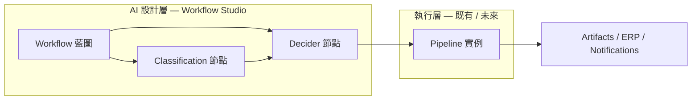
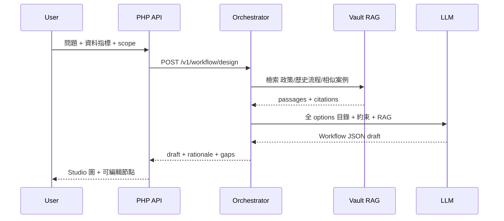

# Design pack — Workflow / Decider Studio

| Field | Value |
|-------|--------|
| **Status** | v0.1 — draft (types frozen) |
| **Epic** | EPIC-WF-1 |
| **Milestone** | **Workflow-Decider-2027**（建議於 Content-Studio-2026 主線穩定後；可與 Business-ERP-2027 並行規劃） |
| **Backlog** | [OAAO_Content_Studio_Epics.md §18](../OAAO_Content_Studio_Epics.md) · [Jira CSV](../OAAO_Content_Studio_Jira_Import.csv) |
| **Legacy** | `WorkflowExecute`（`hub.proto`）— 語意遷移，非 1:1 runtime |

---

## 1. 產品定位（凍結）

**Workflow / Decider Studio** 讓企業把 **資料 + 問題** 丟進平台，由 AI（可搭配 **Vault RAG**）**推理並設計** 應有的公司流程，輸出可檢視、可迭代的 **流程藍圖**，而不是直接執行借貸分錄或 ERP post。

> 典型問題：「我們收到這批合約與郵件，要怎麼審批、存檔、通知誰？」→ 系統回傳 **建議 Workflow**（含 **Classification** 分類閘、**Decider** 分支、**Pipeline** 執行段）。

| 對比 | Intelligence（Chat） | Business ERP（EPIC-BIZ） | **Workflow Studio（本 pack）** |
|------|----------------------|--------------------------|--------------------------------|
| 產出 | 對話回覆、artifacts | Manifest JSON（CRUD 結構） | **流程圖 + 節點契約**（誰做什麼、何時分支） |
| 執行 | RunExecutor 即時跑 | deploy 後 Live ERP | v1 **設計為主**；執行綁定 Pipeline 另 Epic |
| RAG | vault_rag per turn | manifest 歷史 + WS-1 | **流程庫 + 政策文件 + 相似案例** |

**硬性原則：**

- **設計**（NL → Workflow JSON）→ **Python orchestrator** + LLM；PHP = auth、CRUD、版本、≤30s enqueue。
- **禁止** 在 PHP request 內同步跑完整設計或長 RAG。
- 結構性分支規則（會計 post、合規 hard gate）→ 引用 **Special Module / deterministic Decider**，禁止 LLM 自由寫不可逆副作用。
- 與 EPIC-BIZ 對齊：ERP **實體 CRUD** 仍走 Manifest；Workflow 描述 **跨系統步驟與決策**，可 **引用** `entity_slug` / `special_id` / `purpose` 節點。

---

## 2. 四種類型（凍結詞彙）

與現有 **Purpose slot（管線群組）**、**Chat pipeline registry（UI 塊）**、**Corpus document_type（分類）** 並列，但語意不同：



| 類型 | `kind` | 定義 | 輸入 | 輸出 | 範例 |
|------|--------|------|------|------|------|
| **Workflow** | `workflow` | 一條 **業務流程藍圖**（圖或有序階段列表），含目標、角色、資料域、版本 | 使用者 NL 問題、附件摘要、可選 Vault scope | `workflow_id`、節點表、邊、建議 **Pipeline** 綁定 | 「採購申請 → 法務 → 財務核准 → 建 PO」 |
| **Decider** | `decider` | **分支決策**節點：在流程中選擇下路徑 | 上游 context、規則集、RAG 片段、可選 structured fields | `decision`（path id）、`rationale`、confidence | 「金額 &gt; 50k → 董事會分支」 |
| **Pipeline** | `pipeline` | **可執行** 的多步管線（確定性 + 已註冊 tool/agent），對齊 `RunTaskSpec` / vault hook / corpus ingest | 節點 `inputs` 契約 | `job_id`、steps log、artifacts | `vault_rag` → `llm_stream`；Corpus analyze 鏈 |
| **Classification** | `classification` | **標籤 / 路由** 步：在 Decider 或 Pipeline 前決定類型 | 原始文件、郵件、表格行、metadata | `labels[]`、`document_type`、`route_key` | 合約 vs 發票；`knowledge.classify` 桶 |

**關係（必讀）：**

- **Workflow** 是容器；**Classification** 與 **Decider** 是 Workflow **內部節點類型**。
- **Pipeline** 是節點可掛載的 **執行引擎**（`node.execution_ref` → `pipeline_template_id` 或 `purpose` 前綴）。
- 一個 Workflow 可含多個 Classification + 多個 Decider + 多個 Pipeline 段；**Decider 輸出** 選擇下一個 Pipeline 或子 Workflow。

**與現有名詞勿混：**

| 現有 | 勿稱為 | 本 pack 用語 |
|------|--------|-------------|
| `PurposeAllocationRegister` slot | Workflow | **Pipeline** 的 LLM 路由群組（`chat.*`、`rag.*`） |
| `ChatPipelineRegister` entry | Decider | Composer / message **UI 塊** |
| Corpus `document_type` | Workflow | **Classification** 的一種 label 空間 |
| EPIC-BIZ manifest `workflow` 欄位 | 本 Workflow | ERP **狀態機原子** → 引用 `special_id` |

---

## 3. RAG 推理設計（核心能力）



| RAG 來源（v1 建議） | 用途 |
|-------------------|------|
| Vault（embedded docs） | 公司政策、SOP、合規、郵件範本 |
| Tenant **Workflow 版本庫**（已 commit 藍圖） | 相似流程 fork / diff |
| Corpus profile（可選） | 公文風格、欄位語意 |
| EPIC-WS-1 Knowledge（可選） | 外部法規 / 行業慣例（draft 建議） |
| ERP manifest 摘要（可選，EPIC-BIZ 後） | 實體與權限邊界 |

**LLM 任務拆分（建議 purpose）：**

| Purpose | 任務 |
|---------|------|
| `workflow.design.compose` | NL + RAG → 完整 Workflow draft（含節點類型） |
| `workflow.design.refine` | 使用者改圖後局部重寫 |
| `workflow.decider.explain` | 單一 Decider 節點：為何走 A 而非 B |
| `workflow.classify.suggest` | 對上傳樣本建議 Classification 標籤集 |
| `workflow.pipeline.bind` | 為節點推薦已註冊 Pipeline / purpose 模板 |

---

## 4. 契約草圖（`contracts/v1`）

**Workflow document（邏輯名 `workflow-blueprint-v1`）：**

```json
{
  "workflow_id": "wf_procurement_v3",
  "title": "採購審批",
  "scenario_prompt": "…",
  "nodes": [
    {
      "id": "n1",
      "kind": "classification",
      "labels_schema": ["request_type"],
      "rag_hints": ["policy/procurement.md"]
    },
    {
      "id": "n2",
      "kind": "decider",
      "inputs": ["n1.labels", "amount"],
      "branches": [
        { "id": "standard", "when": "amount < 50000" },
        { "id": "board", "when": "amount >= 50000" }
      ]
    },
    {
      "id": "n3",
      "kind": "pipeline",
      "execution_ref": { "purpose_prefix": "chat.", "template_id": "notify_stakeholders_v1" }
    }
  ],
  "edges": [
    { "from": "n1", "to": "n2" },
    { "from": "n2", "branch": "standard", "to": "n3" }
  ]
}
```

**版本化：** `oaao_workflow_blueprint` + `oaao_workflow_blueprint_version`（對齊 ERP manifest 心智：draft → commit → 可選 deploy 到「建議流程庫」）。

---

## 5. 架構與模組邊界

| 層 | 職責 |
|----|------|
| `oaaoai/workflow`（新模組，規劃） | SPA `workspace/workflow`、CRUD、commit |
| PHP API | `workflow_design_enqueue`、`workflow_blueprint_*` |
| Python | `POST /v1/workflow/design`、`/v1/workflow/refine`；RAG 組裝 |
| Registry | `WorkflowNodeKindRegister`（四 kind）+ 可執行 Pipeline 目錄（讀 Purpose + RunTask 模板） |

**執行（Out of scope v1）：** `WorkflowExecute` runtime — 另開 EPIC-WF-2；v1 只輸出 **設計結果 + 匯出 JSON/Mermaid**。

---

## 6. MVP 範圍

**In scope（EPIC-WF-1）：**

- 四類型詞彙 + JSON schema 凍結
- Studio：輸入問題 + 選 Vault scope → 生成 Workflow draft
- RAG + LLM 設計；節點可手動改 label / 分支
- 匯出：JSON + 可選 Mermaid
- i18n EN / zh-Hant

**Out of scope（v1）：**

- 一鍵執行整條 Workflow（EPIC-WF-2）
- 與 ERP deploy 自動連動
- 視覺化自由畫布（v1 可用列表 + 簡圖）

---

## 7. 依賴

| 依賴 | 說明 |
|------|------|
| Vault RAG embedded | 設計推理必須可檢索 |
| `oaao_purpose` / endpoints | Pipeline 綁定建議 |
| Chat stream / jobs | 進度 poll 模式複用 |
| EPIC-BIZ（可選） | ERP 實體節點引用 |

---

## 8. KPI / DoD（EPIC-WF-1）

- 給定 **≥1 個** 真實政策 PDF + NL 問題，**90s 內** 產出含 **≥1 Classification、≥1 Decider、≥2 Pipeline 引用** 的 Workflow draft。
- 人工編輯節點後 **Refine** 不破壖未改子圖。
- 輸出含 **RAG citations**（passage id 列表）。
- CI：`contracts/v1/workflow-blueprint-v1.schema.json` 校驗通過。
