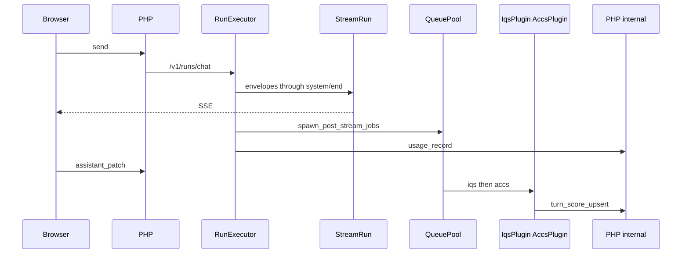

# Phase Plan — IQS / ACCS (Post-Stream Queue)

> **Status**: Phase 3 wired (2026-05-19) — `turn_score_upsert` + plugin persist; Phase 4 read API optional  
> **Goal**: After each assistant reply completes, enqueue **non-blocking** quality jobs (`iqs`, `accs`) that score the turn and persist to `oaao_turn_score`.  
> **Scheme**: Python orchestrator only (scheme **B** in `docs/MIGRATION_LEGACY_OAAO.md`); PHP provides internal persist API + Purpose `uiqe.*` routing.

---

## 1. Principles

| Principle | Detail |
|-----------|--------|
| **Not on the hot path** | Scoring runs in `QueuePool` workers **after** `system/end`; must not delay LLM tokens or `assistant_patch`. |
| **Stable plugin IDs** | Config uses internal IDs `iqs`, `accs` (`plugins/registry.py`) — not renamed per vendor. |
| **UIQE endpoint** | Settings slot `pa-uiqe` / purpose prefix `uiqe.*` — fast, low-cost models for scoring prompts. |
| **No second Pipeline** | Plugins call a single `llm_call` via resolved `endpoint_snapshot`; they must **not** open the main chat stream Pipeline. |
| **PHP no SSE** | Optional late telemetry frames are orchestrator-only; persistence is PHP internal JSON. |

---

## 2. Current codebase map

| Area | Path | State |
|------|------|--------|
| Plugin contract | `python/oaao_orchestrator/plugins/spec.py` | Done |
| Stubs | `python/oaao_orchestrator/plugins/builtins/iqs.py`, `accs.py` | TODO persist |
| Registry | `python/oaao_orchestrator/plugins/registry.py` | Done |
| Queue | `python/oaao_orchestrator/queue_pool.py` | Done (`spawn_post_stream_jobs`) |
| Config example | `python/config/queue_pools.example.json` | Done |
| Prompt bundle stub | `python/materials/prompts/workers/post_stream_metrics.md` | Stub |
| DB schema | `oaao_turn_score` in auth installers (SQLite + PG) | Done |
| Chat run end | `python/oaao_orchestrator/run_executor.py` → `system/end` | Done |
| **Wiring** | `app.py` lifespan + `run_executor.py` after `system/end` | **Done** (Phase 1) |
| PHP upsert API | `turn_score_upsert` (internal) | **Done** |

**Design alignment**: `backbone/sites/oaaoai/oaaoai/docs/backlog/chat-task-pipeline.md` §4.3 — Legacy `iqs` SSE ≈ v1 `post_stream` QueuePool.

---

## 3. Target flow

```text
Browser ──► PHP send.php ──► POST /v1/runs/chat
                │
                ▼
         RunExecutor (task + llm stream)
                │
                ├──► StreamRun SSE (through system/end)
                │
                └──► finally:
                       1. append system/end (metrics, tasks, oaao_pipeline, materials)
                       2. spawn_post_stream_jobs → QueuePool (iqs, accs)  ← NEW
                       3. _report_usage_to_php (existing)
                │
Browser ──► assistant_patch (meta snapshot, no scores yet)

Queue workers (async):
  iqs  → llm_call(uiqe.*) → POST turn_score_upsert
  accs → llm_call(uiqe.*) → POST turn_score_upsert (merge row)
```



---

## 4. Phase breakdown

### Phase 0 — Skeleton (done)

- [x] `PostStreamPlugin` + `PluginContext`
- [x] `QueuePoolSettings` / `QueueJobPayload`
- [x] `IqsPlugin` / `AccsPlugin` placeholders
- [x] `oaao_turn_score` DDL

### Phase 1 — Wire queue to chat run (MVP enqueue)

**Outcome**: Jobs enqueue after every successful chat run; workers log stub execution.

| Task | Owner | Files |
|------|-------|-------|
| Load pool config on startup | Python | `app.py` `_lifespan`, env `OAAO_QUEUE_POOLS_JSON` → `load_pool_settings()` |
| Start/stop workers | Python | `queue_pool.py` `QueuePool.start()` |
| Enqueue in run teardown | Python | `run_executor.py` `finally` after `system/end` |
| Pass `plugin_ctx_meta` | Python | `conversation_id`, `assistant_message_id`, `user_id`, `tenant_id`, `purpose_id`, `mode_id`; optional compact `pipeline` / `tasks` refs |
| Compose env | Infra | Mount `queue_pools.json`, document in `docker/env.example` |

**Acceptance**

1. After a chat completes, orchestrator logs show two jobs enqueued (`iqs`, `accs`).
2. SSE latency unchanged vs today.
3. `assistant_patch` still succeeds before workers finish.

### Phase 2 — Resolve UIQE endpoint + prompts (done)

**Outcome**: Workers call a real small model with versioned prompts.

**Shipped**: `send.php` passes `uiqe` snapshot; `queue_pool.render_prompt` loads `iqs.md` / `accs.md`; plugins call UIQE via `post_stream_llm.call_uiqe_chat`.

| Task | Owner | Files |
|------|-------|-------|
| Resolve `uiqe.*` endpoint row | PHP | Extend `send.php` or dedicated internal resolve; pass snapshot in `ChatRunRequest` **or** store ref in queue JSON |
| Split prompts | Content | `materials/prompts/workers/iqs.md`, `accs.md` (or one bundle + sections) |
| Render prompts | Python | Replace `QueuePool._render_prompt_stub` with MD loader + variable injection from `plugin_ctx_meta` |
| JSON schema | Python | Pydantic models for dimension scores + reasons |

**Acceptance**

1. Worker HTTP call hits configured UIQE `base_url` / model.
2. Failed resolve skips job with warning (no run failure).

### Phase 3 — Persist scores (PHP + plugins) (done)

**Outcome**: Rows in `oaao_turn_score` per assistant message.

**Shipped**: `POST /chat/api/turn_score_upsert` (internal token); `post_stream_persist.py`; IQS/ACCS plugins upsert after LLM parse; `turn_index` from assistant message order in conversation.

| Task | Owner | Files |
|------|-------|-------|
| Internal API | PHP | `chat/default/controller/api/turn_score_upsert.php`, route in `chat.php` |
| Auth | PHP | `X-OAAO-Internal-Token` (same as orchestrator → vault usage) |
| IQS plugin | Python | `plugins/builtins/iqs.py` — parse LLM JSON, POST upsert |
| ACCS plugin | Python | `plugins/builtins/accs.py` — same row or second upsert |
| AIQS v2 blob (optional) | Both | `aiqs_blob_json`, `complete`, `topic_shift` columns |

**Acceptance**

1. One chat turn → one `oaao_turn_score` row with `iqs`, `accs`, `*_dims_json`, `*_reasons_json`.
2. Plugin failure does not affect message content or usage billing.

### Phase 4 — Product surface (optional)

| Task | Notes |
|------|-------|
| Read API | `GET /chat/api/turn_scores?conversation_id=` for thread UI |
| SSE telemetry | `phase=telemetry` after score — only if live UI needed; else poll |
| Settings | Confirm `pa-uiqe` allocation documented in endpoints admin |

---

## 5. `plugin_ctx_meta` contract (draft)

```json
{
  "conversation_id": "123",
  "assistant_message_id": "456",
  "user_id": "1",
  "tenant_id": 1,
  "purpose_id": "chat",
  "mode_id": "default",
  "pipeline_fingerprint": "optional-short-hash",
  "materials_count": 2
}
```

- Do **not** embed full transcripts in meta; workers fetch text via PHP by `assistant_message_id` if needed.
- `mergeMaterialsMeta` / `meta.tasks` on the assistant row remain the **context source** for scoring prompts (see `chat-panel.js` IQS comments).

---

## 6. Configuration

**Example** (`python/config/queue_pools.example.json`):

```json
{
  "pool_id": "post_stream_metrics",
  "worker_number": 4,
  "poll_interval_seconds": 0.2,
  "purpose_id": "default_chat",
  "prompt_bundle_ref": "materials/prompts/workers/post_stream_metrics.md",
  "endpoint": { "endpoint_ref": "internal-metrics-router" },
  "plugins_after_stream": ["iqs", "accs"]
}
```

**Environment**

| Variable | Purpose |
|----------|---------|
| `OAAO_QUEUE_POOLS_JSON` | Path to pool array JSON inside orchestrator container |
| `OAAO_ORCH_SHARED_SECRET` | PHP internal callbacks |
| `OAAO_VAULT_JOB_POLL_BASE_URL` | Pattern for PHP base URL (extend for chat internal routes) |

---

## 7. PR checklist

| PR | Scope |
|----|--------|
| **PR-1** | Phase 1 — lifespan + `spawn_post_stream_jobs` in `run_executor` |
| **PR-2** | Phase 2 — UIQE resolve + prompt loader |
| **PR-3** | Phase 3 — `turn_score_upsert` + `iqs` / `accs` bodies |
| **PR-4** | Phase 4 — read API / UI (if product asks) |

---

## 8. Testing

```bash
docker compose build orchestrator
docker compose up -d orchestrator
docker compose exec -w /app/python orchestrator python -m pytest tests/ -q -k "queue or plugin"  # add tests in PR-1
```

Manual: complete one chat → verify orchestrator logs for enqueue → verify DB row after workers (PR-3).

---

## 9. Related documents

| Document | Path |
|----------|------|
| Chat task pipeline | `backbone/sites/oaaoai/oaaoai/docs/backlog/chat-task-pipeline.md` |
| Legacy migration | `docs/MIGRATION_LEGACY_OAAO.md` |
| Plugin spec | `python/oaao_orchestrator/plugins/spec.py` |
| Endpoints UIQE slot | `backbone/sites/oaaoai/oaaoai/endpoints/default/controller/endpoints.php` |

---

## 10. Revision log

| Date | Version | Notes |
|------|---------|-------|
| 2026-05-19 | 0.1 | Initial phase plan in `/docs` |
