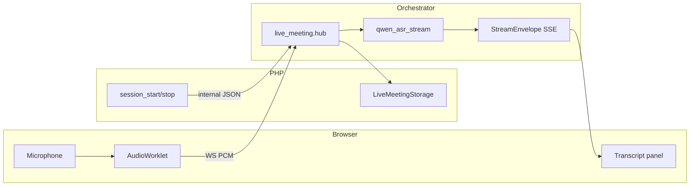

# Phase Plan — Live ASR Assistant

> **Status**: Phase B in progress (2026-05-21) — WS PCM uplink + segment disk; ASR/SSE transcript in Phase C  
> **Goal**: New workspace page for **live meeting copilot** — streaming ASR subtitles first; bubbles, RAG, and materials in later phases.  
> **Rule**: Long-lived connections (WebSocket uplink audio, SSE downlink events) terminate **only** in Python orchestrator; PHP handles sessions, ACL, and disk paths.

**Detailed file manifest (backlog)**: `backbone/sites/oaaoai/oaaoai/docs/backlog/live-meeting-assistant-m1.md`

---

## 1. Confirmed decisions

| # | Decision |
|---|----------|
| 1 | **ASR**: Qwen3-ASR Live/Streaming via Purpose `asr.*` |
| 2 | **Latency**: partial transcripts every 300–800 ms acceptable |
| 3 | **Cadence** (M2+): debate 5–10s / 1v1 15–30s / meeting 60s+ between auto-LLM |
| 4 | **Audio**: persist under `data/live-meeting/`; optional keep; TTL delete if not retained |
| 5 | **UX**: dedicated SPA page; bubbles + materials dialog deferred to M2 |

---

## 2. Scope by milestone

### M1 — Live transcript (this phase plan)

| In scope | Out of scope |
|----------|----------------|
| Page `workspace/live-meeting` shell + record UI | Bubble keywords / questions |
| PHP `session_start` / `session_stop` | Auto cadence LLM |
| Orchestrator WS PCM ingest + Qwen3 bridge | Post-meeting summarize → Chat |
| SSE `live_transcript` (partial / final) | Redis multi-instance |
| Audio segments on disk + TTL settings | TTS reply |

**M1 acceptance**: Mic on → scrolling transcript within **10s**; Network shows **WS uplink** and **SSE downlink**; stop respects keep-audio vs TTL.

### M2 — Copilot loop (preview)

- SSE: `live_bubble`, `live_stats`, `live_materials`, `live_insight_delta`, `live_phase`
- Purpose `live_meeting.*` for bubble / question generation
- Manual bubble → RAG + Materials Dialog (chat `task-materials-dialog` patterns)
- Cadence profiles in session `meta.json`

### M3 — Wrap-up

- Purpose `asr_summary.*` for end-of-session summary
- Optional push summary into chat thread

---

## 3. Architecture (M1)

```text
Browser (live-meeting-panel.js + live-meeting-audio.js)
  AudioWorklet 16 kHz PCM s16le mono ──WS──► GET/WS orchestrator /v1/live/{session_id}/audio
  EventSource ◄──SSE── orchestrator /v1/live/{session_id}/stream

PHP POST /live-meeting/api/session_start
  → { session_id, ws_audio_url, stream_url, stream_token }

PHP POST /live-meeting/api/session_stop
  → { keep_audio } → TTL or retain

data/live-meeting/sessions/{session_id}/
  meta.json, audio/seg_*.pcm, transcript.jsonl
```



---

## 4. Phase breakdown (implementation)

### Phase A — Foundation (infra + PHP shell)

**Outcome**: Empty page, session IDs, directories, docker mounts.

| Task | Path / notes |
|------|----------------|
| Module scaffold | `backbone/sites/oaaoai/oaaoai/live-meeting/default/` — `module.php`, `package.php`, `live-meeting.php` |
| Session APIs (stub) | `controller/api/session_start.php`, `session_stop.php` |
| Storage helper | `library/LiveMeetingStorage.php` — root from `OAAO_LIVE_MEETING_ROOT` |
| Orchestrator client | `library/LiveMeetingOrchestrator.php` — internal POST to Python |
| SPA register | `core/default/controller/core.php` — `workspace/live-meeting` |
| Docker | `docker-compose.yml` volume; `docker/env.example` `OAAO_LIVE_MEETING_*`; `web/docker-entrypoint.sh` mkdir |

**Acceptance**: `session_start` returns URLs; session folder created; page loads without WS/SSE.

### Phase B — Audio uplink + disk

**Outcome**: PCM reaches orchestrator; segments written.

| Task | Path / notes |
|------|----------------|
| AudioWorklet | `live-meeting/default/webassets/js/live-meeting-audio.js` |
| Panel shell | `live-meeting-panel.js` — mic toggle, connection state |
| WS handler (stub → real) | `python/oaao_orchestrator/live_meeting/hub.py` |
| Segment store | `live_meeting/audio_store.py` |
| Session model | `live_meeting/session.py` — TTL, `retention_mode` |

**Acceptance**: Record 30s → `audio/seg_*.pcm` files exist; WS frames logged server-side.

### Phase C — Qwen3 streaming ASR + SSE (in progress)

**Outcome**: Partial/final transcript events on SSE.

**Shipped (segment-batch fallback)**: closed `seg_*.pcm` → ffmpeg WAV → `transcribe_audio_auto`; SSE `phase=live` `kind=live_transcript`; `transcript.jsonl` append; PHP forwards Purpose `asr.*` + workspace glossary.

| Task | Path / notes |
|------|----------------|
| Routes | `app.py`: `POST /v1/live/session_start`, `GET /v1/live/{id}/stream`, WS audio |
| ASR client | `live_meeting/qwen_asr_stream.py` — read Purpose `asr.*` `meta_json.mode=streaming` |
| Envelope kind | `streaming/events.py` — `live_transcript` (or dedicated phase constant) |
| Broadcast | `hub.py` — fan-out to SSE subscribers |
| PHP start | Forward resolved ASR endpoint snapshot to orchestrator |

**Acceptance**: M1 acceptance sentence; `transcript.jsonl` append on final segments.

**Blocker before PR-C** (product/ops):

- Qwen3-ASR streaming **WebSocket URL, auth, binary frame format** from your deployed endpoint doc
- `asr.*` row configured in Purpose allocation (Settings → ASR)

### Phase D — UI polish (M1 complete)

| Task | Notes |
|------|-------|
| Transcript scroll + partial styling | `live-meeting.css`, JIT-friendly layout |
| Stop / keep audio | Wire `session_stop` + retention copy (i18n) |
| Error states | WS drop, ASR provider failure |
| i18n keys | `core/.../oaao-i18n.js` — `live_meeting.*` namespace |

**Acceptance**: Full M1 demo path without console errors.

---

## 5. API contracts (M1)

### POST `/live-meeting/api/session_start`

Request:

```json
{ "cadence": "1v1", "workspace_id": 1, "retention_mode": "disk_ttl" }
```

Response:

```json
{
  "success": true,
  "data": {
    "session_id": "lm_…",
    "ws_audio_url": "/v1/live/lm_…/audio",
    "stream_url": "http://orchestrator:8103/v1/live/lm_…/stream",
    "stream_token": "…"
  }
}
```

### POST `/live-meeting/api/session_stop`

```json
{ "session_id": "lm_…", "keep_audio": false }
```

### Orchestrator SSE

`StreamEnvelope` with transcript payload, e.g.:

```json
{ "text": "…", "is_final": false, "t_ms": 12345 }
```

### Orchestrator WS

Binary: PCM s16le mono 16 kHz; optional JSON `{ "type": "ping" }` heartbeat.

---

## 6. Purpose allocation

| Slot | M1 | Use |
|------|-----|-----|
| `asr.*` | **Required** | Qwen3 streaming |
| `live_meeting.*` | M2 | Bubble / question LLM |
| `chat.*` + `embedding.*` | M2 | RAG answers |
| `asr_summary.*` | M3 | Post-session summary |

**Separate from vault batch ASR**: `docs` / backlog `vault-asr-speaker-mode.md` (FunASR diarization upload path).

---

## 7. Cadence profiles (M2 placeholder)

| Profile | Auto-LLM interval | Scenario |
|---------|-------------------|----------|
| `debate` | 5–10 s | Rapid Q&A |
| `1v1` | 15–30 s | Single customer |
| `meeting` | 60 s+ | Multi-party |

M1 only stores default `1v1` in `meta.json`.

---

## 8. PR order

| PR | Phase | Deliverable |
|----|-------|-------------|
| **PR-A** | A | Storage + PHP session + empty SPA |
| **PR-B** | B | WS + PCM segments |
| **PR-C** | C | Qwen bridge + SSE transcript |
| **PR-D** | D | UI + stop/retention |

---

## 9. Environment

| Variable | Default (documented) |
|----------|----------------------|
| `OAAO_LIVE_MEETING_ROOT` | e.g. `/var/www/html/sites/oaaoai/oaaoai/data/live-meeting` |
| `OAAO_ORCH_SHARED_SECRET` | PHP ↔ orchestrator internal calls |
| ASR upstream | From `oaao_endpoint` via Purpose `asr.*` (not hardcoded in JS) |

---

## 10. Testing

| Level | Command / action |
|-------|------------------|
| Unit | Add `python/tests/test_live_meeting_session.py` in PR-A/B |
| Manual M1 | Open page → record → observe SSE in DevTools → stop → verify disk TTL |
| Regression | Confirm chat `asr_transcribe` and vault ASR unchanged |

---

## 11. Boundaries vs other work

| Area | Relationship |
|------|----------------|
| Chat task pipeline | Same `StreamEnvelope` family; no shared RunExecutor |
| IQS / ACCS | Not used in M1; post-meeting quality is M3+ if needed |
| PHP SSE rule | Browser `EventSource` only to orchestrator URL from `session_start` |
| Composer mic / `asr_transcribe` | Different product path — do not merge UIs in M1 |

---

## 12. Related documents

| Document | Path |
|----------|------|
| M1 file checklist (detailed) | `backbone/sites/oaaoai/oaaoai/docs/backlog/live-meeting-assistant-m1.md` |
| Chat SSE model | `backbone/sites/oaaoai/oaaoai/docs/backlog/chat-task-pipeline.md` |
| ASR settings (batch) | Vault / core `oaao-asr-settings-panel.js` |
| Migration | `docs/MIGRATION_LEGACY_OAAO.md` |
| Stack rules | `.cursor/rules/rayfung-razy-stack.mdc` |

---

## 13. Revision log

| Date | Version | Notes |
|------|---------|-------|
| 2026-05-21 | 0.1 | M1 frozen in site backlog; phase plan copied to `/docs` |
| 2026-05-19 | 0.1 | `/docs` phase plan index |
