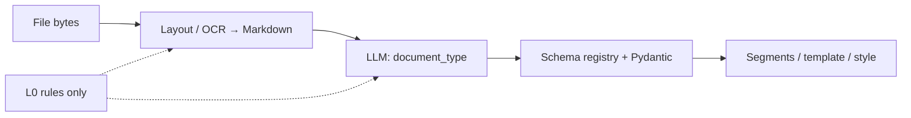

# oaao.ai — 智能 vs Hard-code 全庫稽核報告

| Field | Value |
|-------|--------|
| **Date** | 2026-05-28 |
| **Scope** | Content Studio + orchestrator + oaaoai PHP/JS 業務模組 |
| **Principle** | [Epics §0.1](../OAAO_Content_Studio_Epics.md) — 商品化禁止 domain hard code；有 LLM/語義能力時不得用 regex 堆疊冒充「智能」 |
| **LoRA / 專模** | Repo **未內建** LoRA 訓練；智能應透過 **`oaao_endpoint` 綁定**（Corpus / Planning / `uiqe` 等 purpose）使用你方已訓練權重，**不是**在 Python 再加一套通告 regex |

---

## 1. 執行摘要

| 等級 | 含義 | 模組數（約） |
|------|------|-------------|
| **🔴 P0 — 業務語義靠 regex** | 換客戶/版式即失效；應改 LLM + schema + 驗證 | Corpus, Chat intent, Live meeting bubbles, Slide layout keywords |
| **🟠 P1 — regex 主路徑、LLM 可選/事後** | 有 LLM 但仍先/heavy 依賴規則 | Corpus segmenting, Evaluation IQS/ACCS, Page router L0/L1 |
| **🟡 P2 — 合理確定性** | URL/安全/格式；可保留規則作 **L0** | arXiv URL、RSS、密碼強度、JSON 刮取 |
| **🟢 P3 — 已 LLM-first** | 規則僅 fallback | Slide template_slot_plan, Mine index+LLM, Planner (明示 no keyword) |

**結論：** 產品對外標榜「智能」，但 **Corpus / Chat 路由 / Live 氣泡 / Slide 版型選擇** 仍大量 **關鍵字與 regex**；LLM 多數只做 **style 摘要、貼標、填參**，未做 **版面→Markdown→document_type→schema extraction** 主鏈。這與「有 LoRA 卻選更不智策略」的觀感一致 — **不是缺模型，是 pipeline 設計未把模型放在主路徑**。

---

## 2. 建議的智能主鏈（全站）

| 步驟 | 智能做法 | 禁止擴寫 |
|------|----------|----------|
| Ingest | Markdown + `layout_blocks[]` metadata | 平面 `pypdf` 直接 `segment_analyze_text` |
| Classify | `document_type` + confidence | `if 行員申請轉讓會籍` |
| Extract | 2-pass LLM + JSON schema validate | `_TABLE_COLUMNS` 寫死五欄 |
| Generate | 填參 / 摘要 | 再刮 JSON 無驗證 |

**LoRA 接入點：** `CorpusAnalyze`、`document_markdown`、`document_type`、`extract_pass_a` 的 `llm_cfg` 應允許指向 **專模 endpoint**（與 Chat Planning 同模式），而非預設通用模型 + regex 補洞。

---

## 3. 模組稽核表

### 3.1 🔴 P0 — Content Studio / Corpus

| 檔案 | Hard-code 現狀 | 智能替代 | Story |
|------|----------------|----------|-------|
| `corpus/segmenting.py` | `【第 N 號行員】`、`\d{3}` 列、`編號\|行員名稱`、label:`：` 解析 | Markdown 表格 + LLM row boundary | S15→S16→S17 |
| `corpus/html_template.py` | `_TABLE_COLUMNS`、`行員申請轉讓會籍`、函首 regex | schema → `html_template` 生成 | S18 |
| `corpus/llm.py` | `fill_table_rows` 鍵 `id,before,after,...`；brief 關鍵字 narrative/structured | schema-driven fill + strict JSON mode | S16–S17 |
| `corpus/worker.py` | `_derive_style_json` regex 猜 heading/list；**無** layout ingest | S15 `document_markdown` 主輸入 | **S15** |
| `corpus/structure.py` | trigram / `【第 N 號行員】` 相似度 | 結構 JSON 比對 | S17 後 |
| `routes/library.py` | `split("\n\n")` stub blocks | Unstructured/LLM convert | CS-2 |

### 3.2 🔴 P0 — Chat / Planner（PHP + Python）

| 檔案 | Hard-code 現狀 | 智能替代 |
|------|----------------|----------|
| `chat/.../ChatTeachingIntent.php` | 中英關鍵字 + `第N卷` regex → slide/vault | Planner LLM `slide_action` / 意圖分類（與 orchestrator 對齊） |
| `corpus/llm.py` | `_NARRATIVE_BRIEF_RE` / `_STRUCTURED_BRIEF_RE` | `document_type` + brief 意圖 LLM |
| `planner_llm.py` | 註明 avoid keyword lists（✅）但 PHP 仍雙軌 | 單一 planner JSON 驅動 |

### 3.3 🔴 P0 — Live Meeting

| 檔案 | Hard-code 現狀 | 智能替代 |
|------|----------------|----------|
| `live_meeting/bubble_engine.py` | 問句/意圖多組 regex、CJK stopwords、`我要 XXX 教學` | 輕量 LLM intent（或 endpoint LoRA）+ glossary 語義匹配 |

### 3.4 🔴 P0 — Slide Designer

| 檔案 | Hard-code 現狀 | 智能替代 |
|------|----------------|----------|
| `slide_project/templates/plan.json` | 每 layout `keywords: ["faq","問答",...]` | 已部分由 `template_micro_skills` LLM 取代 — **應刪 keyword 路由** |
| `slide_project/template_registry.py` | `keywords` in layout row match | LLM `use_when` only |
| `slide_project/template_analyzer.py` | `_heuristic_template` fallback | LLM-only analyze + 明確失敗 |
| `slide_project/llm.py` | prompt 內仍寫「FAQ→faq_split」启发式 | 純 geometry + micro_skills |

### 3.5 🟠 P1 — Research / Vault / Page Router

| 檔案 | Hard-code 現狀 | 智能替代 |
|------|----------------|----------|
| `vault_document_extract.py` | pypdf/fitz 平面字 | S15 同構 Markdown ingest（Vault 共用） |
| `page_router/classify.py` | L0 URL rules + L1 features；L2 LLM 可選 | 保持 L0；**模糊頁**應預設 L2 |
| `page_router/link_scoring.py` | 大量 URL/feature 規則 | 研究場景可接受；非公文 |
| `research/naming.py` | weak title 詞表 | LLM title normalize（低優先） |
| `research/summarize.py` | 模板 fallback 文案 | 已有 LLM 主徑 |

### 3.6 🟠 P1 — Evaluation / Evolution

| 檔案 | Hard-code 現狀 | 智能替代 |
|------|----------------|----------|
| `evaluation/iqs.py` | `_VAGUE_ONLY`、heuristic dims | E4B coach 已設計為主 — **預設應 coach-first** |
| `evaluation/accs.py` | `_heuristic_factors` 字串匹配 | ACCS coach / evidence graph |
| `evaluation/pipeline_evidence.py` | regex 證據形態 | 保留部分 L0 + LLM judge |
| `evaluation/fork_*.py` | 建議/引用启发式 | LLM fork（已有部分） |

### 3.7 🟡 P2 — 可保留的確定性規則

| 區域 | 範例 | 理由 |
|------|------|------|
| 安全/驗證 | 密碼、email、host resolver | 不需 LLM |
| 協議/URL | arXiv `/abs/`、RSS `.xml` | 穩定、可測 |
| 基礎設施 | `json_utils` 刮 JSON | 解析層；上游應 JSON mode |
| ASR | `quick_punctuate` | 音訊後處理，非「理解」 |
| Mine | `parse_arxiv_list_html` | 結構化 HTML 列表；與 LLM extract 並存 ✅ |

### 3.8 🟢 已朝智能收斂

| 模組 | 說明 |
|------|------|
| `slide_project/template_slot_plan.py` | 註明 no FAQ/keyword；LLM slot plan |
| `slide_project/template_micro_skills.py` | LLM 選頁，禁 keyword |
| `mine/worker.py` | arXiv heuristic **僅** index；否則 `extract_rows_for_schema` LLM |
| `planner_llm.py` | `slide_action` JSON，avoid keyword lists |
| `office_generate` | 委託 corpus render（參數化）— 瓶頸在 corpus template |

---

## 4. 「有 LLM 卻不用」對照（Corpus 為例）

| 階段 | 現狀 | 應有 |
|------|------|------|
| PDF→文字 | pypdf/fitz | Layout→**Markdown**（S15） |
| 分段 | **regex 先**，LLM 可選 refine | **Markdown→LLM 邊界**（S17） |
| 類型 | 無 | **document_type**（S16） |
| 表格/函首 | regex 欄位 | **schema extract**（S16–S17） |
| 印刷模板 | heuristic HTML | **schema→template**（S18） |
| Render | LLM fill 無 schema 驗證 | Pydantic + 重試 |

---

## 5. Sprint CS-AUDIT-1（與 CS-1-S16 同 sprint）

| ID | 模組 | 動作 | 狀態 |
|----|------|------|------|
| AUDIT-2 | Corpus S16 | `schema_registry.py` + contracts | ✅ |
| AUDIT-3 | `slide_project/templates/plan.json` | 移除 keywords 路由，僅 micro_skills LLM | ✅ |
| AUDIT-4 | `chat/.../ChatTeachingIntent.php` | composer 匹配 + template slide；planner `slide_action` | ✅ |
| AUDIT-5 | `live_meeting/bubble_engine.py` | LLM intent | 🔲 P2 |

見 [OAAO_Content_Studio_Epics.md §2.1](../OAAO_Content_Studio_Epics.md)。

## 6. Remediation 路線（與 Epic 對齊）

| 順序 | Story | 效果 |
|------|-------|------|
| 1 | **CS-1-S15** | analyze 主輸入改 `document_markdown`；LLM 結構化平面字 |
| 2 | CS-1-S16 | `document_type` + contracts |
| 3 | CS-1-S17 | 兩階段 extraction |
| 4 | CS-1-S18 | 移除 CGSE regex 模板 |
| 5 | CS-2 | Library convert 智能 ingest |
| 6 | 橫切 | ChatTeachingIntent → planner；Slide plan.json keywords 移除；Live bubble LLM |

---

## 7. 治理（防止復發）

1. **PR checklist：** 新增 `re.compile` / 中文業務字串常量 → 需 Epic 引用或 `document_type` schema ID。
2. **測試：** 每種 `document_type` ≥1 golden；`unknown` 不得產 PDF。
3. **Endpoint：** Corpus analyze 文件化「建議綁定 LoRA/專模 purpose」。
4. **禁止：** 在 S18 完成前 **新增** `segmenting.py` / `html_template.py` 通告分支。

---

## 8. 相關文件

- [OAAO_Content_Studio_Epics.md §0.1](../OAAO_Content_Studio_Epics.md)
- [corpus-studio.md §4.1](../design/corpus-studio.md)
- [Manus_Gap_Analysis.md](../Manus_Gap_Analysis.md) — 訓練/演化不需重訓主模型，但 **推理鏈** 應用 coach/專模
